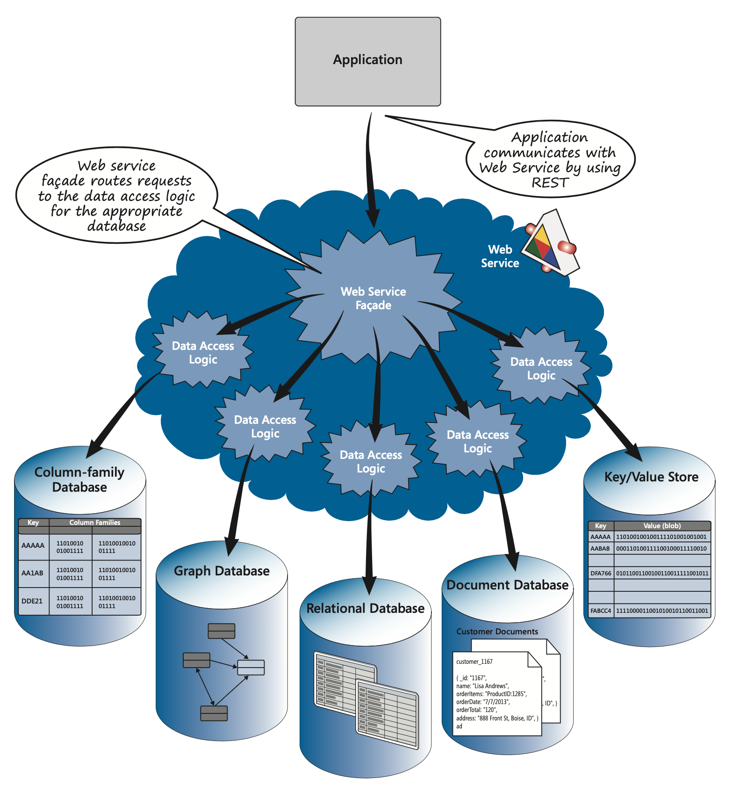

# Integrador Redis I: Arquitetura Pub/Sub e código-fonte básico para Sincronização de CRUD entre ORM e ODM

## 1. Objetivo

A integração entre dois ou mais sistemas de persistência é um desafio comum em arquiteturas modernas. Com o advento dos Web Services, REST APIs e microserviços, a necessidade de sincronizar dados entre diferentes bancos de dados se tornou uma prática recorrente. É comum ter sistemas com entidades comuns, como usuários, produtos ou pedidos, que precisam ser atualizados em múltiplos repositórios de dados, com diversas tecnologias de persistência, como bancos de dados relacionais e NoSQL.

Para resolver esse desafio, é necessário implementar uma arquitetura que permita a **sincronização de dados** entre esses sistemas de forma eficiente e confiável. A abordagem tradicional de replicação de dados pode ser complexa e difícil de manter, especialmente quando se lida com diferentes modelos de dados e tecnologias de persistência. Neste contexto, surgem diversas padrões arquiteturais, como: **[api gateway](https://microservices.io/patterns/apigateway.html)**, **web service façade** (vide figura abaixo), **[event sourcing](https://microservices.io/patterns/data/event-sourcing.html)**, entre outras. Essas abordagens visam desacoplar a lógica de negócios da persistência de dados, permitindo que as aplicações se comuniquem de forma mais flexível e escalável.


Fonte: McMurtry et al. (2013) - Data Access for Highly-Scalable Solutions: Using SQL, NoSQL and Polyglot Persistence

Neste contexto, o Redis se destaca como uma solução eficiente para implementar um **[barramento de eventos](https://dzone.com/articles/design-patterns-event-bus)** que permite a comunicação assíncrona entre diferentes sistemas de persistência. Utilizando o Redis, é possível desacoplar a lógica de negócios da persistência de dados, permitindo que as aplicações se comuniquem de forma mais flexível e escalável.

A arquitetura proposta tem como objetivo **sincronizar operações de escrita (CRUD)** entre dois sistemas distintos de persistência:

- **BD1**: um banco de dados relacional operado por um **ORM** (Object-Relational Mapping), utilizando **SQLite**;
- **BD2**: um banco de dados NoSQL operado por um **ODM** (Object-Document Mapping), utilizando **MongoDB**.

Essa integração é mediada por um **middleware em Java**, que atua como **ponte entre os dois repositórios**, garantindo consistência e interoperabilidade entre eles. O Redis é usado como **buffer de eventos e canal de comunicação 


## 2. Componentes Principais

## Diagrama de Componentes


O diagrama acima foi criado com o **PlantUML** e ilustra os principais componentes da arquitetura. O código-fonte do diagrama está disponível neste link:
[Diagrama PlantUML](https://www.plantuml.com/plantuml/uml/ZP9FRjKm4CRtFiMdie75A-fRia2bYa18VVp9OrTbCI-PfACwTcHFG0MnvG286x3W8Bq99y4EGUfJ6ecD4tc--SryCpwFIa77tXhBhK8zWdJNYaO2rohUcNWZRg10FMhV3zwnqxtUMaOMaEii6sC6gc-eOvpi9IhtX3CylYZEiC7RSfVE_VjBKNvoWYy60AvU35PgkljrzzDdHONDvZckIcuaujrui1AlELJcwmFaRIPlCxd8v9rtdIykLj352XgFjiVqdJIDvKyK6A-TSXUeyM5c_ik-p1qu3ZFoGo0NMn_wB9ry_lxsVIhvSDBfQKfwAPRGC4hMS5lX6Rn3IsB7mFzVgfXBbRl9X5blPSwVXrIPu-aiuokB-Rk-ogmriXHEDgRBXIMpsFCzMOekLtKiCCuhpy_Kjqiyi479DHyOFRj8NJhmKIWZd-x7moHuurNQv1Hwtn77AVYAqgKoehWwU2UVvu6a5vty_aZVhM7N83TYpjFVsDi_)

### Aplicação ORM (BD1)
- Persistência local de objetos em SQLite via ORM.
- Após cada operação de escrita (`CREATE`, `UPDATE`, `DELETE`), a aplicação **serializa a operação em JSON** e envia para o Redis através de um **Publisher**.

### Redis
- Atua como **barramento de eventos assíncrono** entre BD1 e BD2.
- Armazena e distribui mensagens via **canal Pub/Sub (`crud-channel`)**.
- Opcionalmente, pode ser configurado com persistência (AOF/RDB) e políticas de descarte para evitar estouro de memória.

### Middleware Integrador
- Implementado em Java, com uso da biblioteca **Lettuce** para comunicação com Redis.
- Contém um **Redis Listener** que fica assinando (`SUBSCRIBE`) os canais do Redis.
- Ao receber uma operação, **executa a transformação do modelo de dados**:
  - De ORM para ODM (SQLite → MongoDB).
  - Ou, no sentido inverso, de ODM para ORM (MongoDB → SQLite).
- Aplica a operação correspondente no banco de destino.

### Transformadores
- São responsáveis por **converter as representações de dados** entre os modelos relacionais e documentais.
- Garantem compatibilidade semântica entre os campos e estruturas de dados.

### Fila de Retry (Reprocessamento)
- Em caso de falha durante a operação (ex: MongoDB indisponível), a mensagem é registrada em uma fila de reprocessamento.
- Permite tentativas posteriores, garantindo **resiliência** do sistema.

### Aplicação ODM (BD2)
- Atua de forma semelhante à aplicação ORM, porém usando MongoDB e um ODM (como Morphia).
- Também publica eventos no Redis ao realizar operações de escrita, permitindo **sincronização bidirecional**.

## 3. Fluxo de Inclusão de Objeto (ORM → ODM)

1. O usuário cria um objeto na aplicação ORM.
2. O objeto é salvo localmente no banco SQLite via ORM.
3. A operação é serializada e publicada no Redis (`PUBLISH crud-channel {operation}`).
4. O listener do middleware recebe a mensagem via Pub/Sub.
5. A mensagem é convertida para um objeto compatível com o MongoDB.
6. O objeto é salvo via ODM no banco NoSQL.
7. Em caso de falha, a operação é registrada para reprocessamento posterior.

## 3.1. Diagrama de Sequência

O diagrama de sequência abaixo ilustra o fluxo de inclusão de um objeto do ORM para o ODM:


O código-fonte do diagrama está disponível neste link:
[Diagrama de Sequência PlantUML](https://www.plantuml.com/plantuml/uml/ZP9FRjKm4CRtFiMdie75A-fRia2bYa18VVp9OrTbCI-PfACwTcHFG0MnvG286x3W8Bq99y4EGUfJ6ecD4tc--SryCpwFIa77tXhBhK8zWdJNYaO2rohUcNWZRg10FMhV3zwnqxtUMaOMaEii6sC6gc-eOvpi9IhtX3CylYZEiC7RSfVE_VjBKNvoWYy60AvU35PgkljrzzDdHONDvZckIcuaujrui1AlELJcwmFaRIPlCxd8v9rtdIykLj352XgFjiVqdJIDvKyK6A-TSXUeyM5c_ik-p1qu3ZFoGo0NMn_wB9ry_lxsVIhvSDBfQKfwAPRGC4hMS5lX6Rn3IsB7mFzVgfXBbRl9X5blPSwVXrIPu-aiuokB-Rk-ogmriXHEDgRBXIMpsFCzMOekLtKiCCuhpy_Kjqiyi479DHyOFRj8NJhmKIWZd-x7moHuurNQv1Hwtn77AVYAqgKoehWwU2UVvu6a5vty_aZVhM7N83TYpjFVsDi_)

## 4.Características Arquiteturais

| Aspecto              | Descrição                                                                 |
|----------------------|---------------------------------------------------------------------------|
| **Assíncrona**        | A comunicação entre BD1 e BD2 é feita via Redis Pub/Sub, sem bloqueio.   |
| **Reativa**           | O integrador responde a eventos publicados no Redis.                     |
| **Bidirecional**      | Operações em BD2 também podem ser transformadas e aplicadas em BD1.      |
| **Tolerante a falhas**| Operações com erro são armazenadas para retry.                           |
| **Desacoplada**       | O middleware abstrai o acoplamento entre os dois sistemas.               |
| **Extensível**        | Pode-se incluir novas transformações, validadores, logs ou métricas.     |

## 5. Implementação Básica

Para provar o conceito de sincronização, segue uma implementação básica em Java utilizando o Redis como barramento de eventos. O código-fonte está disponível no repositório do GitHub:

* [Integrador Redis I - GitHub](https://github.com/marceloakira/tutorials/tree/main/integrador-redis/code/spd-integrador)

Para implementar o integrador, você precisará do seguinte arquivo `pom.xml` para gerenciar as dependências do projeto:

```xml
<?xml version="1.0" encoding="UTF-8"?>
<project xmlns="http://maven.apache.org/POM/4.0.0"
         xmlns:xsi="http://www.w3.org/2001/XMLSchema-instance"
         xsi:schemaLocation="http://maven.apache.org/POM/4.0.0 http://maven.apache.org/xsd/maven-4.0.0.xsd">
    <modelVersion>4.0.0</modelVersion>

    <groupId>br.ufg.inf</groupId>
    <artifactId>spd-integrador</artifactId>
    <version>1.0-SNAPSHOT</version>

    <properties>
        <maven.compiler.source>17</maven.compiler.source>
        <maven.compiler.target>17</maven.compiler.target>
    </properties>

    <dependencies>
        <dependency>
            <groupId>io.lettuce</groupId>
            <artifactId>lettuce-core</artifactId>
            <version>6.7.1.RELEASE</version>
        </dependency>

        <!-- Gson para serialização/deserialização JSON -->
        <dependency>
        <groupId>com.google.code.gson</groupId>
        <artifactId>gson</artifactId>
        <version>2.11.0</version>
        </dependency>

        <!-- SLF4J facade -->
        <dependency>
            <groupId>org.slf4j</groupId>
            <artifactId>slf4j-api</artifactId>
            <version>2.0.12</version>
        </dependency>

        <!-- Logback implementation (resolve o StaticLoggerBinder) -->
        <dependency>
            <groupId>ch.qos.logback</groupId>
            <artifactId>logback-classic</artifactId>
            <version>1.4.14</version>
        </dependency>        
    </dependencies>
</project>
```

As dependências principais incluem:
- **Lettuce**: Cliente Redis assíncrono.
- **Gson**: Biblioteca para serialização/deserialização JSON.
- **SLF4J**: Facade para logging, com implementação Logback.

Para instalar as dependências, crie um projeto java, copie o arquivo `pom.xml` na pasta do projeto e execute o comando:

```bash
mvn clean install
```

Criar as pastas de código-fonte e testes:
```bash
mkdir -p src/main/java/br/ufg/inf
mkdir -p src/main/resources
mkdir -p src/test/java/br/ufg/inf
```

1. Crie o arquivo `src/main/java/br/ufg/inf/RedisPublisher.java` com o seguinte conteúdo:

```java
package br.ufg.inf;
import com.google.gson.Gson;
import io.lettuce.core.RedisClient;

public class RedisPublisher {

    private final RedisClient client = RedisClient.create("redis://localhost:6379");

    public void publishOperation(CrudOperation op) throws Exception {
        try (var connection = client.connect()) {
            Gson gson = new Gson();
            String json = gson.toJson(op);
            connection.sync().publish("crud-channel", json);
        }
    }
}
```

Este código define um publicador que envia operações CRUD para o canal `crud-channel` do Redis. Ele utiliza a biblioteca Gson para serializar as operações em JSON.

2. Crie o arquivo `src/main/java/br/ufg/inf/CrudOperation.java` com o seguinte conteúdo:

```java
package br.ufg.inf;

public class CrudOperation {
    public enum OperationType { CREATE, UPDATE, DELETE }
    public enum Source { BD1, BD2 }

    private String entity;
    private OperationType operation;
    private Source source;
    private String data; // JSON do objeto serializado
    private String timestamp;

    // Construtores
    public CrudOperation() {}

    public CrudOperation(String entity, OperationType operation, Source source, String data, String timestamp) {
        this.entity = entity;
        this.operation = operation;
        this.source = source;
        this.data = data;
        this.timestamp = timestamp;
    }

    // Getters
    public String getEntity() {
        return entity;
    }

    public OperationType getOperation() {
        return operation;
    }

    public Source getSource() {
        return source;
    }

    public String getData() {
        return data;
    }

    public String getTimestamp() {
        return timestamp;
    }

    // Setters
    public void setEntity(String entity) {
        this.entity = entity;
    }

    public void setOperation(OperationType operation) {
        this.operation = operation;
    }

    public void setSource(Source source) {
        this.source = source;
    }

    public void setData(String data) {
        this.data = data;
    }

    public void setTimestamp(String timestamp) {
        this.timestamp = timestamp;
    }

    // toString()
    @Override
    public String toString() {
        return "CrudOperation{" +
                "entity='" + entity + '\'' +
                ", operation=" + operation +
                ", source=" + source +
                ", data='" + data + '\'' +
                ", timestamp='" + timestamp + '\'' +
                '}';
    }
}
```

Este código define a classe `CrudOperation`, que representa uma operação CRUD com os campos necessários para identificar a entidade, o tipo de operação, a origem (BD1 ou BD2), os dados serializados e um timestamp.

3. Crie o arquivo `src/main/java/br/ufg/inf/Main.java` com o seguinte conteúdo:

```java
package br.ufg.inf;

public class Main {
    public static void main(String[] args) throws Exception {
        // Exemplo: publicar mensagem (teste manual)
        RedisPublisher publisher = new RedisPublisher();
        CrudOperation op = new CrudOperation();
        op.setEntity("User");
        op.setOperation(CrudOperation.OperationType.CREATE);
        op.setSource(CrudOperation.Source.BD1);
        op.setData("{\"id\":1,\"name\":\"João da Silva\"}");
        op.setTimestamp(java.time.Instant.now().toString());

        publisher.publishOperation(op);
    }
}
```

Este código define a classe `Main`, que contém um exemplo de uso do `RedisPublisher` para publicar uma operação CRUD. Você pode executar este código para testar a publicação de mensagens no Redis.

4. Crie o arquivo `src/main/java/br/ufg/inf/RedisListenerServer.java` com o seguinte conteúdo:

```java
package br.ufg.inf;

import java.util.concurrent.CountDownLatch;

import io.lettuce.core.RedisClient;
import io.lettuce.core.pubsub.RedisPubSubAdapter;
import io.lettuce.core.pubsub.StatefulRedisPubSubConnection;

public class RedisListenerServer {

    public void start() throws InterruptedException {
        RedisClient client = RedisClient.create("redis://localhost:6379");
        StatefulRedisPubSubConnection<String, String> connection = client.connectPubSub();

        connection.addListener(new RedisPubSubAdapter<>() {
            @Override
            public void message(String channel, String message) {
                System.out.printf("🔔 [%s] %s%n", channel, message);
            }
        });

        connection.sync().subscribe("crud-channel");

        System.out.println("🟢 Escutando notificações Redis de forma assíncrona...");

        // Mantém a thread principal ativa indefinidamente
        new CountDownLatch(1).await();
    }

    public static void main(String[] args) throws Exception {
        RedisListenerServer listener = new RedisListenerServer();
        listener.start();
    }

}
```

Este código define um servidor de listener que se conecta ao Redis e escuta mensagens no canal `crud-channel`. Quando uma mensagem é recebida, ela é impressa no console.

Para testar a funcionalidade de escuta, você pode executar o `RedisListenerServer` em uma janela de terminal separada. Ele ficará aguardando mensagens publicadas no canal.

Para testar a funcionalidade de publicação, execute o `Main` em outra janela de terminal. Você verá a mensagem publicada sendo recebida pelo listener.
