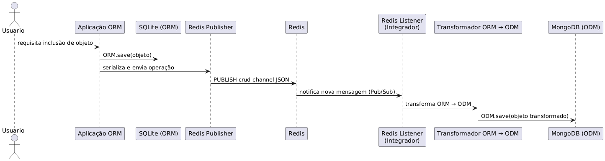

# Integrador Redis I: Arquitetura Pub/Sub e código-fonte básico para Sincronização de CRUD entre ORM e ODM

## 1. Objetivo

A integração entre dois ou mais sistemas de persistência é um desafio comum em arquiteturas modernas. Com o advento dos Web Services, REST APIs e microserviços, a necessidade de sincronizar dados entre diferentes bancos de dados se tornou uma prática recorrente. É comum ter sistemas com entidades comuns, como usuários, produtos ou pedidos, que precisam ser atualizados em múltiplos repositórios de dados, com diversas tecnologias de persistência, como bancos de dados relacionais e NoSQL.

Para resolver esse desafio, é necessário implementar uma arquitetura que permita a **sincronização de dados** entre esses sistemas de forma eficiente e confiável. A abordagem tradicional de replicação de dados pode ser complexa e difícil de manter, especialmente quando se lida com diferentes modelos de dados e tecnologias de persistência. Neste contexto, surgem diversas padrões arquiteturais, como: **[api gateway](https://microservices.io/patterns/apigateway.html)**, **web service façade** (vide figura abaixo), **[event sourcing](https://microservices.io/patterns/data/event-sourcing.html)**, entre outras. Essas abordagens visam desacoplar a lógica de negócios da persistência de dados, permitindo que as aplicações se comuniquem de forma mais flexível e escalável.

Neste contexto, o Redis se destaca como uma solução eficiente para implementar um **[barramento de eventos](https://dzone.com/articles/design-patterns-event-bus)** que permite a comunicação assíncrona entre diferentes sistemas de persistência. Utilizando o Redis, é possível desacoplar a lógica de negócios da persistência de dados, permitindo que as aplicações se comuniquem de forma mais flexível e escalável.

A arquitetura proposta tem como objetivo **sincronizar operações de escrita (CRUD)** entre dois sistemas distintos de persistência:

- **BD1**: um banco de dados relacional operado por um **ORM** (Object-Relational Mapping), utilizando **SQLite**;
- **BD2**: um banco de dados NoSQL operado por um **ODM** (Object-Document Mapping), utilizando **MongoDB**.

Essa integração é mediada por um **middleware em Java**, que atua como **ponte entre os dois repositórios**, garantindo consistência e interoperabilidade entre eles. O Redis é usado como **buffer de eventos e canal de comunicação 

## 2. Componentes Principais

## Diagrama de Componentes

O diagrama acima foi criado com o **PlantUML** e ilustra os principais componentes da arquitetura. O código-fonte do diagrama está disponível neste link:
[Diagrama PlantUML](https://www.plantuml.com/plantuml/uml/ZP9FRjKm4CRtFiMdie75A-fRia2bYa18VVp9OrTbCI-PfACwTcHFG0MnvG286x3W8Bq99y4EGUfJ6ecD4tc--SryCpwFIa77tXhBhK8zWdJNYaO2rohUcNWZRg10FMhV3zwnqxtUMaOMaEii6sC6gc-eOvpi9IhtX3CylYZEiC7RSfVE_VjBKNvoWYy60AvU35PgkljrzzDdHONDvZckIcuaujrui1AlELJcwmFaRIPlCxd8v9rtdIykLj352XgFjiVqdJIDvKyK6A-TSXUeyM5c_ik-p1qu3ZFoGo0NMn_wB9ry_lxsVIhvSDBfQKfwAPRGC4hMS5lX6Rn3IsB7mFzVgfXBbRl9X5blPSwVXrIPu-aiuokB-Rk-ogmriXHEDgRBXIMpsFCzMOekLtKiCCuhpy_Kjqiyi479DHyOFRj8NJhmKIWZd-x7moHuurNQv1Hwtn77AVYAqgKoehWwU2UVvu6a5vty_aZVhM7N83TYpjFVsDi_)

### Aplicação ORM (BD1)
- Persistência local de objetos em SQLite via ORM.
- Após cada operação de escrita (`CREATE`, `UPDATE`, `DELETE`), a aplicação **serializa a operação em JSON** e envia para o Redis através de um **Publisher**.

### Redis
- Atua como **barramento de eventos assíncrono** entre BD1 e BD2.
- Armazena e distribui mensagens via **canal Pub/Sub (`crud-channel`)**.
- Opcionalmente, pode ser configurado com persistência (AOF/RDB) e políticas de descarte para evitar estouro de memória.

### Middleware Integrador
- Implementado em Java, com uso da biblioteca **Lettuce** para comunicação com Redis.
- Contém um **Redis Listener** que fica assinando (`SUBSCRIBE`) os canais do Redis.
- Ao receber uma operação, **executa a transformação do modelo de dados**:
  - De ORM para ODM (SQLite → MongoDB).
  - Ou, no sentido inverso, de ODM para ORM (MongoDB → SQLite).
- Aplica a operação correspondente no banco de destino.

### Transformadores
- São responsáveis por **converter as representações de dados** entre os modelos relacionais e documentais.
- Garantem compatibilidade semântica entre os campos e estruturas de dados.

### Fila de Retry (Reprocessamento)
- Em caso de falha durante a operação (ex: MongoDB indisponível), a mensagem é registrada em uma fila de reprocessamento.
- Permite tentativas posteriores, garantindo **resiliência** do sistema.

### Aplicação ODM (BD2)
- Atua de forma semelhante à aplicação ORM, porém usando MongoDB e um ODM (como Morphia).
- Também publica eventos no Redis ao realizar operações de escrita, permitindo **sincronização bidirecional**.

## 3. Fluxo de Inclusão de Objeto (ORM → ODM)

1. O usuário cria um objeto na aplicação ORM.
2. O objeto é salvo localmente no banco SQLite via ORM.
3. A operação é serializada e publicada no Redis (`PUBLISH crud-channel {operation}`).
4. O listener do middleware recebe a mensagem via Pub/Sub.
5. A mensagem é convertida para um objeto compatível com o MongoDB.
6. O objeto é salvo via ODM no banco NoSQL.
7. Em caso de falha, a operação é registrada para reprocessamento posterior.

## 3.1. Diagrama de Sequência

O diagrama de sequência abaixo ilustra o fluxo de inclusão de um objeto do ORM para o ODM:

O código-fonte do diagrama está disponível neste link:
[Diagrama de Sequência PlantUML](https://www.plantuml.com/plantuml/uml/ZP9FRjKm4CRtFiMdie75A-fRia2bYa18VVp9OrTbCI-PfACwTcHFG0MnvG286x3W8Bq99y4EGUfJ6ecD4tc--SryCpwFIa77tXhBhK8zWdJNYaO2rohUcNWZRg10FMhV3zwnqxtUMaOMaEii6sC6gc-eOvpi9IhtX3CylYZEiC7RSfVE_VjBKNvoWYy60AvU35PgkljrzzDdHONDvZckIcuaujrui1AlELJcwmFaRIPlCxd8v9rtdIykLj352XgFjiVqdJIDvKyK6A-TSXUeyM5c_ik-p1qu3ZFoGo0NMn_wB9ry_lxsVIhvSDBfQKfwAPRGC4hMS5lX6Rn3IsB7mFzVgfXBbRl9X5blPSwVXrIPu-aiuokB-Rk-ogmriXHEDgRBXIMpsFCzMOekLtKiCCuhpy_Kjqiyi479DHyOFRj8NJhmKIWZd-x7moHuurNQv1Hwtn77AVYAqgKoehWwU2UVvu6a5vty_aZVhM7N83TYpjFVsDi_)

## 4.Características Arquiteturais

| Aspecto              | Descrição                                                                 |
|----------------------|---------------------------------------------------------------------------|
| **Assíncrona**        | A comunicação entre BD1 e BD2 é feita via Redis Pub/Sub, sem bloqueio.   |
| **Reativa**           | O integrador responde a eventos publicados no Redis.                     |
| **Bidirecional**      | Operações em BD2 também podem ser transformadas e aplicadas em BD1.      |
| **Tolerante a falhas**| Operações com erro são armazenadas para retry.                           |
| **Desacoplada**       | O middleware abstrai o acoplamento entre os dois sistemas.               |
| **Extensível**        | Pode-se incluir novas transformações, validadores, logs ou métricas.     |

## 5. Implementação Básica

Para provar o conceito de sincronização, segue uma implementação básica em Java utilizando o Redis como barramento de eventos. O código-fonte está disponível no repositório do GitHub:

