# Integrador Redis II: Sincronização de Dados entre Sistemas de Persistência - Transformação de Modelos com Apache Camel

## 1. Introdução

Este documento é parte de uma série de tutoriais sobre integração de sistemas utilizando Redis como canal de mensagens. Este tutorial é a continuação do Integrador Redis I, onde abordamos a arquitetura de integração e um exemplo básico de sincronização de dados. No Integrador Redis II, expandimos essa funcionalidade para incluir a transformação de modelos de dados utilizando o Apache Camel.

Relembrando a arquitetura do Integrador Redis I:

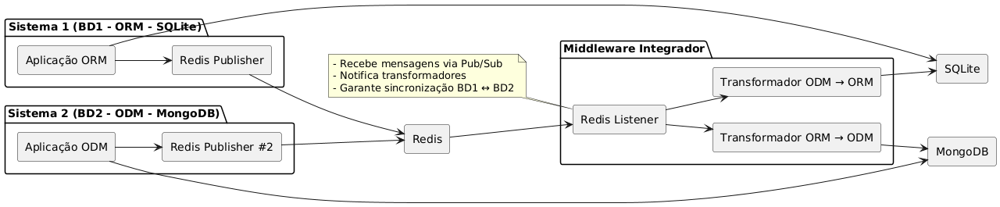

Figura 1: Arquitetura do Integrador Redis I

* **Redis Listener**: Um componente que escuta eventos de inserção, atualização e exclusão de dados no Redis.
* **Transformador de Modelos**: Um componente responsável por transformar os dados recebidos do Redis em um formato compatível com o sistema de persistência de destino (ORM/SQLite e ODM/MongoDB).

### 1.1. Problemas

A transformação de dados é um aspecto crítico em sistemas de integração, especialmente quando diferentes sistemas de persistência utilizam modelos de dados distintos. No Integrador Redis II, enfrentamos os seguintes problemas:

1. **Incompatibilidade de Modelos**: Os dados provenientes de diferentes fontes podem ter estruturas diferentes, o que dificulta a integração.
2. **Complexidade na Transformação**: A lógica de transformação pode ser complexa, exigindo um mapeamento cuidadoso entre os modelos de origem e destino.
3. **Desempenho**: A transformação de dados em tempo real pode impactar o desempenho do sistema, especialmente com grandes volumes de dados.

Para facilitar a transformação de modelos, há diversas abordagens e ferramentas disponíveis. Neste tutorial, utilizaremos o Apache Camel, uma ferramenta de integração que facilita a implementação de diversos padrões de integração, denominados como Enterprise Integration Patterns (EIPs).

## 1.2. Outros problemas

Outros problemas de integração que não serão tratados neste tutorial, mas que são importantes considerar em um sistema de integração completo, incluem:

1. **Manutenção**: A lógica de transformação deve ser facilmente mantida e atualizada conforme os modelos evoluem.
2. **Sincronização de Dados**: Garantir que os dados transformados sejam sincronizados corretamente entre os sistemas de persistência. Ex.
   - Inserção de dados no Redis deve refletir na base de dados ORM/SQLite e ODM/MongoDB.
   - Se um dos sistemas de persistência falhar, o sistema deve ser capaz de lidar com a inconsistência de dados. Exemplos:
     - Se o Redis falhar, os dados devem ser persistidos no Redis quando ele voltar.
     - Se o ORM/SQLite falhar, os dados devem ser persistidos no Redis e sincronizados quando o ORM/SQLite voltar.
     - Se o ODM/MongoDB falhar, os dados devem ser persistidos no Redis e sincronizados quando o ODM/MongoDB voltar.
   - Se algum dado for alterado manualmente em um dos sistemas de persistência, o integrador deve ser capaz de detectar e sincronizar essas alterações. Exemplos:
     - Se um dado for alterado no ORM/SQLite, o integrador deve atualizar o Redis e o ODM/MongoDB.
     - Se um dado for alterado no ODM/MongoDB, o integrador deve atualizar o Redis e o ORM/SQLite.

Os problemas de manutenção e sincronização de dados são complexos e exigem uma abordagem cuidadosa para garantir a integridade e a consistência dos dados em todo o sistema. Neste tutorial, focaremos na transformação de modelos, mas é importante ter em mente esses outros aspectos ao projetar um sistema de integração robusto.

## 2. Padrões de Projeto de Integração

Problemas de integração de dados são recorrentes de Engenharia de Software e a comunidade desenvolvedora com frequência propõe soluções para esses problemas através de padrões de projeto. Há diversas publicações na forma de livros, artigos e blogs que abordam esses padrões. Um dos mais conhecidos é o livro ["Enterprise Integration Patterns" de Gregor Hohpe e Bobby Woolf](#hohpe2004), que descreve uma série de padrões para resolver problemas comuns de integração.

Gregor Hohpe mantém um portal com uma lista de padrões de integração, que pode ser acessado em [Enterprise Integration Patterns](https://www.enterpriseintegrationpatterns.com/). Ele definiu [65 padrões de integração](https://www.enterpriseintegrationpatterns.com/patterns/messaging/), que são divididos em categorias como:
* Os **Padrões de Canal** descrevem como as mensagens são transportadas através de um Canal de Mensagens.
* Os **Padrões de Construção de Mensagens** descrevem a intenção, a forma e o conteúdo das mensagens que trafegam pelo sistema de mensagens.
* Os **Padrões de Roteamento** discutem como as mensagens são direcionadas de um remetente para o(s) destinatário(s) correto(s).
* Os **Padrões de Transformação** alteram o conteúdo de uma mensagem, por exemplo, para acomodar diferentes formatos de dados usados pelos sistemas de envio e recebimento. Dados podem precisar ser adicionados, removidos ou os dados existentes podem precisar ser reorganizados. O padrão base para esta seção é o Tradutor de Mensagens.
* Os **Padrões de Endpoint** descrevem como as aplicações produzem ou consomem mensagens.
* Os **Padrões de Gerenciamento de Sistemas** descrevem o que é necessário para manter um sistema complexo baseado em mensagens funcionando de forma robusta.

Padrões de Integração são uma forma de documentar soluções para problemas comuns de integração, permitindo que desenvolvedores e arquitetos de software reutilizem soluções comprovadas em seus projetos. A seguir, apresentamos os padrões de integração utilizados neste tutorial e os que serão implementados.

## 2.1. Padrões de Integração Utilizados

Há diversos livros e artigos que abordam e catalogam padrões de integração. Um dos mais conhecidos é o livro ["Enterprise Integration Patterns" de Gregor Hohpe e Bobby Woolf](#hohpe2004), que descreve uma série de padrões para resolver problemas comuns de integração. Abaixo, apresentamos uma imagem que ilustra a linguagem de padrões de integração proposta por Hohpe e Woolf:

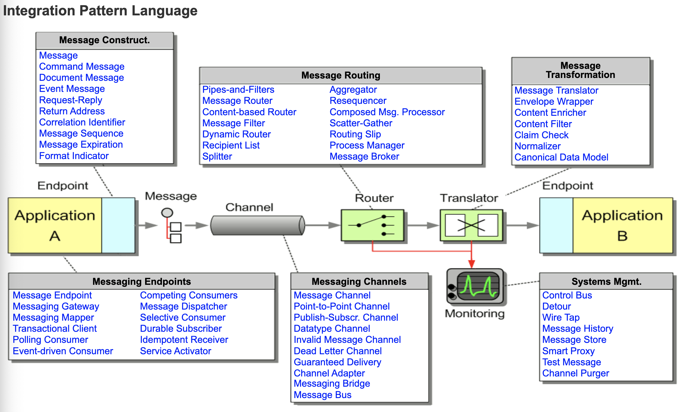
Figura 2: Linguagem de Padrões de Integração - Fonte: [Enterprise Integration Patterns](https://www.enterpriseintegrationpatterns.com/)

No estudo de caso desta série de tutoriais, diversos padrões de integração são utilizados, incluindo:
* **[Mensagem de Evento (Event Message)](https://www.enterpriseintegrationpatterns.com/patterns/messaging/EventMessage.html)**: Representa uma notificação de que algo aconteceu em um sistema, como a inserção, atualização ou exclusão de dados.
* **[Canal Publicador-Assinante (Publisher-Subscriber Channel)](https://www.enterpriseintegrationpatterns.com/patterns/messaging/PublishSubscribeChannel.html)**: Um canal de mensagens onde os remetentes publicam mensagens e os destinatários se inscrevem para receber essas mensagens.
* **[Consumidor Orientado a Evento (Event-Driven Consumer)](https://www.enterpriseintegrationpatterns.com/patterns/messaging/EventDrivenConsumer.html)**: Um consumidor que reage a eventos recebidos através de um canal de mensagens.

## 2.2. Padrões de Integração a serem implementados

Além dos padrões de integração relacionados ao canal e construção de mensagem, há outros padrões descritos por Hohpe e Woolf para roteamento e transformação de mensagens. Os padrões de integração que serão utilizados neste tutorial incluem:
* **[Roteador de Mensagens (Message Router)](https://camel.apache.org/manual/latest/message-router.html)**: Um componente que direciona mensagens para diferentes destinos com base em regras definidas.
* **[Transformador de Mensagens (Message Translator)](https://www.enterpriseintegrationpatterns.com/patterns/messaging/MessageTranslator.html)**: Um componente que transforma o conteúdo de uma mensagem de um formato para outro, permitindo a compatibilidade entre diferentes sistemas de persistência.
* **[Modelo de Dados Canônico (Canonical Data Model)](https://www.enterpriseintegrationpatterns.com/patterns/messaging/CanonicalDataModel.html)**: Um modelo de dados comum que serve como intermediário entre diferentes sistemas, evitando o acoplamento de modelos entre si.

Os três padrões de integração mencionados acima serão utilizados e implementados neste estudo de caso. O Roteador de Mensagens permite direcionar as mensagens para o transformador correto, enquanto o Transformador de Mensagens realiza a transformação propriamente dita. O Modelo de Dados Canônico serve como um intermediário entre os diferentes sistemas, garantindo que as mensagens sejam compatíveis entre si.

## 3. Modelagem do Estudo de Caso

### 3.1. Diagrama de Classes

Considerando que o objetivo do integrador é transformar modelos de dados entre diferentes sistemas de persistência, são necessários dois diagramas de classes: um para o modelo baseado em ORM/SQLite e outro para o modelo baseado em ODM/MongoDB.

Como estudo de caso, considere dois sistemas com camadas de persistência distintas:

* **Sistema de Gestão Acadêmica (SGA)**: responsável pela gestão dos processos acadêmicos de uma universidade. Entre suas principais entidades estão: *Estudante*, *Disciplina*, *Turma* e *Matrícula*.

* **Sistema de Biblioteca (SB)**: responsável pela gestão dos empréstimos de livros aos estudantes. Suas principais entidades incluem: *Estudante*, *Livro* e *Empréstimo*.

Para fins de integração, a entidade *Estudante* deve ser compartilhada entre os dois sistemas. No SB, o estudante deve possuir um *status de matrícula* que determina se ele está autorizado a realizar empréstimos. Já no SGA, o estudante deve possuir um atributo que indica o *status de empréstimo de livros* (por exemplo, `QUITADO` ou `EM_ABERTO`), o qual impacta diretamente na autorização para emissão do diploma.

Abaixo estão os diagramas de classes para cada sistema:

### 3.2. Modelo SGA: ORM/SQLite

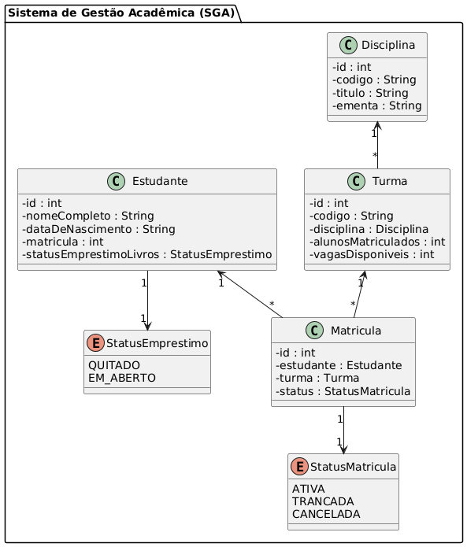

Figura 3: Diagrama de Classes do Modelo SGA, implementado com ORM/SQLite

O código-fonte do diagrama de classes do modelo ORM/SQLite pode ser encontrado em [modelo_orm_sqlite.puml](modelo_orm_sqlite.puml).

* **Estudante**: Representa um aluno da instituição. Possui um relacionamento "1:N" com a entidade *Matricula*, ou seja, um estudante pode se matricular em várias turmas. Também possui um atributo *statusEmprestimoLivros*, que indica a situação do estudante quanto a pendências com a biblioteca (ex: `QUITADO`, `EM_ABERTO`).
* **Disciplina**: Representa um componente curricular. Possui um relacionamento "1:N" com a entidade *Turma*, indicando que uma disciplina pode ser oferecida em várias turmas.
* **Turma**: Representa uma oferta específica de uma disciplina. Possui um relacionamento "N:1" com *Disciplina* e "1:N" com *Matricula*, ou seja, cada turma pertence a uma disciplina e pode ter várias matrículas.
* **Matricula**: Representa o vínculo entre um estudante e uma turma. Possui relacionamentos "N:1" com *Estudante* e *Turma*, e "1:1" com *StatusMatricula*. Ou seja, a matrícula estabelece uma relação N:M entre estudantes e turmas, com um status associado a cada vínculo.
* **StatusMatricula**: Enumeração que indica o estado de uma matrícula (ex: `ATIVA`, `TRANCADA`, `CANCELADA`). Cada matrícula possui exatamente um status associado.
* **StatusEmprestimo**: Enumeração que indica a situação dos empréstimos de livros do estudante, usada para fins administrativos (ex: impedir emissão de diploma). Os valores possíveis são `QUITADO` e `EM_ABERTO`.


### 3.3. Modelo SB: ODM/MongoDB

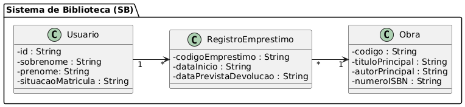

Figura 4: Diagrama de Classes do Modelo SB, implementado com ODM/MongoDB

O código-fonte do diagrama de classes do modelo do Sistemas de Bibliotecas (ODM/MongoDB) pode ser encontrado em [modelo_odm_mongodb.puml](modelo_odm_mongodb.puml).

* **Usuario**: Representa um estudante cadastrado no sistema de biblioteca. O campo `id` é uma `String` que armazena o valor do `ObjectId` do MongoDB (formato hash), usado como identificador único do documento. O nome completo do usuário é representado de forma separada pelos campos `prenome` e `sobrenome`, permitindo maior flexibilidade para ordenação, buscas e formatação. O campo `situacaoMatricula` indica a situação acadêmica do usuário (por exemplo: ATIVO, INATIVO), utilizada para autorizar ou restringir empréstimos.

* **RegistroEmprestimo**: Representa o empréstimo de uma obra a um usuário. Armazena o código do empréstimo e as datas de início e previsão de devolução. Cada registro de empréstimo está associado a um único usuário e a uma única obra.

* **Obra**: Representa um livro ou material disponível para empréstimo. Contém dados bibliográficos como o código, título principal, autor principal e número ISBN. Uma mesma obra pode ser associada a vários registros de empréstimo ao longo do tempo.


### 3.4. Modelo de Dados Canônico

Para facilitar a transformação entre os modelos ORM/SQLite e ODM/MongoDB, é necessário definir um Modelo de Dados Canônico (MDC) que sirva como intermediário. O MDC deve conter os atributos comuns entre os dois modelos, permitindo que as transformações sejam realizadas de forma eficiente.

O MDC é um padrão de integração que minimiza as dependências entre os sistemas de persistência, evitando-se que diversos sistemas dependam diretamente uns dos outros. Em vez disso, todos os sistemas dependem do MDC, que atua como um intermediário entre eles. A figura abaixo ilustra o MDC proposto por [Hohpe e Woolf (2004)](#hohpe2004):


Figura 5: Modelo de Dados Canônico - Fonte: [Enterprise Integration Patterns](https://www.enterpriseintegrationpatterns.com/patterns/messaging/CanonicalDataModel.html)

Na figura acima, os sistemas A, B e C e D dependem do MDC, mas cada um não dependem diretamente dos outros. Isso permite que os sistemas sejam desacoplados, facilitando a manutenção e evolução dos modelos de dados.

### 3.5. 🧩 Tabela Comparativa: `Estudante` (SGA) × `Usuario` (SB)

| Atributo em `Estudante` (SGA)     | Atributo em `Usuario` (SB)     | Equivalência Semântica | Observações                                                                 |
|----------------------------------|--------------------------------|--------------------------|------------------------------------------------------------------------------|
| `id` (int)                       | `id` (String)                  | ✅ Sim                   | Ambos representam identificadores únicos; no SB, é um hash (ObjectId) em String |
| `nomeCompleto` (String)          | `prenome` + `sobrenome`        | ✅ Sim                   | `nomeCompleto` pode ser reconstruído a partir da concatenação dos dois campos |
| `dataDeNascimento` (String)     | *(ausente)*                    | ⚠️ Parcial               | Presente apenas no SGA                                                       |
| `matricula` (int)                | *(ausente)*                    | ⚠️ Parcial               | Pode ser derivada ou ignorada, dependendo das regras do integrador           |
| `statusEmprestimoLivros` (enum) | *(ausente)*                    | ❌ Não                   | Campo específico do SGA usado para controle de pendências com a biblioteca   |
| *(ausente)*                      | `situacaoMatricula` (String)   | ❌ Não                   | Campo específico do SB usado para liberar ou bloquear empréstimos            |

### 3.6. Identificador Canônico e Entidade de Mapeamento

Para que o Modelo de Dados Canônico (MDC) cumpra seu papel de forma eficaz, é fundamental que cada entidade integrada entre os sistemas possua um **identificador universal**, denominado `idCanonico`. Esse identificador atua como chave primária no domínio canônico e deve ser **independente dos identificadores locais** usados por cada sistema de origem ou destino.

A adoção de um `idCanonico` baseado em **[UUID (Universally Unique Identifier)](https://pt.wikipedia.org/wiki/UUID)** traz benefícios importantes: promove o **desacoplamento entre os sistemas**, assegura **unicidade global** e permite que o integrador opere de forma neutra em relação às tecnologias de persistência utilizadas. Enquanto isso, os sistemas originais — como o SGA (com `id` inteiro) e o SB (com `id` em formato de hash) — continuam utilizando seus próprios identificadores.

Para permitir a correspondência entre esses identificadores locais e o canônico, define-se uma **entidade de mapeamento de IDs**, chamada `MapeamentoID`. Essa entidade relaciona o `idCanonico` aos identificadores específicos de cada sistema (`idSGA`, `idSB`) e registra o momento da última sincronização. Ela permite que o integrador **localize, atualize e reconcilie entidades** de forma segura e rastreável. Um benefício central dessa abordagem é o suporte à **[idempotência](https://www.enterpriseintegrationpatterns.com/patterns/messaging/IdempotentReceiver.html)**, ou seja, a garantia de que operações repetidas não causarão efeitos duplicados — característica essencial em cenários com reprocessamentos, mensagens duplicadas ou falhas temporárias.

Além disso, o uso do `idCanonico` junto à entidade `MapeamentoID` torna o modelo naturalmente **extensível**: caso um novo sistema venha a ser integrado, basta adicionar um novo campo de identificador ao mapeamento e os atributos relevantes ao MDC, sem necessidade de alterar os sistemas existentes. Isso torna a arquitetura preparada para evoluir de forma sustentável e desacoplada.

### 3.7. Modelo de Dados Canônico Proposto

Com base na análise comparativa entre os modelos de dados dos sistemas SGA e SB, propõe-se um Modelo de Dados Canônico (MDC) que representa uma abstração comum da entidade *Estudante*. O MDC unifica os atributos compartilhados, normaliza diferenças estruturais e acomoda informações específicas de cada sistema, permitindo uma transformação eficiente e desacoplada.

A estrutura proposta inclui atributos como `idCanonico`, que é um identificador universal baseado em UUID, e os campos `prenome` e `sobrenome`, derivados da separação do `nomeCompleto` utilizado no SGA. Atributos relevantes para ambos os domínios, como `statusBiblioteca` (proveniente do SGA) e `statusAcademico` (presente no SB), também são incorporados ao modelo, assegurando uma visão unificada do estudante em diferentes contextos.

Além disso, para viabilizar a correspondência entre os identificadores locais dos sistemas e o identificador canônico, define-se uma entidade auxiliar denominada `MapeamentoID`. Essa entidade registra os vínculos entre `idCanonico`, `idSGA` e `idSB`, além de armazenar a data da última sincronização. Esse componente é essencial para garantir rastreabilidade, consistência e idempotência na integração entre os sistemas.

A seguir, apresenta-se o diagrama de classes do modelo canônico proposto, incluindo a entidade de mapeamento de IDs:

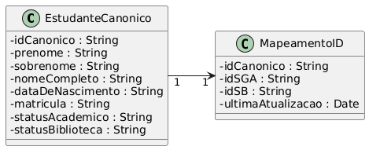

Figura 6: Diagrama de Classes do Modelo de Dados Canônico, código-fonte disponível em [modelo_de_dados_canonico.puml](modelo_de_dados_canonico.puml).

## 4. Implementação

Como foi visto anteriormente, a arquitetura utilizada no integrador é publicador-assinante, onde o Redis atua como canal de mensagens. O SGA e o SB publicam eventos de inserção, atualização e exclusão de dados no Redis, e um consumidor de eventos é responsável por processar esses eventos e realizar as transformações necessárias entre os modelos ORM/SQLite e ODM/MongoDB.

Portanto, a implementação do integrador envolve as seguintes etapas:
1. **Adaptação do SGA e SB para publicar eventos CRUD no Redis**: Modificar os sistemas SGA e SB para que publiquem eventos de inserção, atualização e exclusão de dados no Redis.
2. **Implementação do consumidor de eventos**: Criar um componente que consome os eventos publicados no Redis e realiza as transformações necessárias entre os modelos ORM/SQLite e ODM/MongoDB.
3. **Implementação dos transformadores ORM -> ODM e ODM -> ORM**: Criar transformadores que convertem os dados entre os modelos ORM/SQLite e ODM/MongoDB, garantindo que as informações sejam corretamente mapeadas entre os sistemas.

O código-fonte do integrador pode ser encontrado na [pasta code do repositório integrador-redis2](https://github.com/marceloakira/tutorials/tree/main/integrador-redis2/code). Foram criados 5 projetos Maven independentes, cada um com seu próprio `pom.xml` e estrutura de diretórios.

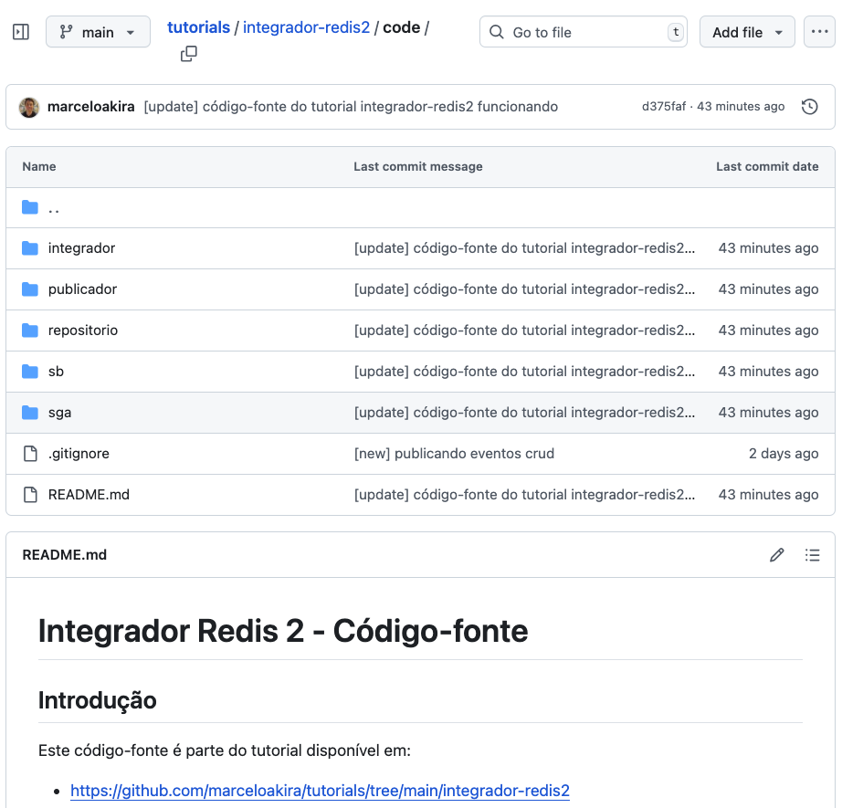

Cada projeto possui uma função específica:
* **sb**: Implementa o Sistema de Biblioteca (SB) com a camada de persistência ODM/MongoDB.
* **sga**: Implementa o Sistema de Gestão Acadêmica (SGA) com a camada de persistência ORM/SQLite.
* **publicador**: Implementa o módulo de publicação de eventos no Redis, que será utilizado pelo SGA e SB.
* **repositório**: Implementa o repositório genérico que realiza operações CRUD e publica eventos no Redis.
* **integrador**: Implementa o integrador que consome os eventos do Redis e realiza as transformações entre os modelos de dados.

As instruções de compilação e execução dos projetos estão disponíveis no arquivo `README.md` da pasta do código-fonte. A seguir, detalharemos as etapas de adaptação dos sistemas SGA e SB para publicar eventos no Redis, a implementação do consumidor de eventos e os transformadores de modelos.

### 4.1. Adaptação para a Produção de Eventos

Para que o SGA e o SB publiquem eventos de inserção, atualização e exclusão de dados no Redis, é necessário adaptar os módulos de cada sistema para incluir a lógica de publicação de eventos. Essa adaptação envolve a implementação de um publicador que envia mensagens para um canal específico do Redis sempre que uma operação CRUD é realizada.

Outro ponto importante é garantir que os eventos sejam publicados de forma assíncrona, para não bloquear as operações dos sistemas. O Redis oferece suporte a publicadores-assinantes, permitindo que os sistemas publiquem eventos em canais específicos e que o consumidor de eventos escute esses canais para processar as mensagens. Há outras ferramentas que também podem ser utilizadas para publicar eventos, como Apache Kafka, RabbitMQ, ActiveMQ, etc. No entanto, neste tutorial, optamos por utilizar o Redis como opção de banco de dados NoSQL mais aderente ao propósito da disciplina.

Outro módulo que será criado é o repositório, que será responsável por persistir os dados no Redis. O repositório deve ser capaz de lidar com as operações CRUD e publicar os eventos correspondentes no canal do Redis através do módulo publicador. Este módulo é genérico, ou seja, realiza operações CRUD para qualquer entidade, inicialmente desenvolvido para o SGA em [tutorial anterior](https://github.com/marceloakira/tutorials/tree/main/javafx-crud2#parte-1-reuso-na-camada-modelo). 

#### Módulo Publicador

O módulo publicador foi explicado no [tutorial anterior](https://github.com/marceloakira/tutorials/tree/main/integrador-redis). Foi implementado usando GSon como serializador/desserializador de objetos Java para JSON e Lettuce como cliente assíncrono para o Redis.

#### Módulo Repositório

O módulo repositório foi implementado em [tutorial anterior](https://github.com/marceloakira/tutorials/tree/main/javafx-crud2) e corresponde às classes `Repositório` e `Database`. A diferença é que o repositório pode publicar eventos no Redis através do módulo publicador, por meio do método `publishCrudOperation(CrudOperation.OperationType operationType, T entity)`:

```java
    /**
     * Publica uma operação CRUD no Redis.
     * @param operationType Tipo da operação (CREATE, UPDATE, DELETE)
     * @param entity Entidade envolvida na operação
     */
    private void publishCrudOperation(CrudOperation.OperationType operationType, T entity) {
        try {
            String entityName = entityClass.getSimpleName();
            String entityJson = gson.toJson(entity);
            String timestamp = LocalDateTime.now().format(DateTimeFormatter.ISO_LOCAL_DATE_TIME);
            
            CrudOperation operation = new CrudOperation(
                entityName, 
                operationType, 
                CrudOperation.Source.ORM, 
                entityJson, 
                timestamp
            );
            redisPublisher.publishOperation(operation);
        } catch (Exception e) {
            System.err.println("Erro ao publicar operação no Redis: " + e.getMessage());
        }
    }
```

Desta forma, sempre que uma operação CRUD for realizada no repositório, um evento correspondente será publicado no Redis. O evento contém informações sobre o tipo de operação (inserção, atualização ou exclusão), a entidade afetada e um timestamp. Para que o evento seja publicado, os métodos create, update e delete do repositório devem chamar o método `publishCrudOperation` após a operação ser concluída com sucesso. Segue o código do método `create` como exemplo:

```java
    /**
     * Cria uma nova entidade no banco de dados.
     * @param entity Entidade a ser criada
     * @return Entidade criada
     */
    public T create(T entity) {
        try {
            System.out.println("🔍 Criando entidade: " + entity);
            int nrows = dao.create(entity);
            if (nrows == 0)
                throw new SQLException("Error: object not saved");
            this.loadedEntity = entity;
            loadedEntities.add(entity);
            
            // Publicar operação CREATE no Redis
            if (enableCrudPublishing) {
                System.out.println("✅ Entidade criada: " + entity);
                System.out.println("  - Operation: CREATE");
                publishCrudOperation(CrudOperation.OperationType.CREATE, entity);
            }
        } catch (SQLException e) {
            System.out.println(e);
            e.printStackTrace();
        }
        return entity;
    }
```

O atributo `enableCrudPublishing` deve ser configurado como `true` para que os eventos sejam publicados no Redis. Caso contrário, as operações CRUD serão realizadas normalmente, mas sem a publicação dos eventos.

Como o objetivo deste tutorial é demonstrar a integração entre os sistemas SGA e SB, o módulo repositório foi adaptado para publicar eventos no Redis. Portanto, neste tutorial as classes `Repositório` e `Database` foram removidas da camada model do [tutorial anterior](https://github.com/marceloakira/tutorials/tree/main/javafx-crud2). As classes `Estudante`, `Disciplina`, dentre outras continuam intactas, sem modificações.

### 4.2. Verificando a Publicação de Eventos no Redis

Para verificar se os eventos estão sendo publicados corretamente no Redis, você pode usar o serviço de escuta de eventos do Redis - `RedisListenerServer` - apresentado no [tutorial anterior](https://github.com/marceloakira/tutorials/tree/main/javafx-crud2). Para executá-lo, basta clonar o projeto, entrar na pasta `code/publicador` e executar os comandos:

```bash
cd code/publicador
mvn clean compile
mvn exec:java -Dexec.mainClass="br.ufg.inf.publicador.RedisListenerServer"
```

A seguinte mensagem deve ser exibida no console:

```
🟢 Escutando notificações Redis de forma assíncrona...
```

Para testar a publicação de eventos, foram criados testes unitários para o módulo repositório, que realizam operações CRUD e verificam se os eventos são publicados corretamente no Redis. Os testes estão localizados na classe `code/repositorio/src/test/java/br/ufg/inf/repositorio/RepositorioTest`:

```java
package br.ufg.inf.repositorio;

import org.junit.jupiter.api.Test;
import org.junit.jupiter.api.BeforeEach;
import org.junit.jupiter.api.AfterEach;
import static org.junit.jupiter.api.Assertions.*;

import com.j256.ormlite.field.DatabaseField;
import com.j256.ormlite.table.DatabaseTable;

import java.io.File;

/**
 * Testes básicos para as classes Database e Repositorio.
 */
public class RepositorioTest {
    
    private Database database;
    private Repositorio<TestEntity, Long> repositorio;
    private final String testDbName = "test_repositorio.sqlite";
    
    @DatabaseTable(tableName = "test_entity")
    public static class TestEntity {
        @DatabaseField(generatedId = true)
        private Long id;
        
        @DatabaseField
        private String nome;
        
        public TestEntity() {
            // Construtor padrão necessário para ORMLite
        }
        
        public TestEntity(String nome) {
            this.nome = nome;
        }
        
        // Getters e setters
        public Long getId() { return id; }
        public void setId(Long id) { this.id = id; }
        
        public String getNome() { return nome; }
        public void setNome(String nome) { this.nome = nome; }
        
        @Override
        public String toString() {
            return "TestEntity{id=" + id + ", nome='" + nome + "'}";
        }
    }
    
    @BeforeEach
    public void setUp() {
        // Remove o arquivo de teste se existir
        File testFile = new File(testDbName);
        if (testFile.exists()) {
            testFile.delete();
        }
        
        database = new Database(testDbName);
        repositorio = new Repositorio<>(database, TestEntity.class);
    }
    
    @AfterEach
    public void tearDown() {
        if (database != null) {
            database.close();
        }
        
        // Remove o arquivo de teste
        File testFile = new File(testDbName);
        if (testFile.exists()) {
            testFile.delete();
        }
    }
    
    @Test
    public void testDatabaseConnection() throws Exception {
        assertNotNull(database.getConnection());
        // Verifica se a conexão não é nula, o que indica que foi criada com sucesso
    }
    
    @Test
    public void testCreateEntity() {
        TestEntity entity = new TestEntity("Teste");
        TestEntity created = repositorio.create(entity);
        
        assertNotNull(created);
        assertNotNull(created.getId());
        assertEquals("Teste", created.getNome());
    }
    
    @Test
    public void testLoadFromId() {
        // Criar uma entidade
        TestEntity entity = new TestEntity("Teste Load");
        TestEntity created = repositorio.create(entity);
        
        // Carregar por ID
        TestEntity loaded = repositorio.loadFromId(created.getId());
        
        assertNotNull(loaded);
        assertEquals(created.getId(), loaded.getId());
        assertEquals("Teste Load", loaded.getNome());
    }
    
    @Test
    public void testLoadAll() {
        // Criar algumas entidades
        repositorio.create(new TestEntity("Entidade 1"));
        repositorio.create(new TestEntity("Entidade 2"));
        repositorio.create(new TestEntity("Entidade 3"));
        
        // Carregar todas
        var entities = repositorio.loadAll();
        
        assertNotNull(entities);
        assertEquals(3, entities.size());
    }
    
    @Test
    public void testUpdate() {
        // Criar uma entidade
        TestEntity entity = new TestEntity("Nome Original");
        TestEntity created = repositorio.create(entity);
        
        // Atualizar
        created.setNome("Nome Atualizado");
        repositorio.update(created);
        
        // Verificar se foi atualizada
        TestEntity loaded = repositorio.loadFromId(created.getId());
        assertEquals("Nome Atualizado", loaded.getNome());
    }
    
    @Test
    public void testDelete() {
        // Criar uma entidade
        TestEntity entity = new TestEntity("Para Deletar");
        TestEntity created = repositorio.create(entity);
        Long id = created.getId();
        
        // Deletar
        repositorio.delete(created);
        
        // Verificar se foi deletada
        TestEntity loaded = repositorio.loadFromId(id);
        assertNull(loaded);
    }
}
```

O teste é bastante auto-contido, ou seja, ele configura seu próprio ambiente, executa as operações necessárias e verifica os resultados, tudo dentro de um único método de teste. Isso facilita a compreensão e manutenção dos testes. Uma entidade de teste `TestEntity` foi criada para representar uma entidade simples com um campo `nome`. Os testes cobrem as operações básicas de criação, carregamento, atualização e exclusão de entidades no repositório. Um arquivo de banco de dados SQLite chamado `test_repositorio.sqlite` é criado durante os testes e removido após a execução. Os testes garantem que as operações CRUD funcionem corretamente.

Para executar os testes, você pode usar o Maven. Basta entrar na pasta `code/repositorio` e executar os seguintes comandos:

```bash
cd code/repositorio
mvn clean test
```

Para verificar se os eventos foram publicados no Redis, verifique se mensagens semelhantes a estas aparecem no console do `RedisListenerServer`:

```
🔔 [crud-channel] {"entity":"TestEntity","operation":"CREATE","source":"ORM","data":"{\"id\":1,\"nome\":\"Para Deletar\"}","timestamp":"2025-07-27T12:51:39.88406"}
12:51:39.923 [lettuce-nioEventLoop-4-1] DEBUG io.lettuce.core.protocol.CommandHandler -- [channel=0x4200d860, /127.0.0.1:49617 -> localhost/127.0.0.1:6379, epid=0x1, chid=0x1] Received: 190 bytes, 0 commands in the stack
12:51:39.923 [lettuce-nioEventLoop-4-1] DEBUG io.lettuce.core.protocol.RedisStateMachine -- Decode done, empty stack: true
🔔 [crud-channel] {"entity":"TestEntity","operation":"DELETE","source":"ORM","data":"{\"id\":1,\"nome\":\"Para Deletar\"}","timestamp":"2025-07-27T12:51:39.908326"}
12:51:39.955 [lettuce-nioEventLoop-4-1] DEBUG io.lettuce.core.protocol.CommandHandler -- [channel=0x4200d860, /127.0.0.1:49617 -> localhost/127.0.0.1:6379, epid=0x1, chid=0x1] Received: 191 bytes, 0 commands in the stack
12:51:39.956 [lettuce-nioEventLoop-4-1] DEBUG io.lettuce.core.protocol.RedisStateMachine -- Decode done, empty stack: true
🔔 [crud-channel] {"entity":"TestEntity","operation":"CREATE","source":"ORM","data":"{\"id\":1,\"nome\":\"Nome Original\"}","timestamp":"2025-07-27T12:51:39.935287"}
12:51:39.973 [lettuce-nioEventLoop-4-1] DEBUG io.lettuce.core.protocol.CommandHandler -- [channel=0x4200d860, /127.0.0.1:49617 -> localhost/127.0.0.1:6379, epid=0x1, chid=0x1] Received: 193 bytes, 0 commands in the stack
12:51:39.974 [lettuce-nioEventLoop-4-1] DEBUG io.lettuce.core.protocol.RedisStateMachine -- Decode done, empty stack: true
🔔 [crud-channel] {"entity":"TestEntity","operation":"UPDATE","source":"ORM","data":"{\"id\":1,\"nome\":\"Nome Atualizado\"}","timestamp":"2025-07-27T12:51:39.958644"}
```

Caso você não veja mensagens semelhantes no console do `RedisListenerServer`, verifique se o servidor Redis está em execução e se a configuração do canal está correta. 

Com isso a camada de persistência do SGA está pronta para publicar eventos no Redis. O próximo passo é implementar o consumidor de eventos que irá processar esses eventos e realizar as transformações necessárias entre os modelos ORM/SQLite e ODM/MongoDB.

### 4.3. Implementação do Consumidor de Eventos

Para consumir eventos, podemos usar algum componente de conexão do [Apache Camel](https://camel.apache.org/). Além de conectar com diversos serviços, esta biblioteca de integração também facilita a criação de rotas de mensagens e transformações de dados entre diferentes sistemas. Há uma lista de centenas de componentes disponíveis no [site do Apache Camel](https://camel.apache.org/components). Para consumir eventos do Redis, há apenas um componente disponível, que é o [Spring Redis](https://camel.apache.org/components/latest/redis-component.html):

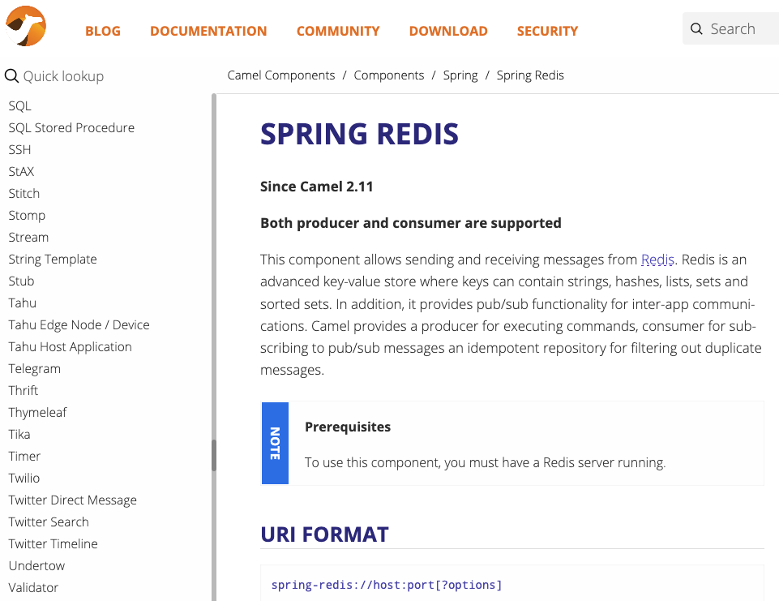

Nos testes de implementação, esse componente não funcionou adequadamente, então optamos por implementar um consumidor de eventos utilizando o cliente assíncrono Lettuce, que já foi utilizado no módulo publicador. O código do consumidor de eventos está localizado na classe `br.ufg.inf.integrador.RedisListener`:

```java
public class RedisListener {

    private final ProducerTemplate producer;

    public RedisListener(ProducerTemplate producer) {
        this.producer = producer;
    }

    public void start() {
        RedisClient client = RedisClient.create("redis://localhost:6379");
        StatefulRedisPubSubConnection<String, String> connection = client.connectPubSub();

        connection.addListener(new RedisPubSubAdapter<String, String>() {
            @Override
            public void message(String channel, String message) {
                System.out.printf("🔔 [%s] %s%n", channel, message);

                // Envia a mensagem para o Camel
                producer.sendBody("direct:crud", message);
            }
        });

        connection.sync().subscribe("crud-channel");

        System.out.println("🟢 Escutando canal Redis: crud-channel");
    }
}
```

O consumidor de eventos utiliza o cliente Lettuce para se conectar ao Redis e assinar o canal `crud-channel`. Quando uma mensagem é recebida, ela é enviada para o Apache Camel através do [ProducerTemplate](https://camel.apache.org/manual/producertemplate.html), que encaminha a mensagem para a rota (endpoint) definida no Camel. A classe `ProducerTemplate` é responsável por enviar mensagens para uma rota específica do Camel, que neste caso é o endpoint `direct:crud`:

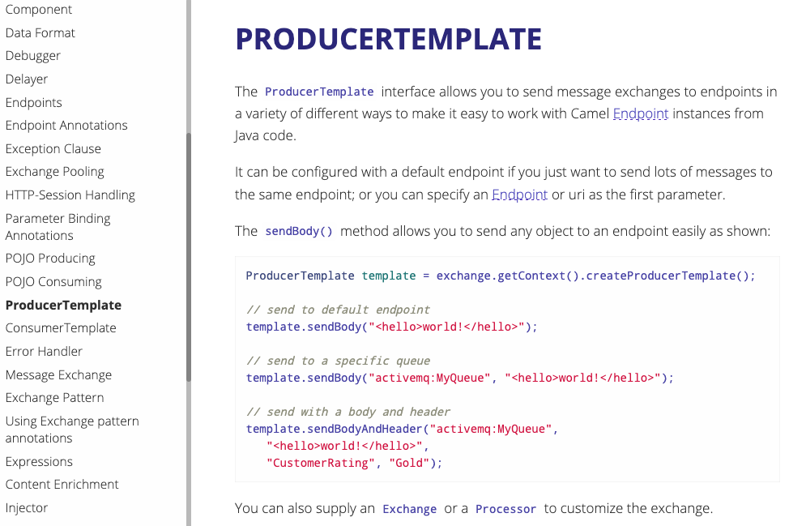

Para executar o consumidor de eventos, você pode criar uma classe principal que inicializa o Camel e o RedisListener. O código da classe principal está localizado em `br.ufg.inf.integrador.Main`:

```java
package br.ufg.inf.integrador;

import br.ufg.inf.integrador.redis.RedisListener;
import br.ufg.inf.integrador.routes.CrudTransformRoute;
import org.apache.camel.CamelContext;
import org.apache.camel.impl.DefaultCamelContext;

public class Main {
    public static void main(String[] args) throws Exception {
        CamelContext context = new DefaultCamelContext();
        context.addRoutes(new CrudTransformRoute());
        context.start();

        // Produz mensagem para rota a partir do Redis
        new RedisListener(context.createProducerTemplate()).start();

        Thread.currentThread().join(); // mantém aplicação viva
    }
}
```

A classe `Main` inicializa o Camel e adiciona a rota de transformação de CRUD, que será explicada na próxima seção. Em seguida, cria uma instância do `RedisListener` e inicia a escuta do canal `crud-channel`. O método `Thread.currentThread().join()` é utilizado para manter a aplicação em execução, aguardando eventos do Redis.

A rota de transformação foi incluída no [contexto do Camel](https://camel.apache.org/manual/camelcontext.html). O conceito de contexto do Camel é fundamental para entender como as rotas e os componentes interagem entre si:

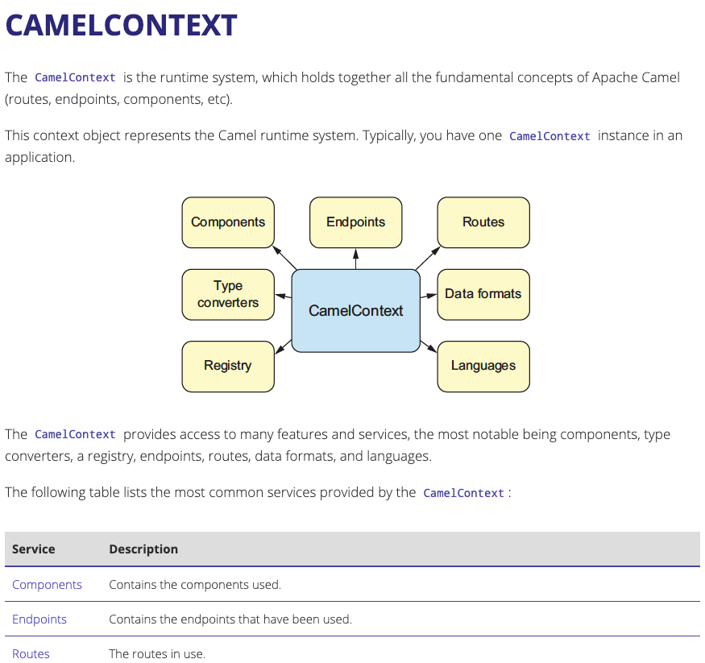

Na próxima seção, veremos como implementar a rota de transformação de CRUD, que será responsável por processar as mensagens recebidas do Redis e realizar as transformações necessárias entre os modelos ORM/SQLite e ODM/MongoDB.

### 4.4. Implementação dos Transformadores de Modelos

#### Rota de Transformação de CRUD

O código-fonte do transformador de modelos está localizado na classe `br.ufg.inf.integrador.routes.CrudTransformRoute`. Esta classe define uma rota do Apache Camel que consome mensagens do endpoint `direct:crud` e realiza as transformações necessárias entre os modelos ORM/SQLite e ODM/MongoDB:

```java
public class CrudTransformRoute extends RouteBuilder {

    private final Gson gson = new Gson();

    @Override
    public void configure() {

        from("direct:crud")
            .routeId("crud-transformer")
            .log("📥 Mensagem recebida: ${body}")
            
            // Prepara headers e propriedades
            .process(this::setOperationHeaders)

            // Transforma o corpo JSON original para o formato necessário (ex: Usuario)
            .process(new CrudProcessor())

            .choice()
                .when(exchangeProperty("CamelSkipSendToEndpoint").isNotEqualTo(true))
                    .log("✅ JSON processado: ${body}")
                    .setHeader("Content-Type", constant("application/json;charset=UTF-8"))

                    // Envia para o endpoint determinado dinamicamente
                    .toD("${header.targetEndpoint}")

                    // Loga a resposta HTTP
                    .log("📤 Resposta HTTP: Status=${header.CamelHttpResponseCode}, Body=${body}")

                    // 🔁 Persistência local (canonico + mapeamento) apenas para entidade Estudante/CREATE
                    .filter().simple("${exchangeProperty.crudEntity.toLowerCase()} == 'estudante' && ${exchangeProperty.crudOperation} == 'CREATE'")
                        .process(new PersistenciaCanonicoProcessor())
                    .endChoice()

                .otherwise()
                    .log("⚠️ Mensagem ignorada pelo processador");
    }
    ...
}
```

A [rota](https://camel.apache.org/manual/route-builder.html) é configurada por meio de uma [linguagem de domínio específica (DSL) do Apache Camel](https://camel.apache.org/manual/routes.html), que permite definir as etapas de processamento de forma declarativa. A rota consome mensagens do endpoint `direct:crud`, processa os dados e envia para o endpoint determinado dinamicamente.

Como uma DSL declarativa, a rota é composta por uma série de etapas encadeadas, onde cada etapa realiza uma operação específica. As etapas são definidas usando [métodos](https://docs.redhat.com/en/documentation/red_hat_fuse/7.5/html/apache_camel_development_guide/fusemrstartedblocks) como `from`, `log`, `process`, `choice`, `when`, `otherwise`, entre outros.

#### Processador `setOperationHeaders`

A rota começa consumindo mensagens do endpoint `direct:crud` e registra a mensagem recebida no log. Em seguida, o processador `setOperationHeaders` é chamado para definir os cabeçalhos e propriedades da mensagem, como o tipo de operação (CREATE, UPDATE, DELETE) e a entidade envolvida. O código do processador `setOperationHeaders` é o seguinte:

```java
    /**
     * Processa a mensagem original para extrair informações da operação CRUD
     * e configurar os headers apropriados para o método HTTP e endpoint
     */
    private void setOperationHeaders(Exchange exchange) throws Exception {
        String json = exchange.getIn().getBody(String.class);
        CrudOperation op = gson.fromJson(json, CrudOperation.class);
        
        // Mapear operação CRUD para método HTTP
        String httpMethod = mapOperationToHttpMethod(op.getOperation());
        exchange.getIn().setHeader("CamelHttpMethod", httpMethod);
        
        // Mapear entidade para endpoint
        String endpoint = mapEntityToEndpoint(op.getEntity(), op.getOperation());
        exchange.getIn().setHeader("targetEndpoint", endpoint);
        
        // Armazenar informações da operação para uso posterior
        exchange.setProperty("crudOperation", op.getOperation());
        exchange.setProperty("crudEntity", op.getEntity());
        
        System.out.println("Headers configurados - Método: " + httpMethod + ", Endpoint: " + endpoint);
    }
```

Esse processador extrai o corpo da mensagem original, que é um JSON representando uma operação CRUD, e converte-o em um objeto `CrudOperation` usando o GSon. Em seguida, ele mapeia a operação CRUD para um método HTTP (GET, POST, PUT, DELETE) e define o endpoint de destino com base na entidade e na operação. As informações da operação são armazenadas como propriedades do [objeto Exchange](https://camel.apache.org/manual/exchange.html) para uso posterior. O conceito de `Exchange` é fundamental no Apache Camel, pois representa uma mensagem que está sendo processada e contém informações sobre o corpo da mensagem, cabeçalhos, propriedades e outros metadados.

#### Processador `CrudProcessor`

O próximo passo na rota é processar o corpo da mensagem usando o `CrudProcessor`, que transforma o JSON original no formato necessário para a operação. O código do `CrudProcessor` é o seguinte:

```java
package br.ufg.inf.integrador.processor;

import br.ufg.inf.publicador.CrudOperation;
import com.google.gson.Gson;
import org.apache.camel.Exchange;
import org.apache.camel.Processor;

public class CrudProcessor implements Processor {

    private final Gson gson = new Gson();
    private final EstudanteProcessor estudanteProcessor = new EstudanteProcessor();

    @Override
    public void process(Exchange exchange) throws Exception {
        String json = exchange.getIn().getBody(String.class);
        
        CrudOperation op = gson.fromJson(json, CrudOperation.class);

        // Armazena a operação original no Exchange para uso posterior
        exchange.setProperty("CrudOriginal", op);

        // Verifica se é uma operação CREATE do ORM
        if (op.getOperation() == CrudOperation.OperationType.CREATE
            && op.getSource() == CrudOperation.Source.ORM) {
            
            // Processar baseado no tipo de entidade
            String resultado = processarEntidade(op);
            
            if (resultado != null) {
                exchange.getIn().setBody(resultado);
            } else {
                exchange.setProperty("CamelSkipSendToEndpoint", true);
            }

        } else {
            exchange.setProperty("CamelSkipSendToEndpoint", true);
        }
    }

    /**
     * Direciona o processamento de acordo com o tipo de entidade
     */
    private String processarEntidade(CrudOperation op) {
        String entidade = op.getEntity();
        
        if ("Estudante".equalsIgnoreCase(entidade)) {
            return estudanteProcessor.estudanteParaUsuario(op.getData());
        }

        // Futuro: suporte a outras entidades como Professor, Disciplina, etc.
        return null; // Entidade não suportada
    }

}
```

O `CrudProcessor` é responsável por processar a mensagem recebida e transformar o corpo JSON original no formato necessário para a operação. Ele verifica se a operação é uma criação (`CREATE`) do ORM e, se for, chama o método `processarEntidade` para direcionar o processamento de acordo com o tipo de entidade. Neste exemplo, apenas a entidade `Estudante` é suportada, e o `EstudanteProcessor` é responsável por transformar os dados do estudante no formato de usuário esperado pelo SB.

Note no código que o `CrudProcessor` armazena a operação original no `Exchange` para uso posterior e define a propriedade `CamelSkipSendToEndpoint` como `true` se a entidade não for suportada ou se não houver um resultado válido. Isso impede que a mensagem seja enviada para o endpoint, evitando erros.

#### Processador `EstudanteProcessor`

O `EstudanteProcessor` é uma classe auxiliar que contém a lógica de transformação dos dados do estudante para o formato de usuário e de diversos modelos em formato JSON. A estrutura do código do `EstudanteProcessor` é o seguinte:

```java
package br.ufg.inf.integrador.processor;

import br.ufg.inf.integrador.model.EstudanteCanonico;
import br.ufg.inf.sb.model.Usuario;
import com.google.gson.Gson;
import com.google.gson.JsonObject;
import com.google.gson.JsonParser;

import java.util.UUID;

/**
 * Classe responsável pelas transformações de dados relacionadas ao Estudante.
 * Contém métodos reutilizáveis para converter dados de Estudante para diferentes formatos.
 */
public class EstudanteProcessor {

    private final Gson gson = new Gson();

    /**
     * Transforma os dados JSON de um estudante em um objeto Usuario (compatível com o SB).
     * 
     * @param dadosJson JSON contendo os dados do estudante
     * @return JSON do objeto Usuario serializado, ou null em caso de erro
     */
    public String estudanteParaUsuario(String dadosJson) {
      // ...
    }

    /**
     * Transforma os dados JSON de um estudante em um objeto EstudanteCanonico.
     * 
     * @param dadosJson JSON contendo os dados do estudante
     * @param idCanonico ID canônico a ser atribuído ao estudante
     * @return Objeto EstudanteCanonico populado, ou null em caso de erro
     */
    public EstudanteCanonico estudanteParaEstudanteCanonico(String dadosJson, String idCanonico) {
        // ...
    }

    public EstudanteCanonico estudanteParaEstudanteCanonico(String dadosJson) {
        // ...
    }

    public String extrairNomeCompleto(String dadosJson) {
      // ...
    }

    public String[] extrairPrenomeESobrenome(String nomeCompleto) {
      // ...
    }
}
```

#### Mapeamento de Entidade para Endpoint

O próximo passo na rota é enviar a mensagem processada para o endpoint determinado dinamicamente. O método `toD` é utilizado para enviar a mensagem para o endpoint configurado no cabeçalho `targetEndpoint` do SB. O endpoint depende de qual entidade está sendo processada e qual operação está sendo realizada. Por exemplo, se a entidade for `Estudante` e a operação for `CREATE`, o endpoint será algo como `http://localhost:8080/usuarios`. A lógica para determinar o endpoint é implementada no método `mapEntityToEndpoint` do `CrudProcessor`:

```java
    private String mapEntityToEndpoint(String entity, CrudOperation.OperationType operation) {
        String baseUrl = "http://localhost:8080";
        String endpoint;

        switch (entity.toLowerCase()) {
            case "estudante": endpoint = baseUrl + "/usuarios"; break;
            // case "professor": endpoint = baseUrl + "/professores"; break;
            // case "disciplina": endpoint = baseUrl + "/disciplinas"; break;
            // case "turma": endpoint = baseUrl + "/turmas"; break;
            default: endpoint = baseUrl + "/" + entity.toLowerCase() + "s";
        }

        return endpoint + "?throwExceptionOnFailure=false&bridgeEndpoint=true&charset=UTF-8";
    }
```

O método `mapEntityToEndpoint` mapeia a entidade para o endpoint correspondente, considerando a operação a ser realizada. Ele constrói a URL base do SB e adiciona o caminho específico da entidade. O parâmetro `throwExceptionOnFailure=false` é utilizado para evitar que o Camel lance uma exceção caso a resposta HTTP não seja bem-sucedida, permitindo que o processamento continue mesmo em caso de falha.

#### Persistência Local (Canonico + Mapeamento)

Após enviar a mensagem para o endpoint, a rota registra a resposta HTTP no log. Em seguida, há uma verificação condicional para persistir os dados canônicos e o mapeamento de IDs apenas para a entidade `Estudante` e para operações de criação (`CREATE`). Isso é feito através do processador `PersistenciaCanonicoProcessor`, que é responsável por persistir os dados canônicos e o mapeamento de IDs no Redis. O código do `PersistenciaCanonicoProcessor` é o seguinte:

```java
// package e importações omitidas para brevidade

public class PersistenciaCanonicoProcessor implements Processor {

    private final Gson gson = new Gson();
    private final EstudanteProcessor estudanteProcessor = new EstudanteProcessor();
    private final Repositorio<EstudanteCanonico, String> estudanteRepo;
    private final Repositorio<EstudanteIdMapping, String> mappingRepo;

    public PersistenciaCanonicoProcessor() {
        Database db = new Database("integrador.db");
        this.estudanteRepo = new Repositorio<>(db, EstudanteCanonico.class);
        this.estudanteRepo.setEnableCrudPublishing(false); // Desabilita publicação de CRUD para evitar loops
        this.mappingRepo = new Repositorio<>(db, EstudanteIdMapping.class);
        this.mappingRepo.setEnableCrudPublishing(false); // Desabilita publicação de CRUD para evitar loops
    }

    @Override
    public void process(Exchange exchange) throws Exception {
        String entidade = ((String) exchange.getProperty("crudEntity")).toLowerCase();
        CrudOperation.OperationType operacao = (CrudOperation.OperationType) exchange.getProperty("crudOperation");

        if (!"estudante".equals(entidade) || operacao != CrudOperation.OperationType.CREATE) {
            return;
        }

        String resposta = exchange.getMessage().getBody(String.class);
        JsonObject jsonResposta = JsonParser.parseString(resposta).getAsJsonObject();
        String idSB = jsonResposta.has("id") ? jsonResposta.get("id").getAsString() : null;

        CrudOperation op = exchange.getProperty("CrudOriginal", CrudOperation.class);
        String idSGA = null;
        JsonObject json = JsonParser.parseString(op.getData()).getAsJsonObject();
        if (json.has("id")) {
            idSGA = json.get("id").getAsString();
        }

        String idCanonico = UUID.randomUUID().toString();

        // Usa o EstudanteProcessor para criar o EstudanteCanonico
        EstudanteCanonico ec = estudanteProcessor.estudanteParaEstudanteCanonico(op.getData(), idCanonico);
        
        if (ec == null) {
            System.err.println("❌ Erro ao criar EstudanteCanonico");
            return;
        }

        EstudanteIdMapping map = new EstudanteIdMapping();
        map.setIdCanonico(idCanonico);
        map.setIdSGA(idSGA);
        map.setIdSB(idSB);
        map.setUltimaAtualizacao(Instant.now().toString());

        estudanteRepo.create(ec);
        mappingRepo.create(map);
    }
}
```

O `PersistenciaCanonicoProcessor` é responsável por persistir os dados canônicos e o mapeamento de IDs em um banco de dados SQLite. Ele verifica se a entidade é `Estudante` e se a operação é `CREATE`. Em seguida, ele extrai o ID do SB da resposta HTTP e o ID do SGA da operação original. Um novo ID canônico é gerado usando `UUID.randomUUID()`, e o `EstudanteProcessor` é utilizado para criar um objeto `EstudanteCanonico` a partir dos dados do estudante. O mapeamento de IDs é armazenado em um objeto `EstudanteIdMapping`, que contém os IDs canônico, SGA e SB, além de um timestamp da última atualização.

#### Modelos de Dados Canonico e Mapeamento

O `EstudanteIdMapping` é uma classe simples que representa o mapeamento de IDs entre os sistemas SGA e SB. O código dessa classe é o seguinte:

```java
@DatabaseTable(tableName = "estudante_id_mapping")
public class EstudanteIdMapping {

    @DatabaseField(id = true)
    private String idCanonico;

    @DatabaseField
    private String idSGA;

    @DatabaseField
    private String idSB;
```

O atributo `idCanonico` é o identificador canônico gerado pelo integrador, enquanto `idSGA` e `idSB` são os IDs correspondentes nos sistemas SGA e SB, respectivamente. A classe também possui um campo `ultimaAtualizacao`, que armazena a data e hora da última atualização do mapeamento.

O EstudanteCanonico é uma classe que representa o modelo canônico do estudante, contendo os dados necessários para a integração. O código dessa classe é o seguinte:

```java
@DatabaseTable(tableName = "estudante_canonico")
public class EstudanteCanonico {

    @DatabaseField(id = true)
    private String idCanonico;

    @DatabaseField
    private String prenome;

    @DatabaseField
    private String sobrenome;

    @DatabaseField
    private String nomeCompleto;

    @DatabaseField
    private String dataDeNascimento;

    @DatabaseField
    private String matricula;

    @DatabaseField
    private String statusAcademico;

    @DatabaseField
    private String statusBiblioteca;
```

A classe `EstudanteCanonico` contém os campos necessários para representar um estudante de forma canônica, incluindo o ID canônico, prenome, sobrenome, nome completo, data de nascimento, matrícula e status acadêmico e de biblioteca. Esses dados são utilizados para persistir as informações do estudante no banco de dados SQLite e também para enviar ao SB quando necessário.

## 4.4. Testes

Para testar de forma interativa e manual, vamos executar os sitemas SB, SGA e integrador.

### Executar o Sistema de Bibliotecas (SB)
Para checar se o integrador está funcionando é necessário executar inicialmente o servidor do Sistema de Bibliotecas (SB). Este sistema foi baseado no [tutorial anterior](https://github.com/marceloakira/tutorials/tree/main/java-odm). Portanto, uma instância do MongoDB deve estar em execução, e o SB deve ser iniciado com o comando:

```bash
cd code/sb
mvn clean compile exec:java -Dexec.mainClass="br.ufg.inf.sb.Main"
```

Para verificar se o SB está funcionando corretamente, você pode acessar a interface web do SB em `http://localhost:8080` e verificar se as operações de CRUD estão funcionando como esperado:

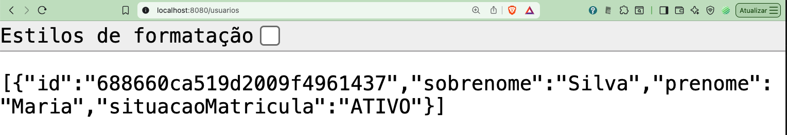

### Executar o Integrador

Para executar o integrador, você deve compilar o projeto e iniciar a aplicação. O integrador irá consumir eventos do Redis e processar as operações de CRUD conforme configurado. Para isso, execute os seguintes comandos na pasta `code/integrador`:

```bash
cd code/integrador
mvn clean compile exec:java -Dexec.mainClass="br.ufg.inf.integrador.Main"
```

Após iniciar o integrador, você verá mensagens indicando que ele está escutando o canal Redis `crud-channel`:

```🟢 Escutando canal Redis: crud-channel
```

### Executar um teste de inclusão de estudante

Para testar a inclusão de um estudante, foi criando uma classe simples `MainTest`:

```java
package br.ufg.inf.integrador;

import br.ufg.inf.sga.model.Estudante;
import br.ufg.inf.sga.model.Repositorios;

public record MainTest() {
    public static void main(String[] args) {
        System.out.println("Running CRUD Event Test...");
        
        // Example instantiation of Estudante
        Estudante estudante = new Estudante();
        estudante.setNomeCompleto("João da Silva");
        estudante.setDataDeNascimento("01/01/2000");
        estudante.setMatricula(123456);

        Repositorios.ESTUDANTE.create(estudante);
        // Estudante criado deve aparecer na console do RedisListenerServer
    }    
}
```

Para executar o teste de inclusão de estudante, você pode compilar e executar a classe `MainTest`:

```bash
cd code/integrador
mvn exec:java -Dexec.mainClass="br.ufg.inf.integrador.MainTest"
``` 

Após executar o teste, você deve ver mensagens no console da classe `Main` executada anteriormente:

```bash
14:37:51.149 [lettuce-nioEventLoop-8-1] INFO crud-transformer -- ✅ JSON processado: {"sobrenome":"da Silva","prenome":"João","situacaoMatricula":"ATIVO"}
14:37:52.118 [lettuce-nioEventLoop-8-1] INFO crud-transformer -- 📤 Resposta HTTP: Status=200, Body={"id":"688663f03fc00d0db8d5225d","sobrenome":"da Silva","prenome":"João","situacaoMatricula":"ATIVO"}
🔍 [EstudanteProcessor] EstudanteCanonico criado: idCanonico=d3171836-980a-4e31-ae2d-df45eba1a41e, prenome=João, sobrenome=da Silva, nomeCompleto=João da Silva
🔍 Criando entidade: br.ufg.inf.integrador.model.EstudanteCanonico@729b7370
🔍 Criando entidade: br.ufg.inf.integrador.model.EstudanteIdMapping@30752272
✅ EstudanteCanonico persistido no SQLite
✅ EstudanteIdMapping persistido no SQLite
```

Essas mensagens indicam que o integrador processou a inclusão do estudante e enviou os dados para o SB, além de persistir os dados canônicos e o mapeamento de IDs no SQLite. Ao recarregar a interface do SB, você deve ver o estudante incluído na lista de usuários:

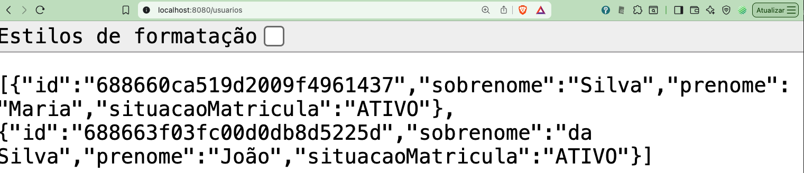

# 5. Conclusão

Neste tutorial, implementamos um integrador que consome eventos de CRUD do Redis e transforma os dados entre os modelos ORM/SQLite e ODM/MongoDB. O integrador foi projetado para ser modular e extensível, permitindo a adição de novos tipos de eventos e entidades no futuro.

Vários padrões de integração foram utilizados, como o padrão de publicador/assinante para eventos no Redis e o padrão de transformação de dados para converter os modelos entre os sistemas. A implementação do integrador foi feita utilizando Java, ORMLite para persistência no SQLite e Lettuce para comunicação com o Redis. Também foi utilizado o Apache Camel para gerenciar as rotas de transformação de dados e facilitar a integração entre os sistemas.

Como exercício ou para futuras versões deste tutorial, você pode explorar as seguintes ideias:

1. Implementar testes automatizados para o integrador, garantindo que as funcionalidades de CRUD estejam sempre funcionando.
2. Adicionar suporte a outros tipos de eventos no Redis, como atualização e exclusão de estudantes.
3. Criar rotas de transformação do SB para o SGA, permitindo que os dados do SB sejam sincronizados com o SGA.


# Referências

1. <a id="hohpe2004"></a>HOHPE, Gregor; WOOLF, Bobby. Enterprise integration patterns: Designing, building, and deploying messaging solutions. [S.l.]: Addison-Wesley Professional, 2004. 
