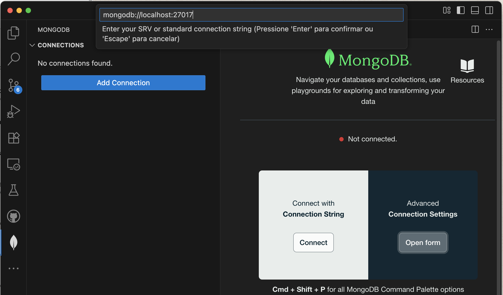
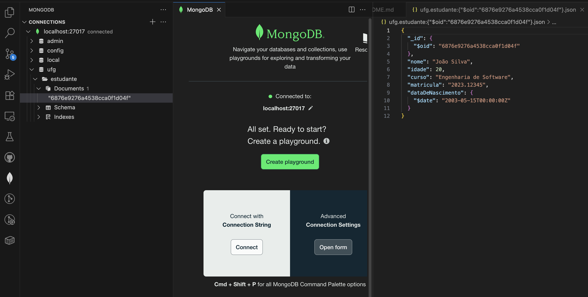

# 🟢 Java ODM com Spring Data MongoDB e Docker (Explicado Passo a Passo)

## 📋 Índice
1. O que vamos fazer
2. Instalação do MongoDB via Docker
3. Criação do projeto Java (Spring Boot) no VS Code
4. Configuração da conexão MongoDB
5. Implementação do modelo Estudante
6. Implementação do repositório
7. Serviço de inicialização com CRUD
8. Execução e testes
9. Verificação dos dados no MongoDB

---

## 1. O que vamos fazer

Neste tutorial, baseado no tutorial [Spring Data MongoDB](https://spring.io/guides/gs/accessing-data-mongodb), você vai:

- Criar um banco MongoDB usando Docker.
- Criar um projeto Java com [Spring Boot](https://spring.io/projects/spring-boot) e [Spring Data MongoDB](https://spring.io/projects/spring-data-mongodb).
- Modelar a entidade `Estudante`, equivalente ao seu exemplo com ORMLite.
- Configurar persistência automática dos dados.
- Realizar operações CRUD (create/read/update/delete).

**Por que usar Spring Data MongoDB?**
- Ele cuida de quase toda a infraestrutura de acesso a dados.
- Você não precisa escrever comandos MongoDB manualmente.
- É um *ODM* (Object Document Mapper): converte automaticamente objetos Java em documentos prontos para serem salvos no MongoDB.

**Outras opções de ODM para Java**
Além do Spring Data MongoDB, existem outras bibliotecas para mapeamento objeto-documento no Java:

- [Morphia](https://morphia.dev/): uma API enxuta e orientada a documentos, [apoiada pela empresa MongoDB](https://www.mongodb.com/resources/languages/morphia).
- [MongoJack](https://github.com/mongojack/mongojack): integra [Jackson JSON Mapper](https://github.com/FasterXML/jackson) diretamente com MongoDB.

Neste tutorial, vamos usar Spring Boot e Spring Data MongoDB por serem muito bem integrados e produtivos, mas vale conhecer essas alternativas.


## 2. Instalação do MongoDB via Docker

Vamos usar Docker para evitar instalação manual no sistema operacional.

> **Docker** é uma plataforma para rodar aplicativos em containers, que são ambientes isolados e reproduzíveis.

---

### Passos

1. **Baixar a imagem oficial do MongoDB**

   Este comando baixa a última versão da Community Edition do MongoDB:

   ```bash
   docker pull mongodb/mongodb-community-server:latest
   ```

   🔍 **O que faz esse comando?**
   - Faz download da imagem do MongoDB que contém tudo pronto para execução.
   - Você só precisa rodar isso uma única vez.

2. **Criar e iniciar o container**

   O comando abaixo cria o container, define nome, portas e volume persistente:

   ```bash
   docker run -d      --name mongodb      -p 27017:27017      -v mongodb_data:/data/db      mongodb/mongodb-community-server:latest
   ```

   🔍 **Explicando cada parâmetro:**
   - `-d`: roda o container em background.
   - `--name mongodb`: dá um nome amigável ao container.
   - `-p 27017:27017`: mapeia a porta padrão do MongoDB para o host.
   - `-v mongodb_data:/data/db`: cria um volume chamado `mongodb_data` que guarda os dados.
   - A última parte indica a imagem a ser usada.

3. **Verificar se o container está ativo**

   Use o comando:

   ```bash
   docker ps
   ```

   Você deve ver algo parecido com:

   ```
   CONTAINER ID   IMAGE                                        PORTS
   abcd1234efgh   mongodb/mongodb-community-server:latest      0.0.0.0:27017->27017/tcp
   ```

4. **Acessar o shell do MongoDB (opcional)**

   Para entrar no prompt interativo do MongoDB, execute:

   ```bash
   docker exec -it mongodb mongosh
   ```

   Exemplo de comandos que você pode usar dentro do shell:

   ```mongodb
   show dbs
   ```

   ```mongodb
   use test
   ```

   ```mongodb
   db.createCollection("exemplo")
   ```


5. **Acessando o MongoDB através do VS Code (opcional)**

Se preferir, você pode gerenciar seu banco MongoDB usando a extensão **MongoDB for VS Code**.

#### Passos

1. Abra o VS Code.
2. Vá no menu lateral esquerdo, clique no ícone de **Extensions** (ou use o atalho `Ctrl + Shift + X`).
3. Pesquise por **MongoDB for VS Code** e instale a extensão oficial da MongoDB Inc.
4. Após instalar, clique no ícone do **MongoDB** no menu lateral esquerdo.
5. Clique em **Connect**.
6. Na tela de conexão, informe a string de conexão:

   ```
   mongodb://localhost:27017
   ```

   > Como estamos rodando localmente no Docker, não é necessário usuário nem senha por padrão.

   

7. Clique em **Connect**.

Após conectar, você poderá:

- Visualizar bancos e coleções.
- Criar documentos.
- Executar queries com sintaxe MongoDB.
- Editar dados interativamente.



Essa é uma opção prática para explorar seus dados sem sair do VS Code.


## 3. Criação do projeto Java (Spring Boot) no VS Code

Nesta etapa, você vai criar um projeto Maven com Spring Boot que será a base da sua aplicação.

> **O que é Maven?**
> Maven é uma ferramenta de automação de builds para projetos Java.  
> Ela gerencia dependências (bibliotecas externas), compila, empacota e executa aplicações de forma padronizada.
> Saiba mais: [https://maven.apache.org/](https://maven.apache.org/)

> **Por que usar Spring Boot?**
> - Automatiza configuração do projeto.
> - Facilita dependências e inicialização.
> - Integra diretamente com MongoDB por meio do Spring Data.

---

### Passos

1. **Criar a pasta do projeto**

   No terminal, execute:

   ```bash
   mkdir java-mongodb-odm
   cd java-mongodb-odm
   ```

   🔍 *O que faz:*
   - `mkdir` cria a pasta chamada `java-mongodb-odm`.
   - `cd` entra na pasta.

2. **Gerar o projeto Maven**

   Use este comando para criar um projeto básico Maven:

   ```bash
   mvn archetype:generate      
   -DgroupId=br.ufg.inf      
   -DartifactId=java-mongodb-odm
   -DarchetypeArtifactId=maven-archetype-quickstart      
   -DinteractiveMode=false
   ```

   🔍 *Explicando cada parâmetro:*
   - `groupId`: identificador base do projeto (`br.ufg.inf`).
   - `artifactId`: nome do projeto/pasta.
   - `archetypeArtifactId`: modelo de projeto Maven.
   - `interactiveMode=false`: evita perguntas interativas.

3. **Abrir no VS Code**

   ```bash
   code java-mongodb-odm
   ```

   > Se não tiver o comando `code` configurado, abra manualmente a pasta no VS Code.

4. **Editar o arquivo `pom.xml`**

   O `pom.xml` define dependências e configurações do projeto.  
   Substitua o conteúdo padrão pelo seguinte:

   ```xml
   <project xmlns="http://maven.apache.org/POM/4.0.0"
            xmlns:xsi="http://www.w3.org/2001/XMLSchema-instance"
            xsi:schemaLocation="http://maven.apache.org/POM/4.0.0
                                http://maven.apache.org/xsd/maven-4.0.0.xsd">
     <modelVersion>4.0.0</modelVersion>
     <groupId>br.ufg.inf</groupId>
     <artifactId>java-mongodb-odm</artifactId>
     <version>1.0-SNAPSHOT</version>
     <parent>
       <groupId>org.springframework.boot</groupId>
       <artifactId>spring-boot-starter-parent</artifactId>
       <version>3.3.0</version>
     </parent>
     <dependencies>
       <dependency>
         <groupId>org.springframework.boot</groupId>
         <artifactId>spring-boot-starter-data-mongodb</artifactId>
       </dependency>
       <dependency>
         <groupId>org.springframework.boot</groupId>
         <artifactId>spring-boot-starter</artifactId>
       </dependency>
       <dependency>
         <groupId>junit</groupId>
         <artifactId>junit</artifactId>
         <version>4.13.2</version>
         <scope>test</scope>
       </dependency>
     </dependencies>
   </project>
   ```

   🔍 *Por que usar essas dependências?*
   - `spring-boot-starter-data-mongodb`: ODM do MongoDB.
   - `spring-boot-starter`: base do Spring Boot.
   - `junit`: framework de testes (versão 4).

5. **Atualizar a classe de teste**

   O projeto gerado pelo archetype vem com um teste JUnit 3 (`TestCase`) desatualizado.
   Para evitar erros, substitua o conteúdo do arquivo:

   ```
   src/test/java/br/ufg/inf/AppTest.java
   ```

   Por este teste usando JUnit 4:

   ```java
   package br.ufg.inf;

   import org.junit.Test;
   import static org.junit.Assert.assertTrue;

   public class AppTest {

       @Test
       public void testApp() {
           assertTrue(true);
       }
   }
   ```

   🔍 *O que mudou?*
   - Passou a usar `@Test` (JUnit 4).
   - Usa `assertTrue` sem herdar `TestCase`.
   - Compatível com dependência JUnit 4.

6. **Criar a classe principal do projeto**

   Apague o arquivo `App.java` criado automaticamente e crie um novo arquivo:

   ```
   src/main/java/br/ufg/inf/Application.java
   ```

   Com o seguinte conteúdo:

   ```java
   package br.ufg.inf;

   import org.springframework.boot.SpringApplication;
   import org.springframework.boot.autoconfigure.SpringBootApplication;

   @SpringBootApplication
   public class Application {
       public static void main(String[] args) {
           SpringApplication.run(Application.class, args);
       }
   }
   ```

   🔍 *O que essa classe faz?*
   - É o ponto de entrada da aplicação.
   - Inicia o contexto Spring Boot.

---

### ✅ Testando a configuração do projeto

Para garantir que tudo está correto antes de prosseguir, execute no terminal dentro da pasta do projeto:

```bash
mvn clean install
```

🔍 **O que esse comando faz?**
- `clean`: apaga arquivos gerados anteriormente (`target`).
- `install`: compila a aplicação, executa testes e instala o artefato no repositório local Maven.

**Resultado esperado:**
No final, você verá:

```
[INFO] BUILD SUCCESS
```

Isso confirma que:
✅ O `pom.xml` está correto.  
✅ O projeto compila normalmente.  
✅ Os testes rodam sem erro.

💡 **Dica extra:**
Você também pode executar a aplicação para ver se inicia sem erros:

```bash
mvn spring-boot:run
```

Se tudo estiver certo, verá:

```
Started Application in X seconds
```
