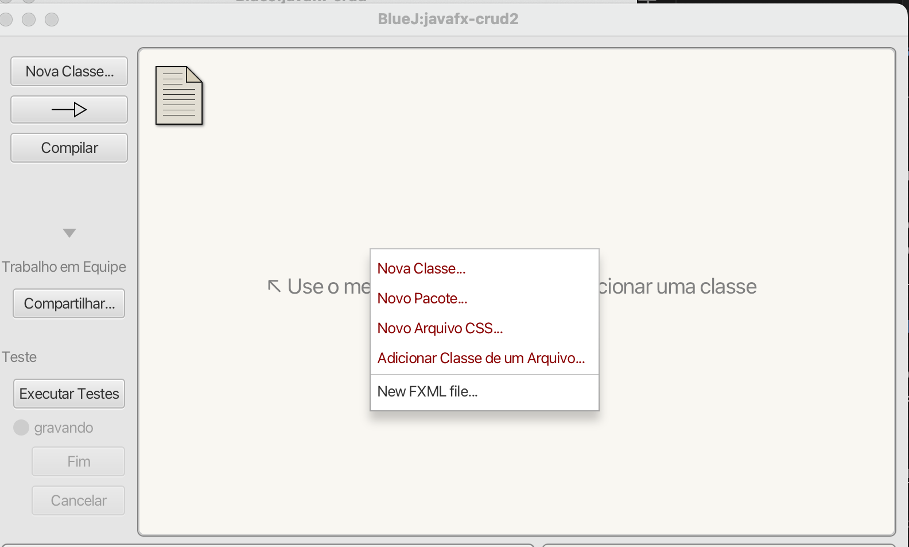
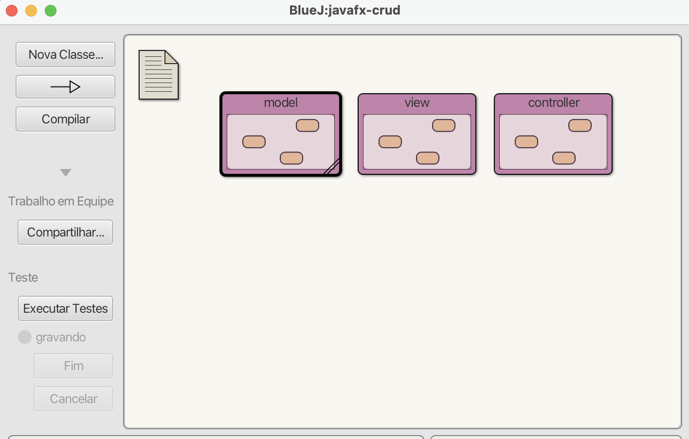
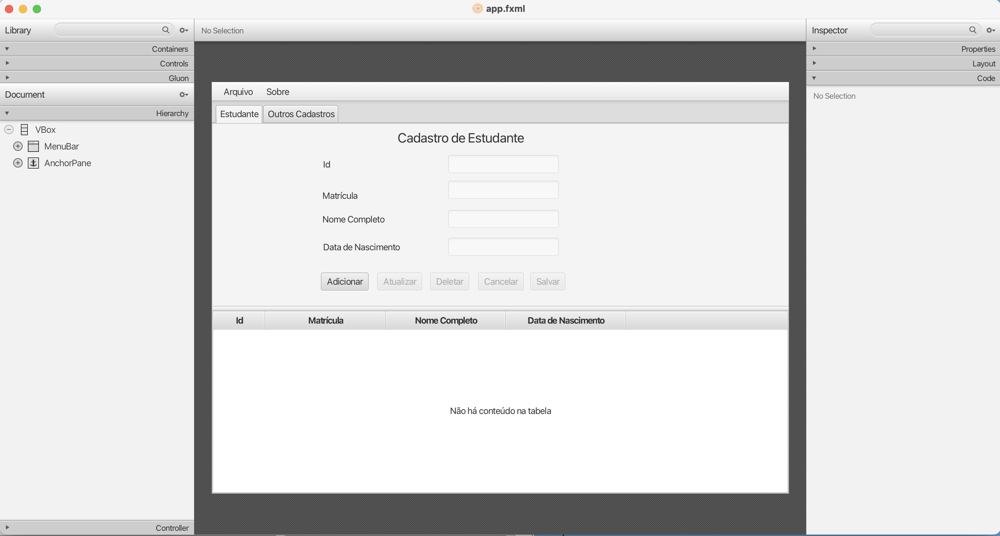
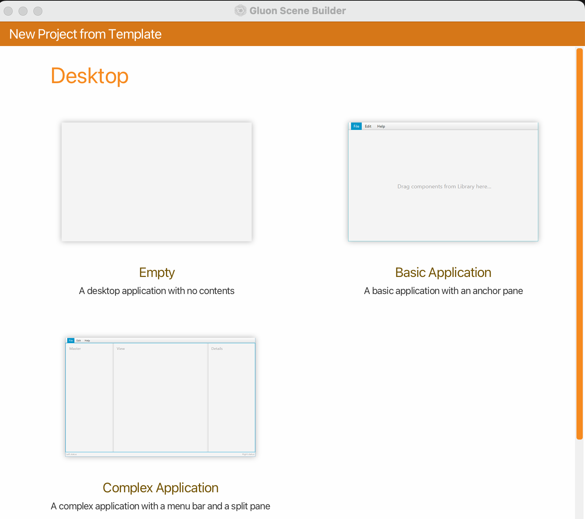
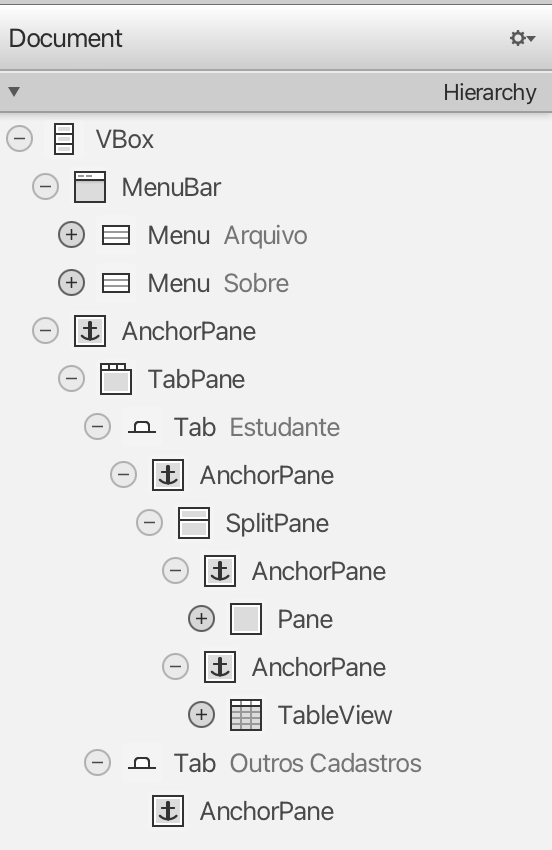
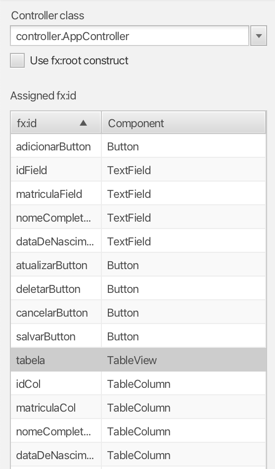
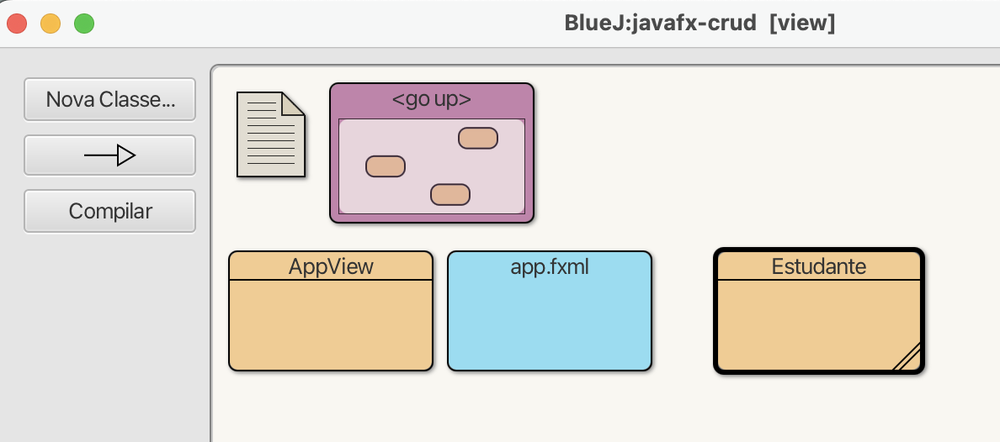

# Tutorial JavaFX CRUD

Aplicações gráficas que realizam operações de cadastro em banco de dados realizam 4 operações básicas chamadas de CRUD (Create, Retrieve, Update e Delete). Neste tutorial, vamos criar uma aplicação JavaFX que realiza essas operações em um banco de dados SQLite.

Para realizar esse tutorial, considera-se que a camada de persistência (ORM) já foi realizada. Caso não tenha feito, siga o tutorial [ORM](https://github.com/marceloakira/tutorials/tree/main/orm).

Todo código-fonte deste tutorial está disponível neste endereço:

* https://github.com/marceloakira/tutorials/tree/main/javafx-crud/src

Este tutorial é baseado no tutorial [JavaFX: Trabalhando com TableView](https://medium.com/@antonio.gabriel/javafx-trabalhando-com-tableview-5cc1065babab)


## 1. Criando pacotes separados

Por uma questão de organização, vamos criar três pacotes separados para as camadas *Model*, *View* e *Controller*. No BlueJ, clique com o botão direito do mouse sobre o projeto e selecione a opção *New Package*:



Crie os pacotes *model*, *view* e *controller*:



## 2. Crie as classes de modelo

As classes de modelo são responsáveis por representar as entidades do mundo real. 

### 2.1. Classe model.Estudante

No nosso exemplo, vamos criar a classe *Estudante* que representa um estudante. Clique com o botão direito do mouse sobre o pacote *model* e selecione a opção *Nova Classe*.

```java
package model;

import java.util.Date;
import java.text.SimpleDateFormat;
import com.j256.ormlite.table.DatabaseTable;
import com.j256.ormlite.field.DatabaseField;
import com.j256.ormlite.field.DataType;

@DatabaseTable(tableName="estudante")
public class Estudante {
    
    @DatabaseField(generatedId = true)
    private int id;
        
    @DatabaseField(dataType=DataType.STRING)    
    private String nomeCompleto;
    
    @DatabaseField(dataType=DataType.STRING)        
    private String dataDeNascimento;
    
    @DatabaseField(dataType=DataType.INTEGER)        
    private int matricula;
    

//Start GetterSetterExtension Source Code

    /**GET Method Propertie id*/
    public int getId(){
        return this.id;
    }//end method getId

    /**SET Method Propertie id*/
    public void setId(int id){
        this.id = id;
    }//end method setId

    /**GET Method Propertie nomeCompleto*/
    public String getNomeCompleto(){
        return this.nomeCompleto;
    }//end method getNomeCompleto

    /**SET Method Propertie nomeCompleto*/
    public void setNomeCompleto(String nomeCompleto){
        this.nomeCompleto = nomeCompleto;
    }//end method setNomeCompleto

    /**GET Method Propertie dataDeNascimento*/
    public String getDataDeNascimento(){
        return this.dataDeNascimento;
    }//end method getDataDeNascimento

    /**SET Method Propertie dataDeNascimento*/
    public void setDataDeNascimento(String dataDeNascimento){
        this.dataDeNascimento = dataDeNascimento;
    }//end method setDataDeNascimento

    /**GET Method Propertie matricula*/
    public int getMatricula(){
        return this.matricula;
    }//end method getMatricula

    /**SET Method Propertie matricula*/
    public void setMatricula(int matricula){
        this.matricula = matricula;
    }//end method setMatricula

//End GetterSetterExtension Source Code


}//End class
```

A classe *Estudante* é uma classe de modelo que representa um estudante. Note que a classe possui anotações do ORMLite que informam que a tabela a ser gravada tem nome *estudante*, conforme o parâmetro *tableName*. A propriedade *id* é autogerada e as propriedades *nomeCompleto*, *dataDeNascimento* e *matricula* são respectivamente do tipo *String*, *String* e *int*.

### 2.2. Classe model.Database

A classe *Database* é responsável por gerenciar a conexão com o banco de dados. Clique com o botão direito do mouse sobre o pacote *model* e selecione a opção *Nova Classe*.

```java
package model;

import java.sql.*;
import com.j256.ormlite.jdbc.JdbcConnectionSource;

public class Database
{
   private String databaseName = null;
   private JdbcConnectionSource connection = null;
   
   public Database(String databaseName) {
       this.databaseName = databaseName;
   }    
   
   public JdbcConnectionSource getConnection() throws SQLException {
      if ( databaseName == null ) {
          throw new SQLException("database name is null");
      }
      if ( connection == null ) {
          try {
              connection = new JdbcConnectionSource("jdbc:sqlite:"+databaseName);             
            } catch ( Exception e ) {
                System.err.println( e.getClass().getName() + ": " + e.getMessage() );
                System.exit(0);
            }
      }
      return connection;
   }
   
   public void close() {
       if ( connection != null ) {
           try {
               connection.close();
               this.connection = null;
           } catch (java.lang.Exception e) {
               System.err.println(e);
           }
       }
   }
}
```

A classe *Database* é responsável por gerenciar a conexão com o banco de dados. Note que a classe possui um método construtor que recebe o caminho do arquivo de base de dados, a propriedade *databaseName*. O método *getConnection()* inicializa a propriedade *connection* com um objeto [JdbcConnectionSource](https://ormlite.com/javadoc/ormlite-jdbc/com/j256/ormlite/jdbc/JdbcConnectionSource.html). O método *close()* fecha a base de dados.

### 2.3. Classe model.EstudanteRepositorio

A classe *EstudanteRepositorio* é responsável por realizar operações CRUD com a entidade *Estudante*. Clique com o botão direito do mouse sobre o pacote *model* e selecione a opção *Nova Classe*.

```java
package model;

import com.j256.ormlite.dao.DaoManager;
import com.j256.ormlite.dao.Dao;
import java.sql.SQLException;
import com.j256.ormlite.table.TableUtils;
import java.util.List;
import java.util.ArrayList;

public class EstudanteRepositorio
{
    private static Database database;
    private static Dao<Estudante, Integer> dao;
    private List<Estudante> loadedEstudantes;
    private Estudante loadedEstudante;
    
    public EstudanteRepositorio(Database database) {
        EstudanteRepositorio.setDatabase(database);
        loadedEstudantes = new ArrayList<Estudante>();
    }
    
    public static void setDatabase(Database database) {
        EstudanteRepositorio.database = database;
        try {
            dao = DaoManager.createDao(database.getConnection(), Estudante.class);
            TableUtils.createTableIfNotExists(database.getConnection(), Estudante.class);
        }
        catch(SQLException e) {
            System.out.println(e);
        }            
    }
    
    public Estudante create(Estudante estudante) {
        int nrows = 0;
        try {
            nrows = dao.create(estudante);
            if ( nrows == 0 )
                throw new SQLException("Error: object not saved");
            this.loadedEstudante = estudante;
            loadedEstudantes.add(estudante);
        } catch (SQLException e) {
            System.out.println(e);
        }
        return estudante;
    }    

    public void update(Estudante Estudante) {
      // TODO
    }

    public void delete(Estudante Estudante) {
      // TODO
    }
    
    public Estudante loadFromId(int id) {
        try {
            this.loadedEstudante = dao.queryForId(id);
            if (this.loadedEstudante != null)
                this.loadedEstudantes.add(this.loadedEstudante);
        } catch (SQLException e) {
            System.out.println(e);
        }
        return this.loadedEstudante;
    }    
    
    public List<Estudante> loadAll() {
        try {
            this.loadedEstudantes =  dao.queryForAll();
            if (this.loadedEstudantes.size() != 0)
                this.loadedEstudante = this.loadedEstudantes.get(0);
        } catch (SQLException e) {
            System.out.println(e);
        }
        return this.loadedEstudantes;
    }
}
```

A classe *EstudanteRepositorio* é responsável por realizar operações CRUD com a entidade *Estudante*. Note que a classe possui um método construtor que recebe um objeto *database* e o atribui a uma variável de classe *database*. O método *setDatabase* atribui a variável de classe *database* e cria um objeto de acesso a dados (Dao) para a entidade *Estudante*. O método *create* persiste um objeto *Estudante* no banco de dados. O método *loadFromId* carrega um objeto *Estudante* a partir de um *id* informado. O método *loadAll* carrega todos objetos *Estudante* do banco de dados.

## 3. Crie as classes de visão

As classes de visão são responsáveis por apresentar os dados ao usuário.

### 3.1. Crie a interface no Scene Builder

Abra o Scene Builder e vamos criar a interface gráfica conforme a imagem abaixo:



Inicialmente, você pode criar uma aplicação por meio de um template. No Scene Builder, escolha a opção *Basic Application*:



Depois vamos criar a aplicação arrastando componentes criando a seguinte árvore hierárquica:



Outro ponto importante é a definição dos *fx:id* dos componentes. Para isso, clique no componente e vá até a aba *Code* e defina o *fx:id* de cada componente, conforme a lista:



A classe controller.AppController ainda não foi criada. Vamos criar essa classe na próxima seção.

Salve esse arquivo como app.fxml no diretório view do seu pacote.

### 3.2. Crie a classe view.AppView

A classe *AppView* é responsável por carregar a interface gráfica e controlar a interação do usuário com a aplicação. Clique com o botão direito do mouse sobre o pacote *view* e selecione a opção *Nova Classe*.

```java
package view;

import javafx.application.Application;
import javafx.fxml.FXMLLoader;
import javafx.scene.Scene;
import javafx.scene.layout.Pane;
import javafx.stage.Stage;
import java.io.File;
import java.net.URL;

/**
 * Interface Gráfica (GUI) do CRUD
 * 
 * @author marceloakira
 * @version 0.01
 */
public class AppView extends Application
{
    private FXMLLoader loader;
    private URL url;
    private Stage primaryStage;
    
    public AppView() {
        this.loader = new FXMLLoader();
        try {
            this.url = new File("view/app.fxml").toURI().toURL();
        } catch (Exception e) {
            System.out.println("Erro na carga do FXML:" + e);
        }
        this.loader.setLocation(this.url);        
    }
    
    @Override
    public void start(Stage primaryStage) throws Exception {
        try {
            Pane pane = loader.<Pane>load();
            Scene scene = new Scene(pane);
            this.primaryStage = primaryStage;
            primaryStage.setScene(scene);
            primaryStage.show();            
        } catch (Exception e) {
            e.printStackTrace();
        }
    }
    
    @Override
    public void stop() {
        System.exit(0);
    }
    
    public void run(String[] args) {
        Application.launch(args);
    }
}
```

A classe *AppView* é responsável por carregar a interface gráfica e controlar a interação do usuário com a aplicação. Note que a classe estende a classe *Application* do JavaFX. O método *start* carrega o arquivo FXML e exibe a interface gráfica. O método *stop* finaliza a aplicação.

### 3.3. Crie a classe view.Estudante

A classe view.Estudante representa a visualização da entidade na tabela (TableView).

```java
package view;

import javafx.beans.property.SimpleBooleanProperty;
import javafx.beans.property.SimpleIntegerProperty;
import javafx.beans.property.SimpleStringProperty;
import javafx.scene.control.TableColumn;
import javafx.scene.control.TableView;

public class Estudante {
    
    private SimpleIntegerProperty id;
    private SimpleStringProperty nomeCompleto;
    private SimpleStringProperty dataDeNascimento;
    private SimpleIntegerProperty matricula;
    
    public Estudante(int id, String nomeCompleto, 
                    String dataDeNascimento, int matricula) {
        this.id = new SimpleIntegerProperty(id);
        this.nomeCompleto = new SimpleStringProperty(nomeCompleto);
        this.dataDeNascimento = new SimpleStringProperty(dataDeNascimento);
        this.matricula = new SimpleIntegerProperty(matricula);        
    }
    
//Start GetterSetterExtension Source Code

    /**GET Method Propertie id*/
    public int getId(){
        return this.id.get();
    }//end method getId

    /**SET Method Propertie id*/
    public void setId(int id){
        this.id.set(id);
    }//end method setNomeCompleto

    /**GET Method Propertie nomeCompleto*/
    public String getNomeCompleto(){
        return this.nomeCompleto.get();
    }//end method getNomeCompleto

    /**SET Method Propertie nomeCompleto*/
    public void setNomeCompleto(String nomeCompleto){
        this.nomeCompleto.set(nomeCompleto);
    }//end method setNomeCompleto

    /**GET Method Propertie dataDeNascimento*/
    public String getDataDeNascimento(){
        return this.dataDeNascimento.get();
    }//end method getDataDeNascimento

    /**SET Method Propertie dataDeNascimento*/
    public void setDataDeNascimento(String dataDeNascimento){
        this.dataDeNascimento.set(dataDeNascimento);
    }//end method setDataDeNascimento

    /**GET Method Propertie matricula*/
    public int getMatricula(){
        return this.matricula.get();
    }//end method getMatricula
    /**SET Method Propertie matricula*/
    public void setMatricula(int matricula){
        this.matricula.set(matricula);
    }//end method setMatricula

//End GetterSetterExtension Source Code


}//End class
```

A classe *Estudante* representa a visualização da entidade na tabela (TableView). Note que a classe possui propriedades do tipo *SimpleIntegerProperty* e *SimpleStringProperty* que são utilizadas para exibir os dados na tabela. Note que é muito parecida com a classe model.Estudante, a diferença é que os atributos são do tipo *SimpleIntegerProperty* e *SimpleStringProperty* e os getters e setters usam o método *get()* e *set()*.

O seu pacote view no final deve estar assim:



## 4. Crie as classes de Controle

As classes de controle são responsáveis por intermediar a comunicação entre a visão e o modelo.

### 4.1. Crie a classe controller.AppController

A classe *AppController* é responsável por controlar a interação do usuário com a aplicação. Clique com o botão direito do mouse sobre o pacote *controller* e selecione a opção *Nova Classe*.

A classe completa está aqui:

```java
package controller;

import javafx.fxml.FXML;
import javafx.scene.control.TableColumn;
import javafx.scene.control.TableView;
import javafx.scene.control.TextField;
import javafx.scene.control.Button;
import javafx.scene.control.Alert.AlertType;
import javafx.collections.FXCollections;
import javafx.scene.control.cell.PropertyValueFactory;
import javafx.collections.ObservableList;
import javafx.stage.Stage;
import javafx.application.Application;
import javafx.fxml.Initializable;
import javafx.scene.control.Alert;

import java.net.URL;
import java.util.ResourceBundle;
import java.util.List;

import model.EstudanteRepositorio;
import view.AppView;

public class AppController implements Initializable {
    @FXML
    private TableView<view.Estudante> tabela;
    @FXML
    private TableColumn<view.Estudante, Integer> idCol;
    @FXML
    private TableColumn<view.Estudante, String> nomeCompletoCol;
    @FXML
    private TableColumn<view.Estudante, String> dataDeNascimentoCol;
    @FXML
    private TableColumn<view.Estudante, Integer> matriculaCol;
    @FXML
    private TextField idField;
    @FXML
    private TextField nomeCompletoField;
    @FXML
    private TextField dataDeNascimentoField;
    @FXML
    private TextField matriculaField;
    @FXML
    private Button adicionarButton;
    @FXML
    private Button atualizarButton;
    @FXML
    private Button deletarButton;    
    @FXML
    private Button cancelarButton;    
    @FXML
    private Button salvarButton;
    
    AppView appView;
    
    private static model.Database database = new model.Database("app.sqlite");
    private static model.EstudanteRepositorio estudanteRepo = 
        new model.EstudanteRepositorio(database);
        
    public AppController() {
        this.appView = new AppView();
    }
    
    public static void main(String[] args) throws Exception {
        AppController appController = new AppController();
        appController.appView.run(args);
    }
    
    private void desabilitarBotoes(boolean adicionar, boolean atualizar, boolean deletar, boolean cancelar, boolean salvar) {
        adicionarButton.setDisable(adicionar);
        atualizarButton.setDisable(atualizar);
        deletarButton.setDisable(deletar);
        cancelarButton.setDisable(cancelar);
        salvarButton.setDisable(salvar);        
    }
    
    private void desabilitarCampos(boolean desabilitado) {
        nomeCompletoField.setDisable(desabilitado);
        matriculaField.setDisable(desabilitado);
        dataDeNascimentoField.setDisable(desabilitado);
    }
    
    private void limparCampos() {
        idField.setText("");
        dataDeNascimentoField.setText("");
        nomeCompletoField.setText("");
        matriculaField.setText("");        
    }
    
    @FXML
    public void onCancelarButtonAction() {
        desabilitarCampos(true);
        desabilitarBotoes(false,true,true,true,true);
        limparCampos();
        tabela.getSelectionModel().select(-1);        
    }
    
    @FXML
    public void onSalvarButtonAction() {
        try {
            model.Estudante estudante = new model.Estudante();            
            estudante.setMatricula(Integer.parseInt(matriculaField.getText()));
            estudante.setNomeCompleto(nomeCompletoField.getText());
            estudante.setDataDeNascimento(dataDeNascimentoField.getText());            
            model.Estudante estudante_salvo = estudanteRepo.create(estudante); 
            view.Estudante estudanteView = modelToView(estudante_salvo);
            tabela.getItems().add(estudanteView);
            tabela.getSelectionModel().select(estudanteView);    
            desabilitarCampos(true);
            desabilitarBotoes(false,true,true,true,true);            
        }
        catch(Exception e) {
            new Alert(AlertType.ERROR, "Erro ao salvar: "+e.getMessage()).show();
        }
    }    
    
    @FXML
    public void onAdicionarButtonAction() {
        tabela.getSelectionModel().select(-1);
        desabilitarCampos(false);
        desabilitarBotoes(true,true,true,false,false);
        limparCampos();
    }

    @FXML
    private void handleEstudanteSelected(view.Estudante newSelection) {
        if (newSelection != null)
            idField.setText(Integer.toString(newSelection.getId()));
            dataDeNascimentoField.setText(newSelection.getDataDeNascimento());
            nomeCompletoField.setText(newSelection.getNomeCompleto());
            matriculaField.setText(Integer.toString(newSelection.getMatricula()));
            desabilitarBotoes(false,false,false,true,true);
    }
    
    @Override
    public void initialize(URL location, ResourceBundle resources) {
        idCol.setCellValueFactory(
                new PropertyValueFactory<>("id"));
        nomeCompletoCol.setCellValueFactory(
                new PropertyValueFactory<>("nomeCompleto"));
        dataDeNascimentoCol.setCellValueFactory(
                new PropertyValueFactory<>("dataDeNascimento"));
        matriculaCol.setCellValueFactory(
                new PropertyValueFactory<>("matricula"));
        tabela.setItems(loadAllEstudantes());
        tabela.getSelectionModel().selectedItemProperty().addListener(
            (observableValue, oldSelection, newSelection) -> {
                handleEstudanteSelected(newSelection);
            });
    }
    
    private view.Estudante modelToView(model.Estudante estudante) {
        return new view.Estudante(
            estudante.getId(),
            estudante.getNomeCompleto(),
            estudante.getDataDeNascimento(),
            estudante.getMatricula()
        );
    }
    
    private ObservableList<view.Estudante> loadAllEstudantes() {
        ObservableList<view.Estudante> lista = 
            FXCollections.observableArrayList();
        List<model.Estudante> listaFromDatabase = estudanteRepo.loadAll();
        for(model.Estudante estudante: listaFromDatabase) {
            lista.add(modelToView(estudante));
        }
        return lista;
    }
}
```

Vamos explicar cada parte do código nas subseções a seguir.

### 4.1. Amarração (binding)

A classe *AppController* é responsável por controlar a interação do usuário com a aplicação. Note que a classe possui propriedades que representam os componentes da interface gráfica. As propriedades são anotadas com *@FXML* para que o JavaFX possa injetar os componentes da interface gráfica. 

```java
    @FXML
    private TableView<view.Estudante> tabela;
    @FXML
    private TableColumn<view.Estudante, Integer> idCol;
    @FXML
    private TableColumn<view.Estudante, String> nomeCompletoCol;
    @FXML
    private TableColumn<view.Estudante, String> dataDeNascimentoCol;
    @FXML
    private TableColumn<view.Estudante, Integer> matriculaCol;
    @FXML
    private TextField idField;
    @FXML
    private TextField nomeCompletoField;
    @FXML
    private TextField dataDeNascimentoField;
    @FXML
    private TextField matriculaField;
    @FXML
    private Button adicionarButton;
    @FXML
    private Button atualizarButton;
    @FXML
    private Button deletarButton;    
    @FXML
    private Button cancelarButton;    
    @FXML
    private Button salvarButton;
```

### 4.2. Construtor e conexão com banco de dados

A conexão de banco de dados pode ser feita de forma estática, quando a classe for carregada na máquina virtual java. Não é a melhor prática, mas é mais simples para este exemplo.

```java
    private static model.Database database = new model.Database("app.sqlite");
    private static model.EstudanteRepositorio estudanteRepo = 
        new model.EstudanteRepositorio(database);
```

A melhor prática seria abrir o banco dados na opção de menu *Arquivo -> Abrir*. Fica como sugestão para o leitor.

O construtor da classe *AppController* inicializa a propriedade *appView*.

```java
    AppView appView;
        
    public AppController() {
        this.appView = new AppView();
    }
```

### 4.3. Método main

O método *main* é o ponto de entrada da aplicação. Ele cria uma instância de *AppController* e executa o método *run* de *AppView*.

```java 
public static void main(String[] args) throws Exception {
    AppController appController = new AppController();
    appController.appView.run(args);
}
```

## 4.4. Inicialização e carga de dados

A inicialização da aplicação é feita no método *initialize*. Neste método, são configuradas as colunas da tabela e carregados os dados do banco de dados.

```java
    @Override
    public void initialize(URL location, ResourceBundle resources) {
        idCol.setCellValueFactory(
                new PropertyValueFactory<>("id"));
        nomeCompletoCol.setCellValueFactory(
                new PropertyValueFactory<>("nomeCompleto"));
        dataDeNascimentoCol.setCellValueFactory(
                new PropertyValueFactory<>("dataDeNascimento"));
        matriculaCol.setCellValueFactory(
                new PropertyValueFactory<>("matricula"));
        tabela.setItems(loadAllEstudantes());
        tabela.getSelectionModel().selectedItemProperty().addListener(
            (observableValue, oldSelection, newSelection) -> {
                handleEstudanteSelected(newSelection);
            });
    }
```

A carga de dados é feita através do método *loadAllEstudantes* que carrega todos os estudantes do banco de dados e converte para uma lista de estudantes da visão.

```java
    private ObservableList<view.Estudante> loadAllEstudantes() {
        ObservableList<view.Estudante> lista = 
            FXCollections.observableArrayList();
        List<model.Estudante> listaFromDatabase = estudanteRepo.loadAll();
        for(model.Estudante estudante: listaFromDatabase) {
            lista.add(modelToView(estudante));
        }
        return lista;
    }
```

O método modelToView converte um objeto *Estudante* do modelo para um objeto *Estudante* da visão.

```java
    private view.Estudante modelToView(model.Estudante estudante) {
        return new view.Estudante(
            estudante.getId(),
            estudante.getNomeCompleto(),
            estudante.getDataDeNascimento(),
            estudante.getMatricula()
        );
    }
```

Na inicialização também foi configurado um listener para a seleção de um estudante na tabela. O método *handleEstudanteSelected* é chamado quando um estudante é selecionado.

```java
    private void handleEstudanteSelected(view.Estudante newSelection) {
        if (newSelection != null)
            idField.setText(Integer.toString(newSelection.getId()));
            dataDeNascimentoField.setText(newSelection.getDataDeNascimento());
            nomeCompletoField.setText(newSelection.getNomeCompleto());
            matriculaField.setText(Integer.toString(newSelection.getMatricula()));
            desabilitarBotoes(false,false,false,true,true);
    }
```

### 4.5. Métodos de controle

Os métodos de controle são responsáveis por controlar a interação do usuário com a aplicação. Os métodos *onCancelarButtonAction*, *onSalvarButtonAction*, *onAdicionarButtonAction* e *handleEstudanteSelected* são chamados quando o usuário interage com a aplicação.


O método *onAdicionarButtonAction* é chamado quando o usuário clica no botão *Adicionar*. Ele habilita os campos, desabilita os botões e limpa os campos.

```java
    @FXML
    public void onAdicionarButtonAction() {
        tabela.getSelectionModel().select(-1);
        desabilitarCampos(false);
        desabilitarBotoes(true,true,true,false,false);
        limparCampos();
    }
```

O método *onCancelarButtonAction* é chamado quando o usuário clica no botão *Cancelar*. Ele desabilita os campos, habilita os botões e limpa os campos.

```java
    @FXML
    public void onCancelarButtonAction() {
        desabilitarCampos(true);
        desabilitarBotoes(false,true,true,true,true);
        limparCampos();
        tabela.getSelectionModel().select(-1);        
    }
```

O método *onSalvarButtonAction* é chamado quando o usuário clica no botão *Salvar*. Ele cria um objeto *Estudante*, salva no banco de dados, converte para um objeto *Estudante* da visão e adiciona na tabela.

```java
    @FXML
    public void onSalvarButtonAction() {
        try {
            model.Estudante estudante = new model.Estudante();            
            estudante.setMatricula(Integer.parseInt(matriculaField.getText()));
            estudante.setNomeCompleto(nomeCompletoField.getText());
            estudante.setDataDeNascimento(dataDeNascimentoField.getText());            
            model.Estudante estudante_salvo = estudanteRepo.create(estudante); 
            view.Estudante estudanteView = modelToView(estudante_salvo);
            tabela.getItems().add(estudanteView);
            tabela.getSelectionModel().select(estudanteView);    
            desabilitarCampos(true);
            desabilitarBotoes(false,true,true,true,true);            
        }
        catch(Exception e) {
            new Alert(AlertType.ERROR, "Erro ao salvar: "+e.getMessage()).show();
        }
    }    
```
