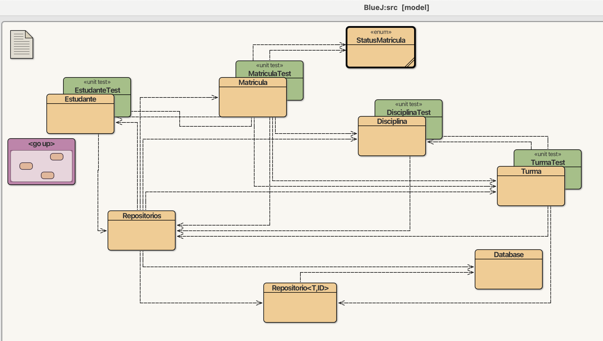
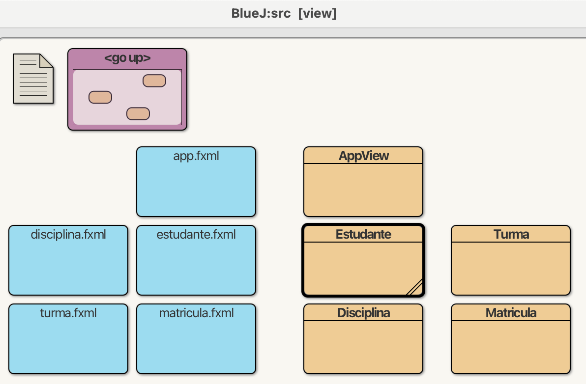
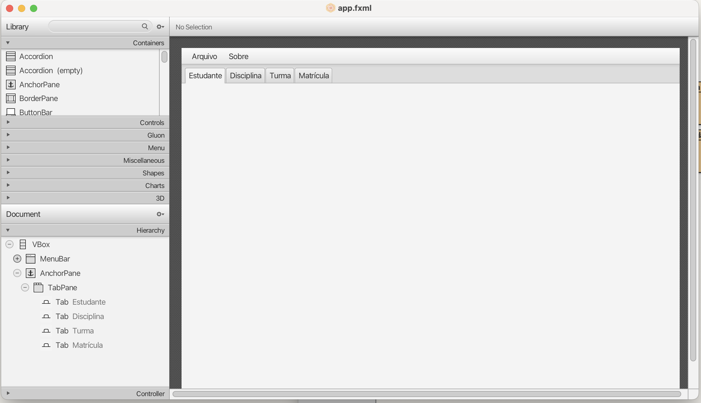
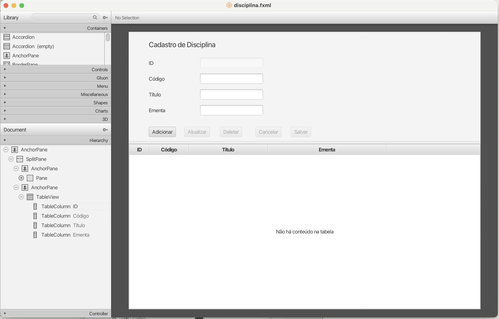
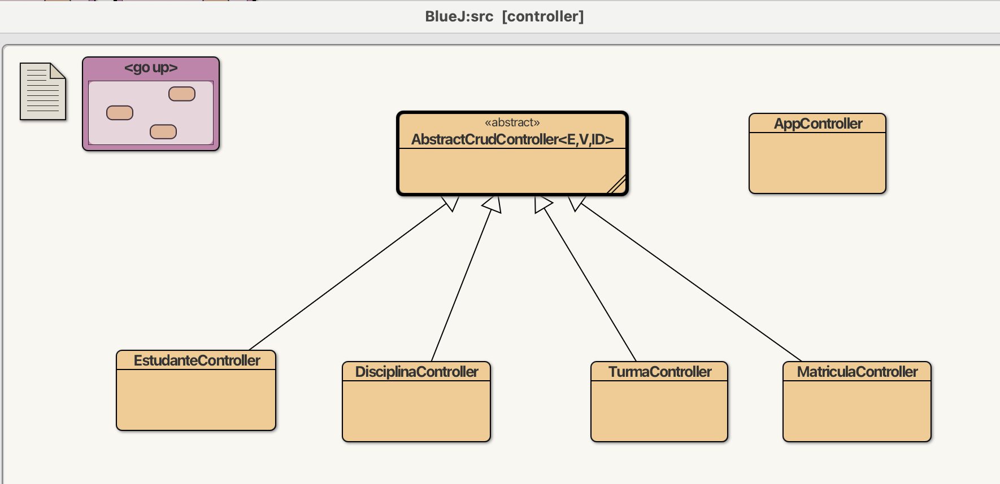
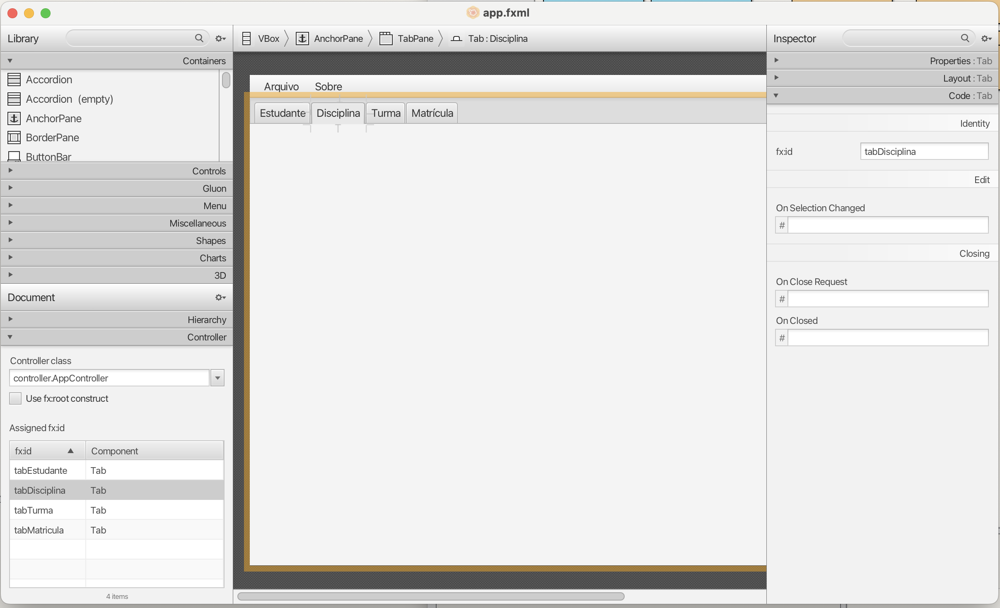
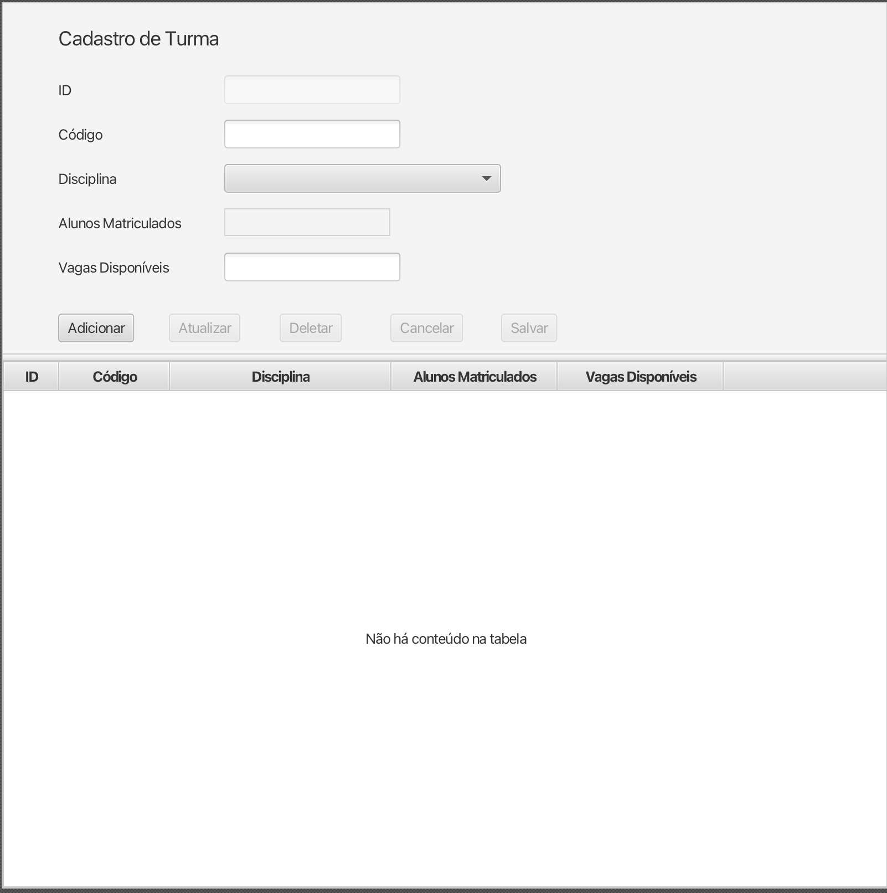
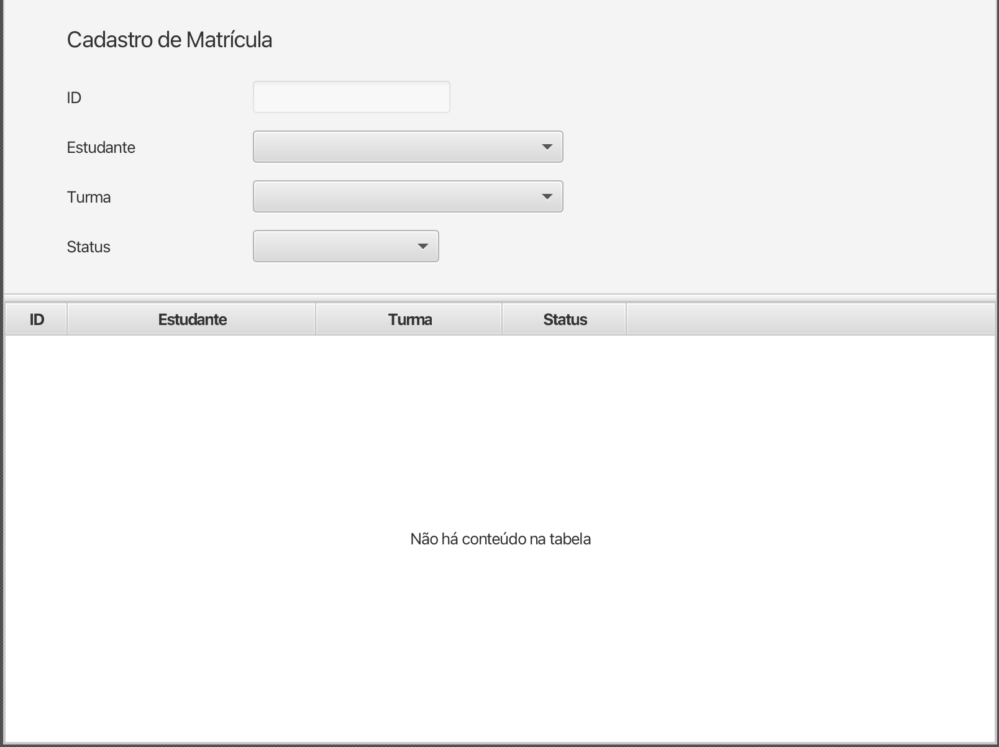
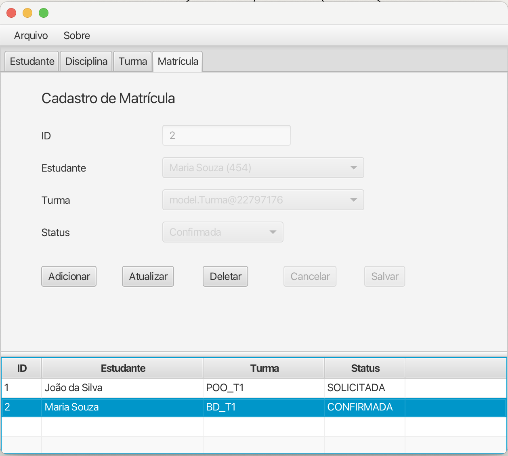

# Tutorial JavaFX CRUD - parte 2

Este tutorial é a segunda parte do tutorial JavaFX CRUD, continuação da [parte 1](https://github.com/marceloakira/tutorials/tree/main/javafx-crud). Na primeira parte, criamos uma aplicação JavaFX simples com um formulário de cadastro de estudantes. Nesta segunda parte, vamos implementar outras entidades: Disciplina, Turma e Matricula. 

Todo código-fonte deste tutorial está disponível neste endereço:

* https://github.com/marceloakira/tutorials/tree/main/javafx-crud2/src

Este projeto foi criado usando o BlueJ. Para abrir o projeto, abra a pasta *src* no BlueJ. O projeto contém as seguintes pastas:
* model: contém as classes de modelo (Model) que representam as entidades do mundo real.
* view: contém as classes de visão (View) que representam a interface gráfica da aplicação.
* controller: contém as classes de controle (Controller) que controlam a interação do usuário com a aplicação.

Este tutorial é dividido em três partes, cada uma abordando uma camada diferente da aplicação. O objetivo é usar as técnicas de herança e [genéricos](https://docs.oracle.com/javase/tutorial/java/generics/types.html) do Java para suportar o reuso de código.

**Parte 1 - Reuso na Camada Modelo:** Criação da classe abstrata `Repositorio` que define os métodos CRUD (Create, Read, Update, Delete) e operações comuns para todas as entidades modelo. Também é criada a classe `Repositorios` que instancia os repositórios de cada entidade. Para cada modelo (Disciplina, Turma e Matricula), foi criado um teste unitário para verificar o funcionamento correto de cada repositório.



**Parte 2 - Desenho de telas na Camada Visão:** Criação de telas para as entidades Disciplina, Turma e Matricula. As telas são criadas usando o FXML e o Scene Builder.



Nesta parte, a tela principal (app.fxml) foi simplificada, com abas que podem receber as telas de cada entidade. 



Assim, cada aba contém um formulário para cadastro e uma tabela para exibição dos dados. Por exemplo, a tela de cadastro de Disciplina (disciplina.fxml) contém um formulário para cadastro de disciplina e uma tabela para exibição das disciplinas cadastradas.



A inclusão de telas de cadastro em cada aba é realizada pelos seus respectivos controladores, que são responsáveis por gerenciar a interação do usuário com a interface gráfica.

**Parte 3 - Reuso na Camada Controller:** Criação da classe abstrata `AbstractCrudController` que abstrai diversos métodos de __callback__ (retorno de chamada) ou também chamado de event listeners (ouvidores de eventos) para as operações CRUD. 



## Parte 1. Reuso na Camada Modelo

Na primeira parte do tutorial, criamos a classe abstrata `Repositorio` que define os métodos CRUD (Create, Read, Update, Delete) e operações comuns para todas as entidades modelo. Também foi criada a classe `Repositorios` que instancia os repositórios de cada entidade.

Segue o código-fonte completo da classe `Repositorio`:

```java
package model;

import com.j256.ormlite.dao.DaoManager;
import com.j256.ormlite.dao.Dao;
import com.j256.ormlite.table.TableUtils;

import java.sql.SQLException;
import java.util.List;
import java.util.ArrayList;

public class Repositorio<T, ID> {

    private static Database database;
    private Dao<T, ID> dao;
    private List<T> loadedEntities;
    private T loadedEntity;
    private Class<T> entityClass;

    public Repositorio(Database database, Class<T> entityClass) {
        this.entityClass = entityClass;
        setDatabase(database);
        loadedEntities = new ArrayList<>();
    }

    public void setDatabase(Database database) {
        Repositorio.database = database;
        try {
            dao = DaoManager.createDao(database.getConnection(), entityClass);
            TableUtils.createTableIfNotExists(database.getConnection(), entityClass);
        } catch (SQLException e) {
            System.out.println(e);
        }
    }

    public T create(T entity) {
        try {
            int nrows = dao.create(entity);
            if (nrows == 0)
                throw new SQLException("Error: object not saved");
            this.loadedEntity = entity;
            loadedEntities.add(entity);
        } catch (SQLException e) {
            System.out.println(e);
        }
        return entity;
    }

    public void update(T entity) {
        try {
            dao.update(entity);
        } catch (SQLException e) {
            System.out.println(e);
        }
    }

    public void delete(T entity) {
        try {
            dao.delete(entity);
        } catch (SQLException e) {
            System.out.println(e);
        }
    }

    public T loadFromId(ID id) {
        try {
            this.loadedEntity = dao.queryForId(id);
            if (this.loadedEntity != null)
                this.loadedEntities.add(this.loadedEntity);
        } catch (SQLException e) {
            System.out.println(e);
        }
        return this.loadedEntity;
    }

    public List<T> loadAll() {
        try {
            this.loadedEntities = dao.queryForAll();
            if (!this.loadedEntities.isEmpty())
                this.loadedEntity = this.loadedEntities.get(0);
        } catch (SQLException e) {
            System.out.println(e);
        }
        return this.loadedEntities;
    }

    // Getters e setters podem ser adicionados se desejar
}
```

A classe `Repositorio` é genérica, permitindo que seja usada para qualquer tipo de entidade. Ela utiliza a biblioteca ORMLite para realizar as operações de persistência no banco de dados. Os métodos `create`, `update`, `delete`, `loadFromId` e `loadAll` são implementados para realizar as operações CRUD.

A generalização foi implementada usando os parâmetros de tipo genérico `<T, ID>`, onde `T` é o tipo da entidade e `ID` é o tipo do identificador da entidade. Isso permite que a classe `Repositorio` seja reutilizada para diferentes entidades, como `Disciplina`, `Turma` e `Matricula`. Veja mais sobre genéricos em Java nas [referências](#referências) [0].

Por exemplo, para a entidade `Disciplina`, a classe `Repositorio` pode ser instanciada da seguinte forma:

```java
Repositorio<Disciplina, Integer> disciplinaRepositorio = new Repositorio<>(database, Disciplina.class);
```

Para facilitar o acesso aos repositórios de cada entidade, foi criada a classe `Repositorios`, que instancia os repositórios de cada entidade uma única vez e os disponibiliza como constantes:

```java
package model;

public class Repositorios {
    public static Database database = new Database("app.sqlite");
    public static final Repositorio<Estudante, Integer> ESTUDANTE =
        new Repositorio<>(database, Estudante.class);
    public static final Repositorio<Matricula, Integer> MATRICULA =
        new Repositorio<>(database, Matricula.class);        
    public static final Repositorio<Disciplina, Integer> DISCIPLINA =
        new Repositorio<>(database, Disciplina.class);   
    public static final Repositorio<Turma, Integer> TURMA =
        new Repositorio<>(database, Turma.class);
}
```

Como essa abordagem, podemos acessar os repositórios de cada entidade de forma simples e direta, por exemplo:

```java
Repositorio<Disciplina, Integer> disciplinaRepositorio = Repositorios.DISCIPLINA;
```

E com isso, podemos realizar as operações CRUD diretamente no repositório da entidade `Disciplina`, facilitando a implementação de testes unitários. Por exemplo, para testar a criação de uma disciplina, foi criado a classe `DisciplinaTest`:

```java
package model;
import static org.junit.jupiter.api.Assertions.*;
import org.junit.jupiter.api.AfterEach;
import org.junit.jupiter.api.BeforeEach;
import org.junit.jupiter.api.Test;

public class DisciplinaTest
{
    public DisciplinaTest()
    {
    }

    @BeforeEach
    public void setUp()
    {
    }

    @AfterEach
    public void tearDown()
    {
    }

    @Test
    public void testCreate()
    {
        Disciplina disciplina = new Disciplina();
        disciplina.setTitulo("Teste de Disciplina");
        disciplina.setCodigo("COD_TEST");
        Disciplina disciplina_salva = Repositorios.DISCIPLINA.create(disciplina);
        System.out.println("código da disciplina: "+disciplina_salva.getId());
        assert( disciplina_salva.getId() > 0):
            "Identificador da disciplina não foi gerado";
        assert( disciplina_salva.getCodigo() == "COD_TEST"):
            "Disciplina não salva corretamente";
        int id_disciplina = disciplina_salva.getId();
        Repositorios.DISCIPLINA.delete(disciplina_salva);
        assert (Repositorios.DISCIPLINA.loadFromId(id_disciplina) == null):
            "Disciplina não deletada";
    }
}
```

Outros testes unitários também foram implementados para as entidades `Turma` e `Matricula`, seguindo a mesma lógica.

## Parte 2. Desenho de telas na Camada Visão

Na segunda parte do tutorial, criamos as telas para as entidades Disciplina, Turma e Matricula. As telas foram desenhadas o Scene Builder que gerou os arquivos de extensão fxml.

O primeiro passo foi simplificar a tela principal (app.fxml) para que ela pudesse receber as telas de cada entidade. A tela principal agora contém abas, onde cada aba pode receber uma tela de cadastro de uma entidade.

Cada aba foi identificada com um id específico, como `disciplinaTab`, `turmaTab` e `matriculaTab`. Assim, cada aba pode ser manipulada pelos controladores correspondentes.



Para cada entidade, foi criada uma tela de cadastro (disciplina.fxml, turma.fxml e matricula.fxml) que contém um formulário para cadastro e uma tabela para exibição dos dados. 

A tela de cadastro de Turma (turma.fxml) possui algumas particularidades, como a seleção de disciplinas e a quantidade de alunos matriculados que não é editável.



A tela de cadastro de Matricula (matricula.fxml) também possui suas particularidades: o administrador de matrículas pode selecionar o estudante e a turma, atribuindo um status à matrícula. Os status permitidos estão definidos na enumeração `StatusMatricula`:

```java
package model;

public enum StatusMatricula {
    CONFIRMADA("Confirmada"),
    SOLICITADA("Solicitada"),
    CANCELADA("Cancelada");

    private final String label;

    StatusMatricula(String label) {
        this.label = label;
    }

    @Override
    public String toString() {
        return label;
    }
}
```



## Parte 3. Reuso na Camada Controller

Na terceira parte do tutorial, criamos a classe abstrata `AbstractCrudController` que abstrai diversos métodos de callback (retorno de chamada) ou também chamado de event listeners (ouvidores de eventos) para as operações CRUD.

```java
package controller;

import javafx.collections.FXCollections;
import javafx.collections.ObservableList;
import javafx.scene.control.Alert;
import javafx.scene.control.TableView;

/**
 * Controlador base genérico para operações CRUD.
 *
 * @param <E>  Entidade de domínio
 * @param <V>  ViewModel usado na TableView
 * @param <ID> Tipo da chave primária
 */
public abstract class AbstractCrudController<E, V, ID> {

    // Fornece o repositório específico
    protected abstract model.Repositorio<E, ID> getRepositorio();

    // Converte entidade em ViewModel
    protected abstract V modelToView(E entidade);

    // Converte dados da tela em entidade
    protected abstract E viewToModel();

    // Preenche os campos da tela com dados
    protected abstract void preencherCampos(V item);

    // Limpa os campos da tela
    protected abstract void limparCampos();

    // Habilita ou desabilita os campos
    protected abstract void desabilitarCampos(boolean desabilitado);

    // Habilita ou desabilita botões
    protected abstract void desabilitarBotoes(
            boolean adicionar, boolean atualizar,
            boolean deletar, boolean cancelar, boolean salvar);

    // Retorna a tabela
    protected abstract TableView<V> getTabela();

    // Extrai a chave primária do ViewModel
    protected abstract ID getIdFromViewModel(V viewModel);

    // Seta o ID na entidade
    protected abstract void setIdOnEntity(E entidade, ID id);

    // Inicializa dados e vincula seleção
    public void initialize() {
        getTabela().setItems(loadAll());
        getTabela().getSelectionModel().selectedItemProperty().addListener(
                (obs, oldSelection, newSelection) -> {
                    if (newSelection != null) {
                        preencherCampos(newSelection);
                        desabilitarBotoes(false, false, false, true, true);
                    }
                });
        desabilitarCampos(true);
    }

    // Carrega todos os registros
    protected ObservableList<V> loadAll() {
        ObservableList<V> lista = FXCollections.observableArrayList();
        for (E entidade : getRepositorio().loadAll()) {
            lista.add(modelToView(entidade));
        }
        return lista;
    }

    // Ação Adicionar
    public void onAdicionar() {
        getTabela().getSelectionModel().clearSelection();
        desabilitarCampos(false);
        desabilitarBotoes(true, true, true, false, false);
        limparCampos();
    }

    // Ação Salvar
    public void onSalvar() {
        V selecionado = getTabela().getSelectionModel().getSelectedItem();
        try {
            E entidade = viewToModel();
    
            if (selecionado != null) {
                // Update
                ID id = getIdFromViewModel(selecionado);
                setIdOnEntity(entidade, id);
                getRepositorio().update(entidade);
                V atualizado = modelToView(entidade);
                int index = getTabela().getItems().indexOf(selecionado);
                getTabela().getItems().set(index, atualizado);
                getTabela().getSelectionModel().select(atualizado);
            } else {
                // Create
                E salvo = getRepositorio().create(entidade);
                V viewItem = modelToView(salvo);
                getTabela().getItems().add(viewItem);
                getTabela().getSelectionModel().select(viewItem);
            }
    
            desabilitarCampos(true);
            desabilitarBotoes(false, true, true, true, true);
        } catch (Exception e) {
            new Alert(Alert.AlertType.ERROR, "Erro ao salvar: " + e.getMessage()).show();
        }
    }

    // Ação Atualizar
    public void onAtualizar() {
        V selecionado = getTabela().getSelectionModel().getSelectedItem();
        if (selecionado == null) {
            new Alert(Alert.AlertType.WARNING, "Nenhum item selecionado para atualizar.").show();
            return;
        }
        try {
            E entidade = viewToModel();
            ID id = getIdFromViewModel(selecionado);
            setIdOnEntity(entidade, id);
            getRepositorio().update(entidade);
            V atualizado = modelToView(entidade);
            int index = getTabela().getItems().indexOf(selecionado);
            getTabela().getItems().set(index, atualizado);
            getTabela().getSelectionModel().select(atualizado);
            desabilitarCampos(false);
            desabilitarBotoes(true, true, true, false, false);
        } catch (Exception e) {
            new Alert(Alert.AlertType.ERROR, "Erro ao atualizar: " + e.getMessage()).show();
        }
    }
    
    public void onDeletar() {
        V selecionado = getTabela().getSelectionModel().getSelectedItem();
        if (selecionado == null) {
            new Alert(Alert.AlertType.WARNING, "Nenhum item selecionado para deletar.").show();
            return;
        }
        try {
            ID id = getIdFromViewModel(selecionado);
    
            // Carrega a entidade completa do banco
            E entidade = getRepositorio().loadFromId(id);
    
            if (entidade == null) {
                new Alert(Alert.AlertType.WARNING, "Registro não encontrado no banco.").show();
                return;
            }
    
            // Deleta
            getRepositorio().delete(entidade);
    
            // Remove da tabela
            getTabela().getItems().remove(selecionado);
            limparCampos();
            desabilitarCampos(true);
            desabilitarBotoes(false, true, true, true, true);
        } catch (Exception e) {
            new Alert(Alert.AlertType.ERROR, "Erro ao deletar: " + e.getMessage()).show();
        }
    }


    // Ação Cancelar
    public void onCancelar() {
        desabilitarCampos(true);
        desabilitarBotoes(false, true, true, true, true);
        limparCampos();
        getTabela().getSelectionModel().clearSelection();
    }
}
```

A classe `AbstractCrudController` é uma classe abstrata que define os métodos básicos para as operações CRUD. Ela é genérica, permitindo que seja usada para qualquer tipo de entidade. Os métodos abstratos devem ser implementados pelos controladores específicos de cada entidade.

Os controladores específicos de cada entidade (como `DisciplinaController`, `TurmaController` e `MatriculaController`) estendem a classe `AbstractCrudController` e implementam os métodos abstratos, fornecendo a lógica específica para cada entidade.

O primeiro controlador a ser acionado é o `AppController`, que é responsável por carregar as telas de cada entidade nas abas correspondentes. 

```java
package controller;

import javafx.fxml.FXML;
import javafx.fxml.FXMLLoader;
import javafx.application.Application;
import javafx.fxml.Initializable;
import javafx.scene.control.Tab;
import javafx.scene.Parent;

import java.net.URL;
import java.util.ResourceBundle;

import view.AppView;

public class AppController implements Initializable {
    @FXML
    private Tab tabEstudante;
    @FXML
    private Tab tabDisciplina;
    @FXML
    private Tab tabTurma;
    @FXML
    private Tab tabMatricula;
    
    AppView appView;
    
    public AppController() {
        this.appView = new AppView();
    }
    
    public static void main(String[] args) throws Exception {
        AppController appController = new AppController();
        appController.appView.run(args);
    }
    
    @Override
    public void initialize(URL location, ResourceBundle resources) {
        try {
            // Carrega estudante.fxml
            Parent estudanteContent = FXMLLoader.load(getClass().getResource("/view/estudante.fxml"));
            tabEstudante.setContent(estudanteContent);

            // Carrega disciplina.fxml
            Parent disciplinaContent = FXMLLoader.load(getClass().getResource("/view/disciplina.fxml"));
            tabDisciplina.setContent(disciplinaContent);
            
            // Carrega turma.fxml
            Parent turmaContent = FXMLLoader.load(getClass().getResource("/view/turma.fxml"));
            tabTurma.setContent(turmaContent);

            // Carrega matricula.fxml
            Parent matriculaContent = FXMLLoader.load(getClass().getResource("/view/matricula.fxml"));
            tabMatricula.setContent(matriculaContent);            
        } catch (Exception e) {
            e.printStackTrace();
        }       
    }
}
```

Note no método de inicialização `initialize` que cada aba é carregada com o conteúdo de uma tela específica, como `estudante.fxml`, `disciplina.fxml`, `turma.fxml` e `matricula.fxml`.

Cada tela configurada foi configurada para usar o controlador correspondente, como `EstudanteController`, `DisciplinaController`, `TurmaController` e `MatriculaController`. Esses controladores estendem a classe `AbstractCrudController` e implementam os métodos abstratos, fornecendo a lógica específica para cada entidade. Por exemplo, o controlador `EstudanteController` é responsável por gerenciar as operações CRUD para a entidade `Estudante`:

```java
package controller;

import javafx.fxml.FXML;
import javafx.fxml.Initializable;
import javafx.scene.control.TableView;
import javafx.scene.control.TableColumn;
import javafx.scene.control.TextField;
import javafx.scene.control.Button;
import javafx.scene.control.cell.PropertyValueFactory;
import view.Estudante;
import model.Repositorio;

import java.net.URL;
import java.util.ResourceBundle;

public class EstudanteController extends AbstractCrudController<model.Estudante, view.Estudante, Integer> implements Initializable {

    @FXML
    private TableView<view.Estudante> tabela;

    @FXML
    private TableColumn<view.Estudante, Integer> idCol;
    @FXML
    private TableColumn<view.Estudante, String> nomeCompletoCol;
    @FXML
    private TableColumn<view.Estudante, String> dataDeNascimentoCol;
    @FXML
    private TableColumn<view.Estudante, Integer> matriculaCol;

    @FXML
    private TextField idField;
    @FXML
    private TextField nomeCompletoField;
    @FXML
    private TextField dataDeNascimentoField;
    @FXML
    private TextField matriculaField;

    @FXML
    private Button adicionarButton;
    @FXML
    private Button atualizarButton;
    @FXML
    private Button deletarButton;
    @FXML
    private Button cancelarButton;
    @FXML
    private Button salvarButton;

    private static final Repositorio<model.Estudante, Integer> estudanteRepo = model.Repositorios.ESTUDANTE;

    @Override
    public void initialize(URL location, ResourceBundle resources) {
        idCol.setCellValueFactory(new PropertyValueFactory<>("id"));
        nomeCompletoCol.setCellValueFactory(new PropertyValueFactory<>("nomeCompleto"));
        dataDeNascimentoCol.setCellValueFactory(new PropertyValueFactory<>("dataDeNascimento"));
        matriculaCol.setCellValueFactory(new PropertyValueFactory<>("matricula"));
        super.initialize();
    }

    @Override
    protected Repositorio<model.Estudante, Integer> getRepositorio() {
        return estudanteRepo;
    }

    @Override
    protected view.Estudante modelToView(model.Estudante e) {
        return new view.Estudante(e.getId(), e.getNomeCompleto(), e.getDataDeNascimento(), e.getMatricula());
    }

    @Override
    protected model.Estudante viewToModel() {
        model.Estudante e = new model.Estudante();
        e.setNomeCompleto(nomeCompletoField.getText());
        e.setDataDeNascimento(dataDeNascimentoField.getText());
        e.setMatricula(Integer.parseInt(matriculaField.getText()));
        return e;
    }

    @Override
    protected void preencherCampos(view.Estudante est) {
        idField.setText(String.valueOf(est.getId()));
        nomeCompletoField.setText(est.getNomeCompleto());
        dataDeNascimentoField.setText(est.getDataDeNascimento());
        matriculaField.setText(String.valueOf(est.getMatricula()));
    }

    @Override
    protected void limparCampos() {
        idField.clear();
        nomeCompletoField.clear();
        dataDeNascimentoField.clear();
        matriculaField.clear();
    }

    @Override
    protected void desabilitarCampos(boolean desabilitado) {
        nomeCompletoField.setDisable(desabilitado);
        dataDeNascimentoField.setDisable(desabilitado);
        matriculaField.setDisable(desabilitado);
    }

    @Override
    protected void desabilitarBotoes(boolean adicionar, boolean atualizar, boolean deletar, boolean cancelar, boolean salvar) {
        adicionarButton.setDisable(adicionar);
        atualizarButton.setDisable(atualizar);
        deletarButton.setDisable(deletar);
        cancelarButton.setDisable(cancelar);
        salvarButton.setDisable(salvar);
    }

    @Override
    protected TableView<view.Estudante> getTabela() {
        return tabela;
    }

    @Override
    protected Integer getIdFromViewModel(view.Estudante viewModel) {
        return viewModel.getId();
    }

    @Override
    protected void setIdOnEntity(model.Estudante entidade, Integer id) {
        entidade.setId(id);
    }

    // Métodos que chamam a superclasse
    @FXML
    public void onAdicionar() {
        super.onAdicionar();
    }

    @FXML
    public void onSalvar() {
        super.onSalvar();
    }

    @FXML
    public void onAtualizar() {
        super.onAtualizar();
    }

    @FXML
    public void onDeletar() {
        super.onDeletar();
    }

    @FXML
    public void onCancelar() {
        super.onCancelar();
    }
}
```

O controlador `TurmaController` e `MatriculaController`, a diferença é que eles operam com diversas entidades e possuem lógicas específicas para cada uma. Por exemplo, o `TurmaController` lida com a seleção de disciplinas e a quantidade de alunos matriculados, enquanto o `MatriculaController` lida com a seleção de estudantes e turmas, além do status da matrícula. Segue o código do `TurmaController`:

```java
package controller;

import javafx.fxml.FXML;
import javafx.fxml.Initializable;
import javafx.scene.control.TableView;
import javafx.scene.control.TableColumn;
import javafx.scene.control.TextField;
import javafx.scene.control.Label;
import javafx.scene.control.ComboBox;
import javafx.scene.control.Button;
import javafx.scene.control.cell.PropertyValueFactory;
import javafx.collections.FXCollections;
import javafx.scene.control.ListCell;
import model.Repositorio;
import model.Turma;
import model.Disciplina;

import java.net.URL;
import java.util.ResourceBundle;
import java.util.List;

public class TurmaController extends AbstractCrudController<model.Turma, view.Turma, Integer> implements Initializable {

    @FXML
    private TableView<view.Turma> tabela;

    @FXML
    private TableColumn<view.Turma, Integer> idCol;
    @FXML
    private TableColumn<view.Turma, String> codigoCol;
    @FXML
    private TableColumn<view.Turma, String> disciplinaCol;
    @FXML
    private TableColumn<view.Turma, Integer> alunosMatriculadosCol;
    @FXML
    private TableColumn<view.Turma, Integer> vagasDisponiveisCol;

    @FXML
    private TextField idField;
    @FXML
    private TextField codigoField;
    @FXML
    private ComboBox<Disciplina> disciplinaComboBox;
    @FXML
    private Label alunosMatriculadosLabel;
    @FXML
    private TextField vagasDisponiveisField;

    @FXML
    private Button adicionarButton;
    @FXML
    private Button atualizarButton;
    @FXML
    private Button deletarButton;
    @FXML
    private Button cancelarButton;
    @FXML
    private Button salvarButton;

    private static final Repositorio<model.Turma, Integer> turmaRepo = model.Repositorios.TURMA;
    private static final Repositorio<model.Disciplina, Integer> disciplinaRepo = model.Repositorios.DISCIPLINA;

    @Override
    public void initialize(URL location, ResourceBundle resources) {
        // Configurar colunas
        idCol.setCellValueFactory(new PropertyValueFactory<>("id"));
        codigoCol.setCellValueFactory(new PropertyValueFactory<>("codigo"));
        disciplinaCol.setCellValueFactory(new PropertyValueFactory<>("disciplinaCodigo"));
        alunosMatriculadosCol.setCellValueFactory(new PropertyValueFactory<>("alunosMatriculados"));
        vagasDisponiveisCol.setCellValueFactory(new PropertyValueFactory<>("vagasDisponiveis"));

        // Carregar disciplinas no ComboBox
        List<Disciplina> disciplinas = disciplinaRepo.loadAll();
        disciplinaComboBox.setItems(FXCollections.observableArrayList(disciplinas));
        disciplinaComboBox.setCellFactory(cb -> new ListCell<>() {
            @Override
            protected void updateItem(Disciplina d, boolean empty) {
                super.updateItem(d, empty);
                setText(empty || d == null ? "" : d.getCodigo());
            }
        });
        disciplinaComboBox.setButtonCell(new ListCell<>() {
            @Override
            protected void updateItem(Disciplina d, boolean empty) {
                super.updateItem(d, empty);
                setText(empty || d == null ? "" : d.getCodigo());
            }
        });

        super.initialize();
    }

    @Override
    protected Repositorio<model.Turma, Integer> getRepositorio() {
        return turmaRepo;
    }

    @Override
    protected view.Turma modelToView(model.Turma t) {
        return new view.Turma(
            t.getId(),
            t.getCodigo(),
            t.getDisciplina() != null ? t.getDisciplina().getId() : 0,
            t.getDisciplina() != null ? t.getDisciplina().getCodigo() : "",
            t.getVagasDisponiveis(),
            t.getAlunosMatriculados()
        );
    }

    @Override
    protected model.Turma viewToModel() {
        model.Turma t = new model.Turma();
        t.setCodigo(codigoField.getText());
        t.setDisciplina(disciplinaComboBox.getValue());

        // Parsing seguro
        String vagasText = vagasDisponiveisField.getText();
        int vagas = 0;
        if (vagasText != null && !vagasText.isBlank()) {
            try {
                vagas = Integer.parseInt(vagasText);
            } catch (NumberFormatException ex) {
                vagas = 0;
            }
        }
        t.setVagasDisponiveis(vagas);

        // alunosMatriculados é derivado
        return t;
    }

    @Override
    protected void preencherCampos(view.Turma turma) {
        idField.setText(String.valueOf(turma.getId()));
        codigoField.setText(turma.getCodigo());
        alunosMatriculadosLabel.setText(String.valueOf(turma.getAlunosMatriculados()));
        vagasDisponiveisField.setText(String.valueOf(turma.getVagasDisponiveis()));

        // Selecionar disciplina por ID
        Disciplina d = disciplinaRepo.loadFromId(turma.getDisciplinaId());
        disciplinaComboBox.setValue(d);
    }

    @Override
    protected void limparCampos() {
        idField.clear();
        codigoField.clear();
        alunosMatriculadosLabel.setText("");
        vagasDisponiveisField.clear();
        disciplinaComboBox.setValue(null);
    }

    @Override
    protected void desabilitarCampos(boolean desabilitado) {
        codigoField.setDisable(desabilitado);
        disciplinaComboBox.setDisable(desabilitado);
        vagasDisponiveisField.setDisable(desabilitado);
        // Label alunosMatriculados é só leitura
    }

    @Override
    protected void desabilitarBotoes(boolean adicionar, boolean atualizar, boolean deletar, boolean cancelar, boolean salvar) {
        adicionarButton.setDisable(adicionar);
        atualizarButton.setDisable(atualizar);
        deletarButton.setDisable(deletar);
        cancelarButton.setDisable(cancelar);
        salvarButton.setDisable(salvar);
    }

    @Override
    protected TableView<view.Turma> getTabela() {
        return tabela;
    }

    @Override
    protected Integer getIdFromViewModel(view.Turma viewModel) {
        return viewModel.getId();
    }

    @Override
    protected void setIdOnEntity(model.Turma entidade, Integer id) {
        entidade.setId(id);
    }

    @FXML
    public void onAdicionar() {
        super.onAdicionar();
    }

    @FXML
    public void onSalvar() {
        super.onSalvar();
    }

    @FXML
    public void onAtualizar() {
        super.onAtualizar();
    }

    @FXML
    public void onDeletar() {
        super.onDeletar();
    }

    @FXML
    public void onCancelar() {
        super.onCancelar();
    }
}
```

O controlador `MatriculaController` segue a mesma lógica, mas com suas particularidades para lidar com a seleção de estudantes e turmas, além do status da matrícula.

Com todas as telas e controladores implementados, a aplicação agora possui uma interface gráfica organizada em abas, onde cada aba permite o cadastro e a visualização dos dados das entidades Disciplina, Turma e Matricula.



## Conclusão

Neste tutorial, implementamos uma aplicação JavaFX CRUD com reuso de código usando herança e genéricos. A camada modelo foi generalizada para suportar diferentes entidades, enquanto a camada visão foi organizada em abas para facilitar o acesso às telas de cadastro. Por fim, a camada controller foi abstraída para permitir a reutilização de código nas operações CRUD.

Exercícios:
1. Computar automaticamente a quantidade de alunos matriculados na turma ao criar ou deletar uma matrícula.
1. Criar uma tela de login, onde o usuário deve se autenticar para acessar a aplicação.
1. Implementar diferentes perfis de usuário (por exemplo, administrador, professor, estudante) e exibir funcionalidades específicas para cada perfil.
1. Criar uma aba "Realizar Matrícula" que permita a um aluno selecionar uma turma e solicitar a matrícula.
1. Baseado no perfil do usuário, exibir apenas as abas correspondentes (por exemplo, um administrador pode ver todas as abas administrativas e o aluno poderia acessar somente a aba "Realizar Matrícula").

## Referências

* [0] Genéricos em Java: [Tutorial de Genéricos](https://docs.oracle.com/javase/tutorial/java/generics/index.html)

