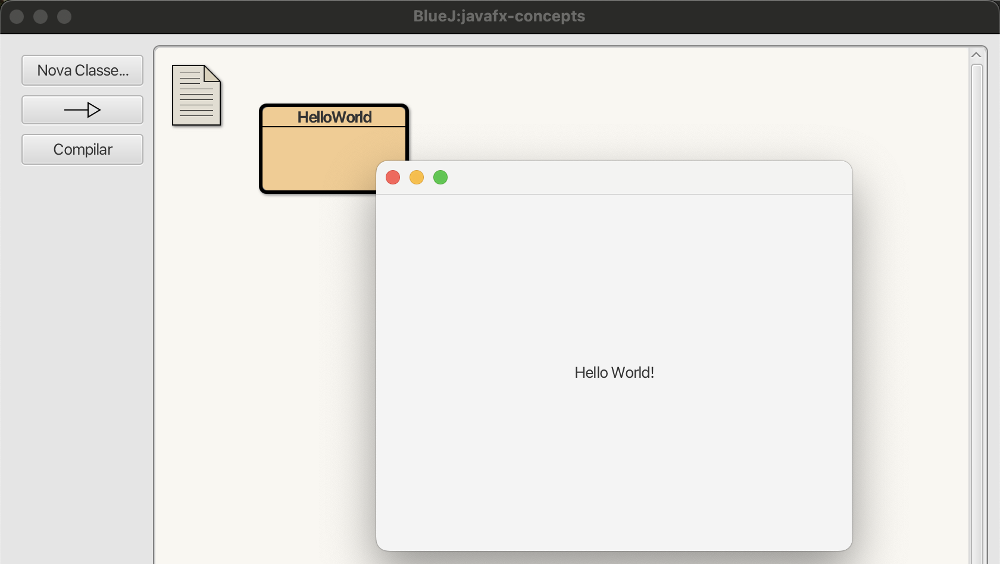
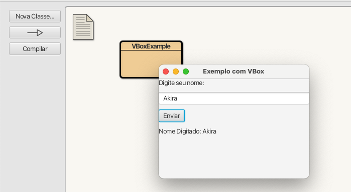
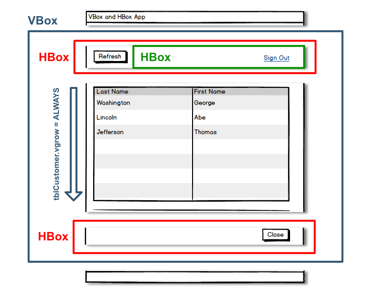
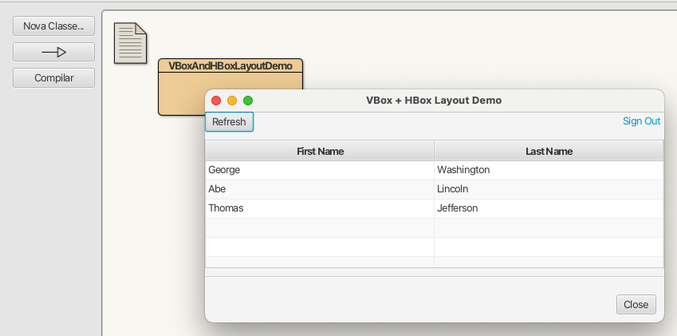
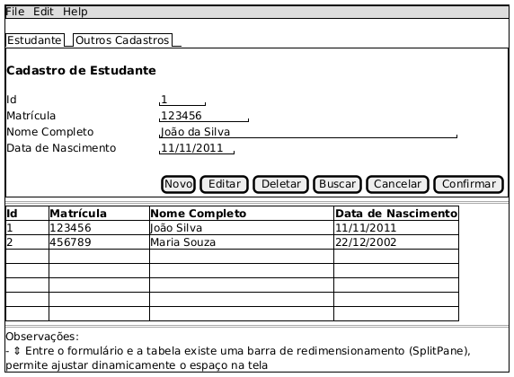
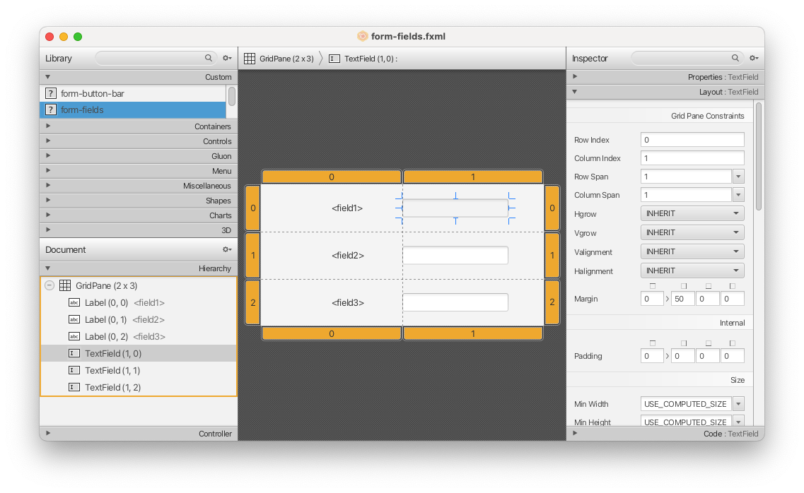
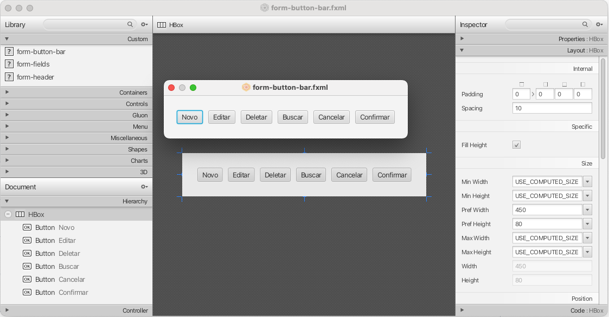
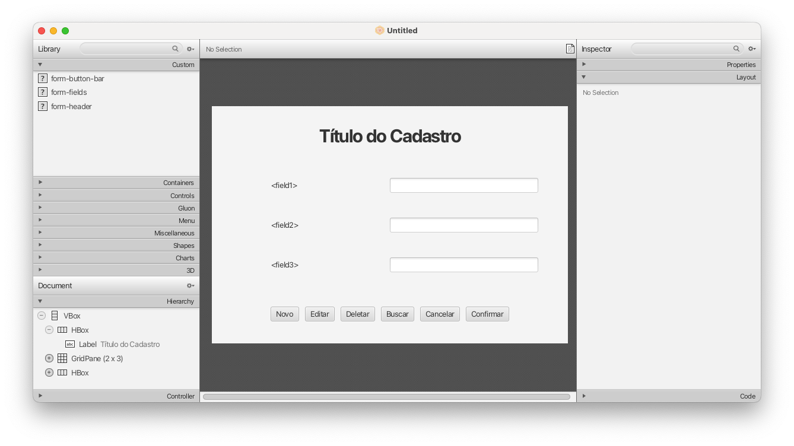
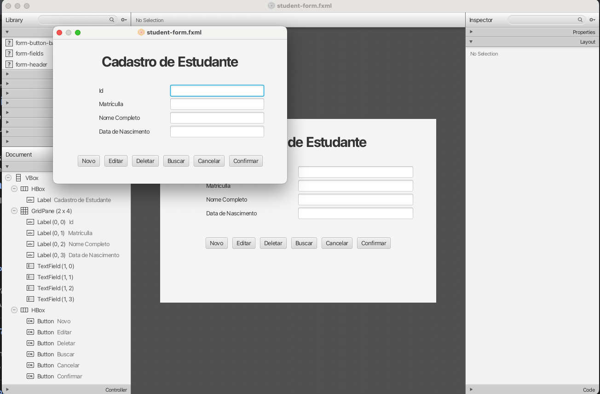

# Introdução ao JavaFX

Neste tutorial, você aprenderá os conceitos fundamentais do [JavaFX](https://openjfx.io/) e como criar uma aplicação simples. O ambiente utilizado será o **BlueJ**, que já vem configurado com suporte ao JavaFX. Para verificar as versões do software, acesse:  
**Menu BlueJ > Opções > Sobre o BlueJ**.  

  
*Figura 1: Tela "Sobre o BlueJ" mostrando as versões do BlueJ, JDK e JavaFX*  

Também utilizaremos o **[Scene Builder](https://gluonhq.com/products/scene-builder/)** (versão 23.0.1), ferramenta que permite criar interfaces gráficas de forma visual e intuitiva:  

  
*Figura 2: Tela do Scene Builder em ação*  

💡 **Por que registrar as versões dos softwares?**  
Saber exatamente as versões do BlueJ, JavaFX e Scene Builder ajuda a diagnosticar problemas durante a execução do tutorial, além de facilitar a identificação de incompatibilidades ou bugs específicos dessas versões.  


## 1. Aspectos gerais

O **JavaFX** é uma biblioteca para construção de interfaces gráficas (GUIs) em Java. Criado para substituir o Swing como principal biblioteca de GUI, ele oferece uma abordagem mais moderna e rica em recursos para o desenvolvimento de aplicações desktop e móveis.  

Entre seus diferenciais estão o suporte a **gráficos 2D e 3D**, **animações**, **efeitos visuais** e a **linguagem de marcação FXML**, que permite definir interfaces de forma declarativa.  

💡 **Por que o FXML é importante?**  
O FXML, assim como o HTML, é uma linguagem de marcação. Arquivos `.fxml` têm estrutura semelhante a arquivos `.html`, o que facilita a definição clara e concisa da interface. Aliado ao suporte a **CSS**, os desenvolvedores podem separar a lógica de negócios da aparência, tornando a aplicação mais modular e de fácil manutenção. Além disso, o FXML pode ser usado em conjunto com o **Scene Builder** para criar interfaces de forma visual, acelerando o desenvolvimento.  

O **JavaFX** é mantido pelo projeto de código aberto **OpenJFX**, hospedado no GitHub. Isso possibilita contribuições de desenvolvedores ao redor do mundo, que podem sugerir melhorias, reportar bugs e participar ativamente da evolução da plataforma.  

## 2. Passado e Futuro

O **JavaFX** surgiu com o objetivo de substituir o **Swing** como a principal biblioteca de interfaces gráficas em Java, oferecendo uma plataforma mais moderna, rica em recursos visuais e preparada para aplicações responsivas. Inicialmente lançado em **2008** como um projeto independente, foi posteriormente **incorporado ao JDK** a partir do **Java 7 (2012)**, tornando-se parte oficial da distribuição Java. No entanto, com a evolução do ecossistema, o JavaFX foi **desacoplado do JDK a partir do Java 11 (2018)**, passando a ser distribuído separadamente sob o projeto **OpenJFX**, mantido pela comunidade e por empresas como a Gluon. 

Comparado ao **Swing**, o JavaFX oferece vantagens como **melhor performance**, **aparência mais moderna** e a possibilidade de criar aplicações **responsivas**, que funcionam em diferentes dispositivos e tamanhos de tela.  

Outro ponto importante é a **comunidade ativa** do JavaFX, que oferece ampla documentação, bibliotecas, tutoriais e fóruns de discussão. Além do portal oficial [OpenJFX](https://openjfx.io/), há também iniciativas como o [JFX Central](https://jfx-central.com/), que disponibilizam recursos open-source para apoiar desenvolvedores.  

  

Apesar dessas vantagens, o JavaFX apresenta alguns desafios, como uma **curva de aprendizado mais íngreme** para quem vem do Swing e a **necessidade de versões mais recentes do JDK**. A partir do **JDK 11**, o JavaFX oficial passou a ser distribuído como **OpenJFX**, deixando de ser mantido diretamente pela Oracle e tornando-se um projeto da comunidade **OpenJDK**.  

💡 Por que recursos básicos como bibliotecas são geralmente mantidas por comunidades de software livres?

Bibliotecas e recursos fundamentais de software são frequentemente mantidos por comunidades de software livre por atenderem necessidades amplas e comuns a diferentes projetos. O modelo colaborativo permite que desenvolvedores de todo o mundo contribuam, garantindo **transparência, auditabilidade e continuidade**, mesmo quando empresas deixam de apoiar o projeto. Essa abordagem favorece a **inovação distribuída**, reduz o risco de dependência de um único fornecedor e reforça a **neutralidade e acessibilidade** do ecossistema, tornando-o mais sustentável, seguro e confiável para todos.


Atualmente, a liderança do projeto **OpenJFX** está sob a responsabilidade da [Gluon](https://gluonhq.com/), empresa que oferece suporte comercial e ferramentas relacionadas ao JavaFX, incluindo o [Scene Builder](https://gluonhq.com/products/scene-builder/), software livre que facilita a criação de interfaces de forma **visual e interativa**.   

## 3. Hello World: uma aplicação simples

Nesta seção, você aprenderá a criar uma aplicação simples em JavaFX que exibe uma janela com o texto "Hello, World!". O objetivo dessa aplicação é demonstrar os conceitos básicos do JavaFX, incluindo a estrutura de um programa JavaFX, a criação de uma janela (Stage) e a adição de elementos gráficos (Scene e Nodes). Será explicado também como um conjunto de Threads (linhas de execução) são utilizadas para rodar a aplicação JavaFX.

### Como instalar

Para acompanhar este tutorial, você pode usar o **BlueJ**, que já vem com o JavaFX pré-configurado. Nesse caso, não há necessidade de instalar bibliotecas adicionais — basta abrir o BlueJ e criar um novo projeto Java. Para verificar se o JavaFX está funcionando, acesse **BlueJ > Opções > Sobre o BlueJ** e confira a versão instalada.  

Se você deseja trabalhar com **outras IDEs** (como IntelliJ IDEA, Eclipse ou VS Code), será necessário:  

1. **Baixar o SDK do JavaFX** no site oficial: [https://openjfx.io/](https://openjfx.io/).  
2. **Descompactar** o pacote em um diretório de sua preferência.  
3. **Configurar o projeto** na IDE:  
   - Adicione os arquivos `.jar` do JavaFX ao classpath do projeto.  
   - Configure os parâmetros de execução para incluir os módulos JavaFX, por exemplo:  
     ```bash
     --module-path /caminho/para/javafx-sdk/lib --add-modules javafx.controls,javafx.fxml
     ```  

> 💡 **Dica:** A Gluon, mantenedora do OpenJFX, mantém tutoriais de configuração para cada IDE no link [Getting Started](https://openjfx.io/openjfx-docs/).  

### Como rodar um exemplo simples

Crie e compile o seguinte código no BlueJ:

```java
import javafx.application.Application;
import javafx.scene.Scene;
import javafx.scene.control.Label;
import javafx.scene.layout.StackPane;
import javafx.stage.Stage;

public class HelloWorld extends Application { // 1. Herda de Application
    @Override
    public void start(Stage palco) {    // 2. Inicia aplicação
        Label label = new Label("Hello World!");
        StackPane root = new StackPane(label);  // 3. Cria o nó raiz

        Scene cena = new Scene(root, 400, 300); // 4. Conteúdo da janela
        palco.setScene(cena);                 // 5. Associa a cena ao palco
        palco.show(); // 6. Exibe o palco
    }

    public static void main(String[] args) {
        launch(); // 7. Inicia a aplicação
    }
}
```

Para executar, clique com o botão direito no arquivo `HelloWorld.java` no BlueJ e selecione "Executar aplicação JavaFX". Isso iniciará a aplicação JavaFX e abrirá a janela com a mensagem "Hello World!", conforme mostrado na imagem abaixo.




> 💡 **Você sabia?**  
> O nome **JavaFX** é pronunciado “Java F-X” e faz um trocadilho com **“Java Effects”** (Efeitos Java).  A escolha reflete a inspiração na indústria do cinema, onde conceitos como **Stage** (palco) e **Scene** (cena) reforçam a ideia de construir interfaces gráficas como se fossem produções teatrais ou cinematográficas.


### Explicação do Código

O programa `HelloWorld` é um exemplo mínimo de uma aplicação JavaFX.  
**(1)** A classe herda de `Application`, que é a base de todas as aplicações no framework, permitindo que o JavaFX gerencie automaticamente o ciclo de vida da aplicação, desde a inicialização até a exibição da interface.  

**(7)** O método `main()` continua sendo o ponto de entrada do programa, mas em vez de construir a interface diretamente, ele chama o método `launch()`. Essa chamada inicializa toda a infraestrutura do JavaFX (incluindo as threads internas) e, ao final do processo, invoca o método `start()`.  

**(2)** O método `start(Stage palco)` recebe como parâmetro um `Stage`, que representa a janela principal do aplicativo — uma moldura vazia que servirá de contêiner para o restante da interface.  

**(3)** Para exibir algo na janela, criamos um `Label` com o texto “Hello World!” e o inserimos dentro de um `StackPane`. O `StackPane` é um contêiner de layout simples que organiza seus filhos em pilha e centraliza os elementos automaticamente. Esse contêiner (`root`) será o nó raiz da interface.  

**(4)** Em seguida, criamos uma `Scene`, que define todo o conteúdo da janela. Ao criar a cena, passamos o nó raiz e as dimensões da janela (400 x 300 pixels).  
**(5)** A cena é associada ao palco com `palco.setScene(cena)`, preparando a janela para exibir o conteúdo.  

**(6)** Por fim, o método `palco.show()` torna a janela visível na tela do usuário.  

Esse exemplo demonstra o ciclo básico de uma aplicação JavaFX: uma classe que estende `Application`, um método `main()` que chama `launch()`, um `Stage` como janela principal, uma `Scene` que agrupa o conteúdo e uma árvore de `Nodes` compondo os elementos visuais. Esse modelo de construção organiza a interface em camadas claras e reutilizáveis.  


## 4. Uso de Threads no JavaFX

A aplicação `HelloWorld` demonstra um comportamento comum em programas JavaFX: ao fechar a janela, a **JVM (Java Virtual Machine)** pode continuar em execução, mantendo threads ativas em segundo plano. Isso ocorre porque o JavaFX utiliza várias threads para gerenciar a interface e eventos, e algumas delas não são encerradas automaticamente quando a janela principal é fechada.

Para observar esse comportamento, execute a aplicação `HelloWorld` pelo método `main()`, feche a janela e tente executá-la novamente. A seguinte exceção será exibida:

```java
java.lang.IllegalStateException: Application launch must not be called more than once
```

Esse erro acontece porque o JavaFX utiliza um modelo de **thread única para a interface do usuário (UI Thread)**. Ao fechar a janela, a thread principal pode permanecer ativa, impedindo que a aplicação seja reiniciada enquanto a JVM não for encerrada.

Para investigar melhor, podemos usar um método que **lista todas as threads em execução**:

```java
public static void listarThreads() {
    System.out.println("=== THREADS ATIVAS ===");
    Thread.getAllStackTraces().keySet().forEach(thread ->
        System.out.println("Thread: " + thread.getName() +
                           " | Daemon: " + thread.isDaemon() +
                           " | Estado: " + thread.getState())
    );
    System.out.println("======================");
}
```

### Resultados empíricos (BlueJ)

**Antes de iniciar a aplicação JavaFX**: reinicie a máquina virtual Java no canto inferior do BlueJ e, em seguida, execute o método `listarThreads()`. O resultado típico é semelhante a:

```
=== THREADS ATIVAS ===
Thread: Reference Handler | Daemon: true | Estado: RUNNABLE
Thread: Signal Dispatcher | Daemon: true | Estado: RUNNABLE
Thread: AWT-Shutdown | Daemon: false | Estado: TIMED_WAITING
Thread: Notification Thread | Daemon: true | Estado: RUNNABLE
Thread: Common-Cleaner | Daemon: true | Estado: TIMED_WAITING
Thread: Finalizer | Daemon: true | Estado: WAITING
Thread: AppKit Thread | Daemon: true | Estado: RUNNABLE
Thread: DestroyJavaVM | Daemon: false | Estado: RUNNABLE
Thread: main | Daemon: false | Estado: RUNNABLE
Thread: BlueJ worker thread | Daemon: false | Estado: RUNNABLE
======================
```

**Após iniciar a aplicação JavaFX**: execute a aplicação e, antes de fechá-la, chame novamente `listarThreads()`. O resultado será semelhante a:

```
=== THREADS ATIVAS ===
...mesmas threads anteriores...
Thread: JavaFX Application Thread | Daemon: true | Estado: RUNNABLE
Thread: process reaper | Daemon: true | Estado: TIMED_WAITING
Thread: JavaFX-Launcher | Daemon: false | Estado: WAITING
Thread: Prism Font Disposer | Daemon: true | Estado: WAITING
Thread: QuantumRenderer-0 | Daemon: true | Estado: WAITING
Thread: JavaFX BlueJ Helper | Daemon: false | Estado: WAITING
Thread: InvokeLaterDispatcher | Daemon: true | Estado: WAITING
======================
```

Essas threads adicionais são específicas do JavaFX e desempenham papéis importantes na renderização gráfica e no processamento de eventos. *Os nomes podem variar conforme a versão do JDK/JavaFX e o sistema operacional.*

Para garantir o encerramento completo da aplicação (e da JVM), podemos sobrescrever o método `stop()`, chamado automaticamente ao fechar a janela:

```java
@Override
public void stop() {
    System.out.println("Aplicação finalizada. Encerrando a JVM...");
    System.exit(0);  // Finaliza explicitamente a JVM
}
```

**Classe completa com listagem de threads e parada explícita:**

```java
import javafx.application.Application;
import javafx.scene.Scene;
import javafx.scene.control.Label;
import javafx.scene.layout.StackPane;
import javafx.stage.Stage;

public class StoppableHelloWorld extends Application {

    @Override
    public void start(Stage palco) {
        Label label = new Label("Hello World!");
        StackPane root = new StackPane(label);  // Nó raiz

        Scene cena = new Scene(root, 400, 300); // Conteúdo da janela
        palco.setScene(cena);
        palco.setTitle("Hello World com Threads");
        palco.show();

        listarThreads();  // Lista threads ativas
    }

    @Override
    public void stop() {
        System.out.println("Aplicação finalizada. Encerrando a JVM...");
        System.exit(0);  // Finaliza explicitamente a JVM
    }

    public static void listarThreads() {
        System.out.println("=== THREADS ATIVAS ===");
        Thread.getAllStackTraces().keySet().forEach(thread ->
            System.out.println("Thread: " + thread.getName() +
                               " | Daemon: " + thread.isDaemon() +
                               " | Estado: " + thread.getState())
        );
        System.out.println("======================");
    }

    public static void main(String[] args) {
        launch();
    }
}
```

Aplicações JavaFX utilizam múltiplas threads internas, e fechar a janela nem sempre encerra a JVM. Ao sobrescrever `stop()` e chamar `System.exit(0)`, você garante o término de todas as threads, evitando processos persistentes em segundo plano e tornando o ciclo de execução previsível — especialmente útil em ambientes de desenvolvimento como o BlueJ.

> :bulb: Para saber mais
> Thread é um recurso computacional para executar tarefas simultaneamente. Para aprender mais sobre como as threads funcionam em Java, você pode consultar a [documentação oficial](https://docs.oracle.com/javase/tutorial/essential/concurrency/index.html).

## 5. Tratamento de Eventos

O tratamento de eventos é uma parte fundamental do desenvolvimento de interfaces gráficas. JavaFX fornece uma ampla gama de eventos que podem ser tratados, como cliques de mouse, pressionamentos de tecla e alterações em componentes de interface.

Para ilustrar esse conceito, execute o código abaixo:

```java
import javafx.application.Application;
import javafx.scene.Scene;
import javafx.scene.control.Button;
import javafx.scene.layout.StackPane;
import javafx.stage.Stage;

public class EventDemo extends Application {

    @Override
    public void start(Stage palco) {
        // Cria um botão
        Button botao = new Button("Clique em mim!");

        // Define uma ação para o botão
        botao.setOnAction(event -> {
            botao.setText("Botão clicado! Evento disparado.");
        });

        // Layout simples com o botão centralizado
        StackPane root = new StackPane(botao);

        // Cena e configuração do palco
        Scene cena = new Scene(root, 300, 200);
        palco.setScene(cena);
        palco.show();
    }

    public static void main(String[] args) {
        launch();
    }
}
```


### Explicação do código `EventDemo`

Este código cria uma aplicação JavaFX simples chamada `EventDemo` que demonstra o **tratamento de eventos de clique**.  
A classe estende `Application`, e o método `start(Stage palco)` é chamado para configurar a interface:

1. Um **botão** é criado com o texto “Clique em mim!”.  
2. É definido um tratador de eventos **event handler** com `setOnAction`, que altera o texto do botão para “Botão clicado! Evento disparado.” quando ele é pressionado.  
3. O botão é colocado dentro de um `StackPane`, um layout simples que centraliza o conteúdo.  
4. Uma `Scene` de 300x200 pixels é criada e associada ao `Stage` (janela principal).  
5. Por fim, `palco.show()` exibe a janela.  

💡 Esse exemplo ilustra a base do **modelo de eventos do JavaFX**: um componente gráfico (`Button`) gera um evento (`ActionEvent`), que é tratado por um manipulador definido pelo método `setOnAction`.  

### Tratador de eventos com função lambda

No JavaFX, muitos eventos, como cliques de botão, são representados por objetos do tipo `EventHandler<ActionEvent>`. Tradicionalmente, seria necessário criar uma [**classe anônima**](https://docs.oracle.com/javase/tutorial/java/javaOO/anonymousclasses.html) para implementar esse manipulador de eventos:

```java
botao.setOnAction(new EventHandler<ActionEvent>() {
    @Override
    public void handle(ActionEvent event) {
        System.out.println("Botão clicado!");
    }
});
```

Com a introdução das [**expressões lambda**](https://docs.oracle.com/javase/tutorial/java/javaOO/lambdaexpressions.html) no Java (a partir da versão 8), esse código pode ser escrito de forma mais **curta e legível**:

```java
botao.setOnAction(event -> {
    System.out.println("Botão clicado!");
});
```

💡 A **expressão lambda** `event -> { ... }` é uma forma simplificada de escrever uma função que recebe um parâmetro (`event`) e executa um bloco de código. Em vez de criar uma classe inteira para lidar com o evento, basta indicar **o que fazer** quando o evento ocorrer.

- **`event`**: parâmetro que representa o evento disparado.  
- **`->`**: indica que o que vem depois é o código a ser executado.  
- **`{ ... }`**: contém as ações que serão realizadas.  

Essa abordagem torna o código mais **curto, claro e moderno**, facilitando a leitura e manutenção.

> 💡 **Saiba mais sobre mais componente e tratamento de eventos**
> Explore exemplos práticos e bem explicados no *JavaFX Prático*:
> - [Tratamento de eventos simples e o botão](https://jesuino.gitbooks.io/javafx-pratico/content/artigos/tratamento_de_eventos_simples_e_o_botao.html): cobre manipuladores de eventos com classes, classes anônimas e expressões lambda.
> - [Radio Button, CheckBox e ToggleButton](https://jesuino.gitbooks.io/javafx-pratico/content/artigos/radio_button_checkbox_togglebutton.html): demonstra seleção única com `RadioButton` e `ToggleGroup`, além de opções booleanas com `CheckBox`.
> - [ComboBox e ChoiceBox](https://jesuino.gitbooks.io/javafx-pratico/content/artigos/combobox_e_choicebox.html): apresenta como lidar com seleção única em listas e como usar o `SelectionModel`.

## 6. Gerenciamento de Leiaute (Layout)

A disposição dos componentes gráficos em uma tela é controlada por **gerenciadores de layout** (*layout managers*), que definem regras para o **posicionamento, tamanho, margens e alinhamento** dos elementos. Em JavaFX, esses layouts são implementados por **contêineres** (`StackPane`, `VBox`, `HBox`, `BorderPane`, etc.), que são nós capazes de conter outros componentes, sejam eles **nós simples** (botões, rótulos, campos de texto) ou **outros contêineres**. Essa organização forma uma **estrutura em árvore**, na qual existe um nó raiz (geralmente o contêiner principal da interface) que contém **nós filhos**, podendo haver **vários níveis de aninhamento**. Essa hierarquia torna a interface modular, flexível e fácil de gerenciar, permitindo compor telas complexas a partir de elementos simples.

Essa organização em árvore reflete diretamente a **hierarquia de classes** do JavaFX, conforme ilustrado na Figura a seguir:


- **`Node`** é a superclasse base de todos os elementos gráficos, representando qualquer objeto que possa ser exibido em uma cena.  
- **`Parent`** herda de `Node` e adiciona a capacidade de conter **nós filhos**.  
- **`Region`** herda de `Parent` e fornece suporte a layout, gerenciamento de tamanho preferido, mínimo e máximo, além de estilização via CSS.  
- **`Pane`** é uma subclasse de `Region` que serve de base para diversos **gerenciadores de layout**, como `VBox`, `HBox`, `BorderPane`, entre outros.  
- **`Control`** também herda de `Region` e é a classe base para **componentes interativos** como `Button`, `Label`, `TextField`, `ListView`, etc.  
- **`Group`**, assim como `Region`, é uma subclasse de `Parent`, mas **não aplica regras de layout**. Os nós filhos mantêm suas posições e tamanhos originais, sendo útil para **posicionamento absoluto** ou agrupamento lógico de elementos.  


Este diagrama resume de forma simples a **árvore de herança das classes JavaFX** usadas na construção de interfaces gráficas.

### 6.1. Exemplo de VBox

Para ilustrar a utilização do `VBox`, compile e execute o seguinte exemplo:

```java
import javafx.application.Application;
import javafx.scene.Scene;
import javafx.scene.control.Button;
import javafx.scene.control.Label;
import javafx.scene.control.TextField;
import javafx.scene.layout.VBox;
import javafx.stage.Stage;

public class VBoxExample extends Application {

    @Override
    public void start(Stage palco) {
        // Cria os componentes
        Label label = new Label("Digite seu nome:");
        TextField campoTexto = new TextField();
        Button botao = new Button("Enviar");
        Label resultado = new Label("");

        // VBox com espaçamento de 10px entre os elementos
        VBox vbox = new VBox(10);
        vbox.getChildren().addAll(label, campoTexto, botao, resultado);

        // Evento simples no botão
        botao.setOnAction(e -> {
            resultado.setText("Nome Digitado: "+ campoTexto.getText());
        });


        // Cena e configuração do palco
        Scene cena = new Scene(vbox, 300, 200);
        palco.setScene(cena);
        palco.setTitle("Exemplo com VBox");
        palco.show();
    }

    public static void main(String[] args) {
        launch();
    }
}
```

Este código cria uma aplicação JavaFX simples que usa o **`VBox`** para organizar componentes em **colunas**. A classe `VBoxExample` estende `Application`, e o método `start` monta a interface.

São criados um `Label`, um `TextField`, um `Button` e outro `Label` para exibir o resultado. Esses elementos são adicionados ao `VBox`, que os posiciona verticalmente com **10px de espaçamento**.

O botão possui um evento (`setOnAction`) que atualiza o `Label resultado` com o texto digitado. A cena de 300x200 pixels é associada ao palco (`Stage`) e exibida. O método `launch()` inicia a aplicação.

O resultado será exibido no `Label resultado` assim que o botão for clicado, conforme ilustrado na imagem a seguir:



### 6.2. VBox com HBox

Gerenciadores de layout podem ser combinados para criar interfaces mais complexas. Por exemplo, você pode usar um `HBox` dentro de um `VBox` para organizar elementos horizontalmente em uma coluna vertical. Um bom exemplo deste design é apresentado no [projeto de documentação FXDocs](https://fxdocs.github.io/docs/html5/#_vbox_and_hbox). O design é iniciado com um protótipo visual (_mockup_):


Fonte: Projeto FXDocs, licenciado sob a [Licença CC-BY-NC-ND](https://creativecommons.org/licenses/by-nc-nd/4.0/).

E a divisão por contêiner é feita da seguinte forma:



Baseado nesse desenho, podemos implementar a interface usando JavaFX. O `VBox` será o contêiner principal, enquanto os `HBox` serão usados para organizar os elementos dentro dele. Baseado no exemplo da [referência FXDocs](https://fxdocs.github.io/docs/html5/#_vbox_and_hbox), a implementação pode ser feita da seguinte forma:

```java
import javafx.application.Application;
import javafx.collections.FXCollections;
import javafx.collections.ObservableList;
import javafx.scene.Scene;
import javafx.scene.control.Button;
import javafx.scene.control.Hyperlink;
import javafx.scene.control.Separator;
import javafx.scene.control.TableColumn;
import javafx.scene.control.TableView;
import javafx.scene.layout.HBox;
import javafx.scene.layout.Priority;
import javafx.scene.layout.VBox;
import javafx.stage.Stage;
import javafx.geometry.Pos;
import javafx.geometry.Insets;

import java.util.HashMap;
import java.util.Map;

public class VBoxAndHBoxLayoutDemo extends Application {

    @Override
    public void start(Stage stage) {
        // VBox raiz
        VBox vbox = new VBox(10);

        // Barra superior (HBox)
        HBox topControls = new HBox(10);
        Button btnRefresh = new Button("Refresh");
        Hyperlink linkSignOut = new Hyperlink("Sign Out");
        HBox spacer = new HBox(); // "spacer" para empurrar itens para a direita
        HBox.setHgrow(spacer, Priority.ALWAYS);
        topControls.getChildren().addAll(btnRefresh, spacer, linkSignOut);

        // TableView simples usando Map
        TableView<Map<String, String>> table = new TableView<>();
        table.setColumnResizePolicy(TableView.CONSTRAINED_RESIZE_POLICY);

        TableColumn<Map<String, String>, String> colFirst = new TableColumn<>("First Name");
        colFirst.setCellValueFactory(data -> {
            Map<String, String> item = data.getValue();
            return new javafx.beans.property.SimpleStringProperty(item.get("firstName"));
        });

        TableColumn<Map<String, String>, String> colLast = new TableColumn<>("Last Name");
        colLast.setCellValueFactory(data -> {
            Map<String, String> item = data.getValue();
            return new javafx.beans.property.SimpleStringProperty(item.get("lastName"));
        });

        table.getColumns().addAll(colFirst, colLast);

        ObservableList<Map<String, String>> data = FXCollections.observableArrayList();
        data.add(createItem("George", "Washington"));
        data.add(createItem("Abe", "Lincoln"));
        data.add(createItem("Thomas", "Jefferson"));
        table.setItems(data);

        // Barra inferior (HBox)
        HBox bottomControls = new HBox();
        bottomControls.getChildren().add(new Button("Close"));
        bottomControls.setAlignment(Pos.BOTTOM_RIGHT);
        VBox.setMargin( bottomControls, new Insets(10.0d) );
        
        // Montagem do layout
        vbox.getChildren().addAll(topControls, table, new Separator(), bottomControls);

        Scene scene = new Scene(vbox, 600, 400);
        stage.setScene(scene);
        stage.setTitle("VBox + HBox Layout Demo");
        stage.show();
    }

    // Método utilitário para criar itens para a TableView
    private Map<String, String> createItem(String first, String last) {
        Map<String, String> item = new HashMap<>();
        item.put("firstName", first);
        item.put("lastName", last);
        return item;
    }

    public static void main(String[] args) {
        launch(args);
    }
}

```

A execução do código acima resultará na seguinte interface:



> **:bulb: Saiba mais sobre TableView**
> A `TableView` é um dos componentes mais poderosos do JavaFX para exibir dados tabulares.  
> Ela suporta:
> - **Colunas configuráveis**: criação dinâmica de colunas e associação a propriedades dos objetos;
> - **Renderização customizada**: uso de `cellFactory` para personalizar a exibição das células;
> - **Edição de dados**: suporte a campos editáveis diretamente na tabela;
> - **Integração com ObservableList**: atualizações automáticas da interface ao alterar dados;
> - **Seleção múltipla**: controle de seleção de linhas e colunas.
>
> 🔗 Consulte a documentação detalhada:  
> [Documentação TableView (fxdocs)](https://fxdocs.github.io/docs/html5/#_tableview)

Este código mostra como usar **VBox** e **HBox** para criar uma interface organizada em JavaFX. O `VBox` é o contêiner principal e organiza os elementos em uma coluna com espaçamento de 10px.

A **barra superior** (`HBox`) contém o botão “Refresh” à esquerda e o link “Sign Out” à direita, usando um **spacer** para separar os elementos.  A **tabela** (`TableView`) tem duas colunas (`First Name` e `Last Name`) e usa `Map<String, String>` para inserir dados simples, exibidos com `SimpleStringProperty`.  A **barra inferior** (`HBox`) tem apenas o botão “Close”, alinhado à direita.

Todos os elementos são adicionados ao `VBox`, e a cena é exibida em uma janela de 600x400px. Este exemplo ilustra como **VBox** (vertical) e **HBox** (horizontal) podem ser combinados para criar layouts claros e estruturados.


> **:bulb: Saiba mais sobre outros gerenciadores de Layout**
> Além do **VBox** e **HBox**, o JavaFX oferece outros gerenciadores de layout, como:
> - **AnchorPane**: permite ancorar nós a bordas específicas do contêiner, oferecendo controle preciso sobre a posição.
> - **BorderPane**: divide a área em cinco regiões: centro, norte, sul, leste e oeste.
> - **FlowPane**: organiza os nós em uma única linha ou coluna, quebrando para a próxima linha ou coluna quando o espaço é insuficiente.
> - **GridPane**: organiza os nós em uma grade de linhas e colunas.
> - **StackPane**: empilha os nós uns sobre os outros, permitindo sobreposição e alinhamento centralizado.
> - **TilePane**: organiza os nós em um padrão de grade, ajustando automaticamente o tamanho das células.
> 🔗 Consulte mais sobre Gerenciadores de Layout:
> - [BorderPane, FlowPane e o GridPane (JavaFX Prático)](https://jesuino.gitbooks.io/javafx-pratico/content/artigos/gerenciando_layout_borderpane_flowpane_e_o_gridpa.html)
> - [Documentação Layouts (fxdocs)](https://fxdocs.github.io/docs/html5/#_layout)

## 6.3. Criando interfaces com Scene Builder

Antes de criar uma interface gráfica, é recomendável rascunhá-la em papel ou em uma ferramenta de design. Isso ajuda a planejar a disposição dos elementos e a definir a estrutura da interface. O resultado é um protótipo visual (_mockup_), semelhante ao utilizado na seção anterior, que serve como guia para a implementação.

Para esta seção, vamos criar uma interface para operações CRUD (Create, Read, Update, Delete) de um cadastro simples de estudante. O protótipo visual é o seguinte:



O protótipo mostra uma interface com campos para inserir os dados do estudante, botões para as operações CRUD e uma tabela para exibir os registros. A ferramenta que foi utilizada para criar o protótipo foi o [módulo Salt do PlantUML](https://plantuml.com/salt), projetado para criar wireframes através de texto. O código fonte do protótipo está disponível no arquivo [student-crud-mockup.puml](student-crud-mockup.puml).

Uma boa estratégia para criar interfaces é construir componentes de forma modular. Cada parte da interface pode ser desenvolvida como um módulo independente, facilitando a manutenção e reutilização. Por exemplo, o formulário de cadastro pode ser um módulo separado da tabela de exibição dos registros. Isso permite que cada módulo seja testado e ajustado individualmente antes de integrá-los na interface completa.

### Criação do primeiro módulo: formulário de cadastro

Este módulo é o que mais contém elementos que podem ser reutilizados em outras interfaces. Ele inclui campos de entrada de dados e botões para as operações básicas. Por isso, será demonstrado como criar componentes em arquivos .fxml separados, que podem ser integrados posteriormente. Os componentes que serão criados são:
- **form-header.fxml**: cabeçalho com o título do formulário.
- **form-fields.fxml**: campos de entrada de dados.
- **form-button-barra.fxml**: barra de botões para ações.

Segue o passo a passo para criar o módulo de formulário usando o Scene Builder:

##### 1) Componente form-header.fxml
1. Abra o Scene Builder e crie um novo arquivo FXML: **File → New**.  
2. Na seção **Containers**, arraste um **HBox** para a área de design.  
   - Na aba **Properties**, selecione **Alignment = CENTER**
   - Na aba **Layout**, confgure `Pref Height = 100` e `Pref Width = 500`.  
3. Na seção **Controls**, arraste um **Label** para dentro do HBox.  
   - Texto: `<Título do Formulário>`
   - Fonte: **System Bold**, tamanho **30**.
4. Salve o arquivo como **[form-header.fxml](form-header.fxml)**.
5. No menu **Library**, clique em **JAR/FXML Manager** e adicione o arquivo **form-header.fxml** à biblioteca. Uma nova aba **Custom** será criada e isso permitirá reutilizá-lo em outros arquivos FXML.

O resultado será semelhante a este:


##### 2) Componente form-fields.fxml:   
1. Crie um novo arquivo FXML: **File → New**.  
2. Na seção **Containers**, arraste um **GridPane** para a área de design. Por padrão, vai aparecer uma layout em grade com 3 linhas e 2 colunas.  
    - Na aba **Layout**, defina `Pref Height = 200` e `Pref Width = 400`.
3. Preencha as células arrastando componentes **Label** da seção **Controls**:
    - (0,0) Label → `<field1>`
    - (0,1) Label → `<field2>`  
    - (0,2) Label → `<field3>`
    - Em cada Label, ajuste **Padding → Left = 100** na seção **Layout**.
4. Preencha as células da segunda coluna, arrastando componentes **TextField** da seção controls. Para cada campo de texto, configure **Margin → Right = 50** na seção Layout.
5. Salve o arquivo como **[form-fields.fxml](form-fields.fxml)**.
6. No menu **Library**, clique em **JAR/FXML Manager** e adicione o arquivo **form-fields.fxml** à biblioteca. Uma nova aba **Custom** será criada e isso permitirá reutilizá-lo em outros arquivos FXML.


O resultado será semelhante a este:



##### 3) Componente form-button-bar.fxml:   

1. Adicione um **Hbox** disponibilizado na aba e configure-o com as seguintes propriedades:
    - **Spacing = 10**, **Pref Height = 80** e **Pref Width = 450** na aba **Layout**.
    - selecione **Alignment = CENTER** na aba **Properties**
2. Acrescente os botões na seguinte ordem:  
   - **Novo**, **Editar**, **Deletar**, **Buscar**, **Cancelar**, **Confirmar**.  
3. Salve o arquivo como **[form-button-bar.fxml](form-button-bar.fxml)**.
4. No menu **Library**, clique em **JAR/FXML Manager** e adicione o arquivo **form-menu-bar.fxml** à biblioteca. Uma nova aba **Custom** será criada e isso permitirá reutilizá-lo em outros arquivos FXML.


O resultado será semelhante a este:



Note que o componente foi pré-visualizado, basta clicar na aba **Preview**, seguido da opção **Show Preview in Window**.

#### 4) Juntando os componentes no formulário principal:
Agora que os componentes foram criados, podemos juntá-los em um arquivo FXML principal que representará o formulário completo. Siga os passos abaixo:
1. Crie um novo arquivo FXML: **File → New**.  
2. Na seção **Containers**, arraste um **VBox** para a área de design.  
   - Na aba **Layout**, defina `Pref Width = 600` e `Pref Height = 400`.
3. Na seção **Library → Custom**, arraste os componentes criados anteriormente para dentro do VBox, na seguinte ordem:
    - **form-header.fxml**
    - **form-fields.fxml**
    - **form-button-bar.fxml**
O resultado será semelhante a este:


Note que os componentes foram incorporados ao VBox, formando a estrutura do formulário. Na aba **Hierarchy**, você pode ver a árvore de componentes, confirmando que o VBox é o nó raiz e os outros componentes são seus filhos.

4. Ajuste o título do formulário:
   - Selecione o componente **Label** dentro do primeiro **HBox** filho (componente **form-header.fxml**). Altere o texto para `Cadastro de Estudantes` na aba **Properties**.
5. Configure os campos do formulário:
   - Selecione o componente **GridPane** (componente **form-fields.fxml**).
   - Acrescente uma nova linha: clique com o botão direito na área de linhas e selecione **Add Row Below**.
   - Na aba **Hierarchy**, selecione cada **Label** e altere os textos para:
        - (0,0) Label → `Id`  
        - (0,1) Label → `Matrícula`  
        - (0,2) Label → `Nome Completo`
        - (0,3) Label → `Data de Nascimento`
6. Salve o arquivo como **student-form.fxml**.

A tela final do formulário será semelhante a esta:



A criação da interface gráfica completa conforme o protótipo visual fica como exercício para o leitor. 

## 7. Conclusão

Este tutorial apresentou uma introdução prática ao **JavaFX**, cobrindo desde o histórico da tecnologia e sua evolução até a criação de interfaces gráficas simples e modulares. Exploramos conceitos fundamentais, como:

- **Estrutura de uma aplicação JavaFX**: `Application`, `Stage`, `Scene` e árvore de `Nodes`;  
- **Ciclo de vida da aplicação** e uso de **threads**;  
- **Tratamento de eventos** com expressões lambda, tornando o código mais conciso e legível;  
- **Gerenciadores de layout** (`VBox`, `HBox`, entre outros) para organizar componentes;  
- **Construção modular de interfaces** usando **Scene Builder** e arquivos FXML reutilizáveis.  

Com esses conhecimentos, você está pronto para criar interfaces gráficas robustas em Java, integrar diferentes componentes visuais e organizar seu projeto de forma profissional. O JavaFX, apesar de ter uma curva de aprendizado inicial, oferece um ecossistema moderno, flexível e com suporte de uma comunidade ativa, permitindo construir desde aplicações desktop simples até soluções complexas.

O próximo passo é **experimentar**:  
- Crie seus próprios layouts combinando os contêineres apresentados;  
- Explore eventos mais avançados, animações e estilização via CSS;  
- Aprofunde-se na API do JavaFX e contribua para projetos open-source como o OpenJFX.  

Essa base é suficiente para avançar para tópicos como **integração com bancos de dados**, **padrões de projeto (MVC)** e **componentes customizados**. Com prática e exploração, você poderá desenvolver aplicações Java modernas e completas.


## 8. Exercícios

### 1) Hello World personalizado
**Objetivo:** fixar a estrutura básica de uma aplicação JavaFX.  
**O que fazer:** copie o código `HelloWorld`, altere o tamanho da janela, o título e a mensagem exibida.  
**Critérios de aceitação:** janela com dimensões personalizadas e texto centralizado.

### 2) Botão com contador de cliques
**Objetivo:** praticar **eventos** com `setOnAction`.  
**O que fazer:** crie uma aplicação com um `Button` e um `Label` que exibe quantas vezes o botão foi clicado.  
**Critérios de aceitação:** o rótulo atualiza corretamente a cada clique.

### 3) Layout com VBox e HBox
**Objetivo:** treinar organização de componentes.  
**O que fazer:** crie uma tela com:
- Barra superior (`HBox`) com dois botões, um à esquerda e outro à direita (use espaçador);  
- Área central com um texto (`Label`);  
- Barra inferior (`HBox`) com um botão centralizado.  
**Critérios de aceitação:** os elementos ficam alinhados e respeitam o espaçamento configurado.

### 4) Tabela simples com TableView
**Objetivo:** criar uma tabela básica com dados fixos.  
**O que fazer:** crie uma aplicação com uma `TableView` que tenha duas colunas (Nome, Sobrenome) e pelo menos três registros adicionados diretamente no código.  
**Critérios de aceitação:** dados exibidos corretamente em colunas.

### 5) Formulário modular de Livro
**Objetivo:** usar o Scene Builder para modularizar a interface.  
**O que fazer:** crie:  
- `form-header.fxml`: cabeçalho com título **"Cadastro de Livro"**;  
- `form-fields.fxml`: grid com campos **ISBN, Título, Autor, Ano, Editora**;  
- `form-button-bar.fxml`: barra de botões com ações **Novo, Confirmar, Cancelar**.  
Depois crie um arquivo `book-form.fxml` que **junte esses módulos** em uma única tela.  
**Critérios de aceitação:** a tela exibe todos os componentes juntos, com layout limpo e títulos corretos, pronta para pré-visualização no Scene Builder.

### 6) Threads: encerramento da aplicação
**Objetivo:** entender ciclo de vida da aplicação JavaFX.  
**O que fazer:** adapte o `StoppableHelloWorld` para imprimir as threads ativas ao abrir e fechar a janela.  
**Critérios de aceitação:** logs mostram threads JavaFX; ao fechar, a JVM encerra corretamente.

## Para saber mais

Este tutorial é uma visão geral bem resumida sobre JavaFX. Há muito mais a explorar e aprender. Aqui estão alguns recursos recomendados:

- [JavaFX Prático](https://jesuino.gitbooks.io/javafx-pratico/content/) - Livro online com exemplos práticos de JavaFX
- [FX Docs](https://fxdocs.github.io/docs/html5/) - Documentação abrangente sobre JavaFX
- [OpenJFX Documentation](https://openjfx.io/openjfx-docs/) - Documentação oficial do OpenJFX
- [Introduction to FXML](https://openjfx.io/javadoc/24/javafx.fxml/javafx/fxml/doc-files/introduction_to_fxml.html) - Guia oficial de introdução ao FXML
- [JavaFX 24 JavaDoc](https://openjfx.io/javadoc/24/) - Documentação completa da API JavaFX 24
- [JavaFX CSS Reference](https://openjfx.io/javadoc/24/javafx.graphics/javafx/scene/doc-files/cssref.html) - Guia de referência do CSS no JavaFX