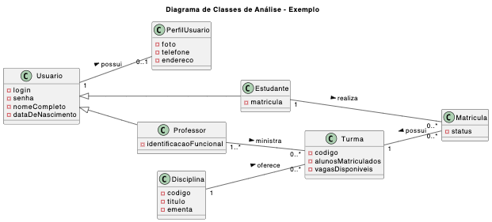
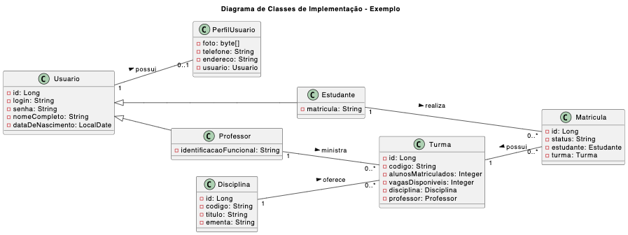
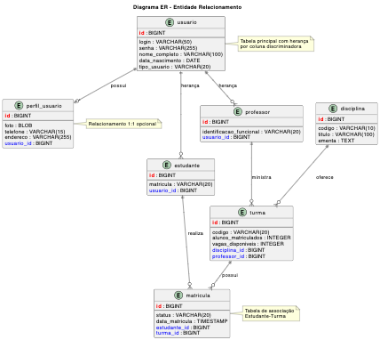

# Tutorial: Modelagem ORM em Java com JPA/Hibernate

## 1. Introdução

Este tutorial tem como objetivo ensinar os conceitos fundamentais de modelagem objeto-relacional (ORM) utilizando Java Persistence API (JPA) com Hibernate como implementação. Através de um exemplo prático, você aprenderá a mapear classes Java para tabelas de banco de dados relacionais, incluindo herança e diferentes tipos de relacionamentos.

Observação: diferentemente de outros tutoriais anteriores, neste o banco de dados H2 (em memória) será utilizado em vez do SQLite. O H2 tem melhor suporte para recursos avançados de JPA/Hibernate, como herança e relacionamentos complexos.

### 1.1 Objetivos do Tutorial

Este tutorial tem como principais objetivos:

🎯 **Experimentar o mapeamento objeto-relacional na prática** através de um exemplo completo de sistema acadêmico, onde você poderá ver como classes Java se transformam em tabelas de banco de dados.

🎯 **Aplicar conceitos fundamentais** da modelagem ORM, incluindo:
- **Mapeamento de herança**: Como modelar hierarquias de classes (Usuario → Estudante/Professor)
- **Relacionamentos 1:1**: Conexão única entre entidades (Usuario ↔ PerfilUsuario)
- **Relacionamentos 1:N**: Um para muitos (Disciplina ↔ Turmas)
- **Relacionamentos N:M**: Muitos para muitos (Professor ↔ Turmas, com classe de associação Matricula)

Ao final, você terá uma compreensão sólida de como implementar um modelo de dados complexo usando JPA/Hibernate.

### 1.2 O que é ORM?

**Mapeamento Objeto-Relacional ou Object-Relational Mapping (ORM)** é uma técnica de programação que permite fazer uma ponte entre o paradigma orientado a objetos e bancos de dados relacionais. O ORM mapeia tabelas do banco de dados para classes Java, colunas para atributos, e linhas para instâncias de objetos.

**Exemplo conceitual:**
```
Tabela: usuarios          ←→    Classe: Usuario
Colunas: id, nome, email  ←→    Atributos: id, nome, email
Linha: 1, "João", "j@..."  ←→    Objeto: new Usuario(1, "João", "j@...")
```

### 1.3 Histórico e Evolução

- **1990s**: Início dos ORMs com ferramentas como Hibernate para linguagens específicas
- **2006**: Lançamento da **JPA 1.0** como especificação padrão Java
- **2009**: JPA 2.0 - Criteria API, mais anotações, validação
- **2013**: JPA 2.1 - Schema generation, stored procedures
- **2017**: JPA 2.2 - Suporte ao Java 8, recursos de Injeção de Dependências
- **2019**: Jakarta Persistence 3.0 - Migração do namespace javax para jakarta

### 1.4 JPA (Java Persistence API)

**JPA** é uma especificação Java que define uma API padrão para mapeamento objeto-relacional. É importante entender:

- **JPA é apenas uma especificação** (como uma interface)
- **Hibernate, EclipseLink, OpenJPA** são implementações da JPA
- **Fornece anotações padronizadas** (@Entity, @Id, @OneToMany, etc.)
- **JPQL** (Java Persistence Query Language) para consultas

### 1.5 Hibernate Framework

**Hibernate** é a implementação mais popular da JPA:

- **ORM maduro e robusto** desde 2001
- **Cache de primeiro e segundo nível**
- **Lazy Loading** automático
- **HQL** (Hibernate Query Language) além da JPQL
- **Geração automática de esquemas**

### 1.6 Camada de Persistência

A camada de persistência é responsável por:

```
┌─────────────────┐
│   Camada View   │  ← Interface do usuário
├─────────────────┤
│ Camada Business │  ← Lógica de negócio
├─────────────────┤
│ Camada Persist. │  ← ✅ NOSSA CAMADA (JPA/Hibernate)
├─────────────────┤
│ Banco de Dados  │  ← Armazenamento
└─────────────────┘
```

**Responsabilidades:**
- Mapeamento objeto-relacional
- Transações e controle de conexões
- Cache e otimizações
- Consultas e atualizações

### 1.7 Vantagens e Desvantagens do ORM

#### ✅ **Vantagens:**
- **Produtividade**: Menos código SQL manual
- **Manutenibilidade**: Código mais limpo e organizado
- **Independência de SGBD**: Mesmo código para diferentes bancos
- **Segurança**: Proteção contra SQL Injection
- **Cache automático**: Melhoria de performance

#### ⚠️ **Desvantagens:**
- **Curva de aprendizado**: Complexidade inicial
- **Performance**: Queries podem ser menos otimizadas
- **Overhead**: Camada adicional de abstração
- **Debugging**: Mais difícil rastrear problemas
- **Consultas complexas**: Algumas queries são melhores em SQL puro


## 2. Instalação e Configuração do Ambiente

Para este tutorial, você precisará configurar um ambiente Java com as seguintes ferramentas:
- **Java Development Kit (JDK)**: Versão 11 ou superior
- **Maven**: Para gerenciamento de dependências
- **IDE**: VS Code
- **Banco de Dados**: H2 (banco em memória para testes)
- **Jupyter Notebook**: Para executar e testar o código interativamente


## 3. Modelagem de Classes e Entidade-Relacionamento

Nosso tutorial inicia com um diagrama de classes de análise que representa um sistema acadêmico simples, incluindo usuários (estudantes e professores), disciplinas, turmas e matrículas. Depois, transformaremos esse modelo em diagrama de classes de implementação e finalmente em um diagrama entidade-relacionamento (DER).

### 3.1 Diagrama de Classes de Análise

Vamos usar este diagrama de classes de análise como base para nosso tutorial:



O código-fonte do diagrama acima está disponível no arquivo [diagrama-classes-de-analise.puml](diagrama-classes-de-analise.puml).

**Entidades principais:**
- **Usuario** (superclasse)
- **Estudante** (herda de Usuario)
- **Professor** (herda de Usuario)
- **PerfilUsuario** (relacionamento 1:1 com Usuario)
- **Disciplina** (relacionamento 1:N com Turma)
- **Turma** (relacionamento 1:N com Professor)
- **Matricula** (classe de associação, relaciona Estudante e Turma, ou seja, consiste em um relacionamento N:M entre Professor e Turma)

**Cardinalidades dos relacionamentos:**

| Relacionamento | Cardinalidade | Tipo |
|---|---|---|
| Usuario ↔ PerfilUsuario | 1:1 | Composição |
| Usuario ↔ {Estudante, Professor} | 1:1 | Herança |
| Disciplina ↔ Turma | 1:N | Associação |
| Professor ↔ Turma | N:M | Associação |
| Estudante ↔ Matricula | 1:N | Associação |
| Turma ↔ Matricula | 1:N | Associação |


### 3.2 Diagrama de Classes de Implementação

A seguir, o diagrama de classes de implementação que mapeia as classes de análise.



O código-fonte do diagrama acima está disponível no arquivo [diagrama-classes-de-implementacao.puml](diagrama-classes-de-implementacao.puml).

Note as diferenças em relação ao diagrama de análise:
- Adição de atributos de identificação (IDs) para cada entidade
- Tipos de dados específicos para cada atributo
- Atributos "estrangeiros", por exemplo, `disciplina` em `Turma`. Obs: Estes atributos na linguagem UML não são obrigatórios, pois são redundantes, mas ajudam a visualizar a implementação dos relacionamentos.

### 3.3 Diagrama Entidade-Relacionamento (DER)

A seguir, o diagrama entidade-relacionamento (DER) que representa a estrutura do banco de dados relacional.



O código-fonte do diagrama acima está disponível no arquivo [diagrama-er.puml](diagrama-er.puml).

Note neste diagrama:
- As tabelas correspondem às classes de implementação
- As colunas correspondem aos atributos das classes
- A estratégia de mapeamento de herança escolhida foi de "tabela por classe concreta" (cada subclasse tem sua própria tabela, incluindo os atributos da superclasse)
- Os atributos "estrangeiros" (foreign keys) indicam os relacionamentos entre as tabelas

## 4. Implementação do Código Java com JPA/Hibernate

### 4.1 Configuração do Maven

✅ **Configuração Completa Disponível!**

Para este tutorial, já foi criada uma configuração completa do Maven com todas as dependências necessárias. Os arquivos de configuração incluem:

- **`pom.xml`**: Configuração principal do Maven com dependências JPA/Hibernate
- **`persistence.xml`**: Configuração das unidades de persistência JPA
- **`logback.xml`**: Configuração de logs para desenvolvimento
- **`JPAUtil.java`**: Classe utilitária para gerenciamento de EntityManager

📋 **Para detalhes completos da configuração, consulte:** [`SETUP.md`](SETUP.md)

#### Principais Dependências Configuradas:

```xml
<!-- JPA/Hibernate -->
<dependency>
    <groupId>org.hibernate.orm</groupId>
    <artifactId>hibernate-core</artifactId>
    <version>6.4.1.Final</version>
</dependency>

<!-- Banco H2 -->
<dependency>
    <groupId>com.h2database</groupId>
    <artifactId>h2</artifactId>
    <version>2.2.224</version>
</dependency>

<!-- Jakarta Persistence API -->
<dependency>
    <groupId>jakarta.persistence</groupId>
    <artifactId>jakarta.persistence-api</artifactId>
    <version>3.1.0</version>
</dependency>
```

#### Comandos Básicos:

```bash
# Testar configuração
mvn test

# Executar aplicação
mvn exec:java

# Compilar projeto
mvn compile
```

### 4.2 Implementação das Entidades JPA

Como exercício, você deve criar as classes Java correspondentes às entidades do modelo, utilizando as anotações JPA apropriadas para mapear os atributos e relacionamentos. Sugestão de tutorial para consulta:

https://www.baeldung.com/learn-jpa-hibernate


