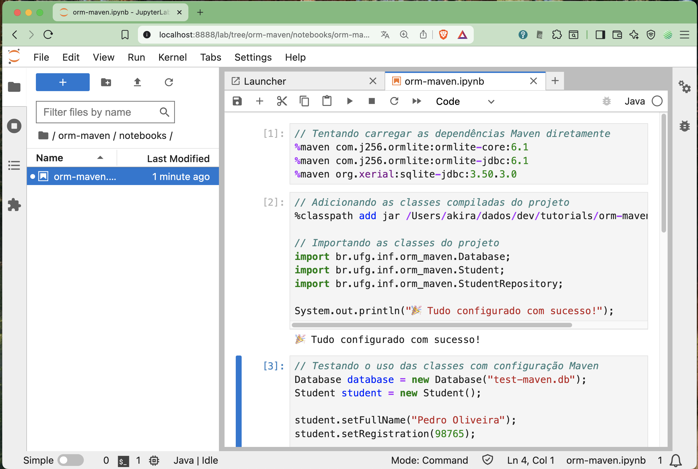
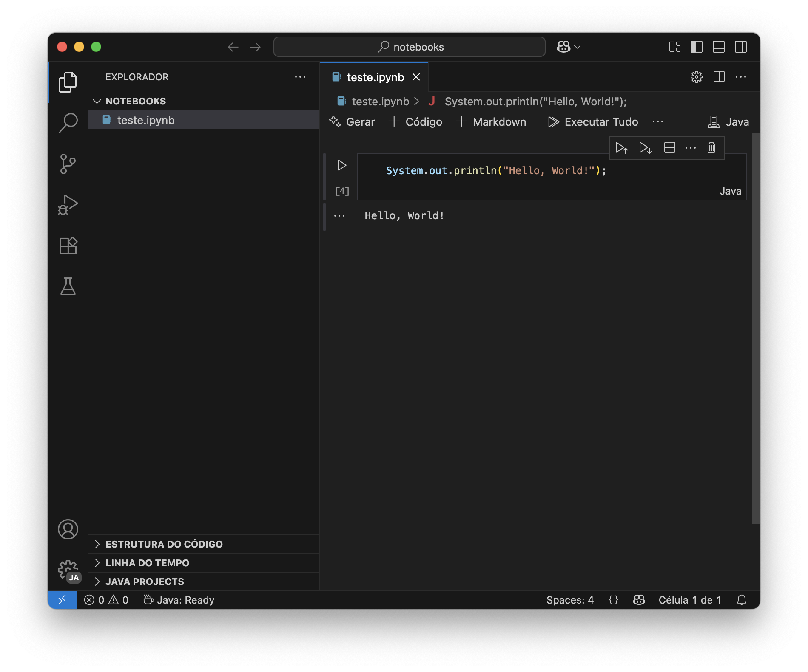
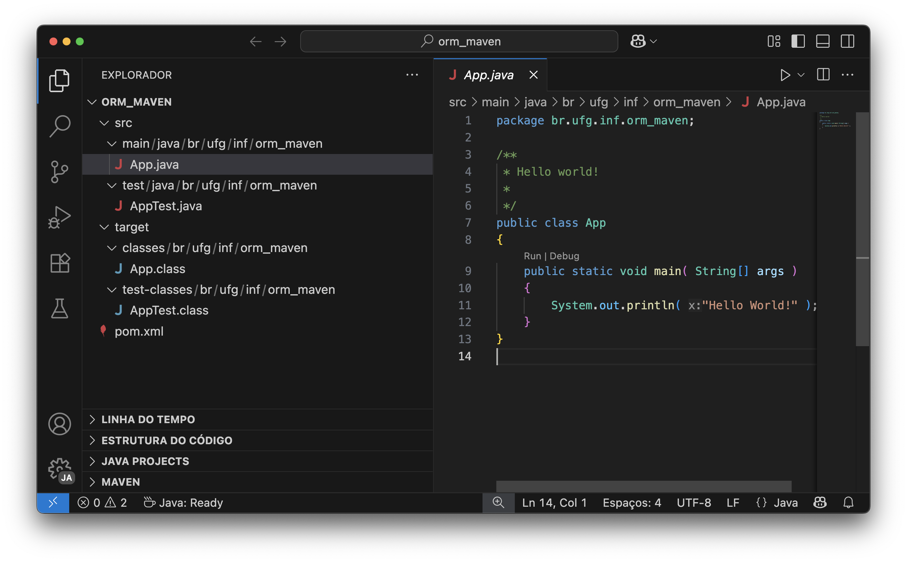
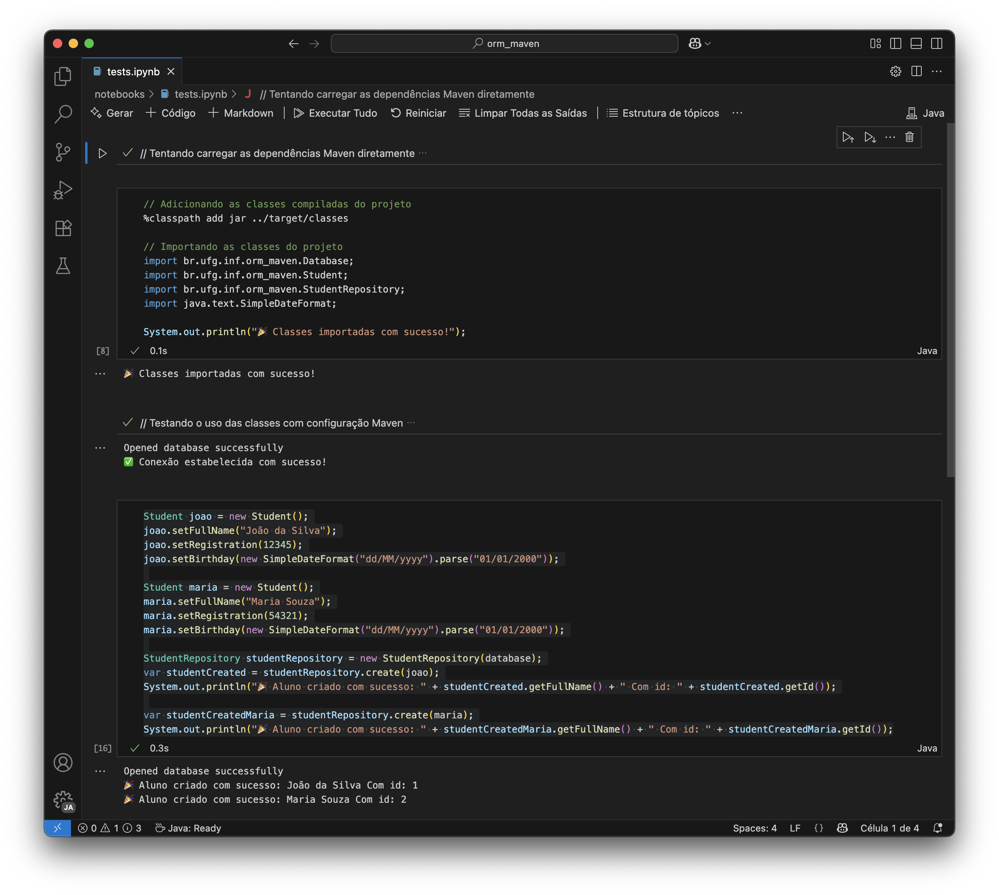
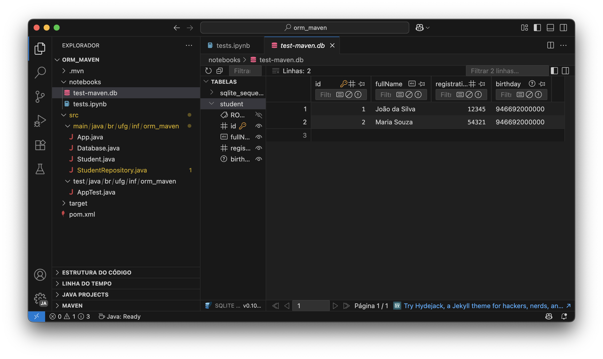

# Tutorial ORM e Acesso a Banco de Dados com Maven

No padrão arquitetural MVC, temos a camada de modelo que é responsável por representar os dados e a lógica de negócio da aplicação. A camada de modelo é a mais importante, pois é a responsável por representar o domínio da aplicação. Neste tutorial, será apresentado como utilizar o [ORM](https://pt.wikipedia.org/wiki/Mapeamento_objeto-relacional) ([Object Relational Mapping](https://en.wikipedia.org/wiki/Object%E2%80%93relational_mapping)) para persistir objetos em banco de dados relacional.

:warning: Observação: Esta é versão de um tutorial anterior deste mesmo repositório que utiliza o [BlueJ](https://www.bluej.org/). Esta versão utiliza o [Maven](https://maven.apache.org/) como ferramenta de gerenciamento de dependências e build e demonstra a interação com os objetos através de um notebook Jupyter usando um [kernel Java](https://github.com/SpencerPark/IJava) na IDE VS Code.

A parte fundamental é o acesso a uma base de dados. Poderíamos adotar um banco de dados sofisticado, como o PostgreSQL ou Oracle, mas o foco não é esse, então podemos adotar algo bem mais simples como o [Sqlite](https://www.sqlite.org/index.html). Além de ser leve, o SQLite também não necessita instalação, o próprio driver (JDBC) cria e gerencia um arquivo de banco de dados.

Outra tecnologia adotada neste tutorial é o [Ormlite](https://ormlite.com/), que provê a persistência de objetos em banco de dados relacional (baseado em tabelas), ou seja, é também conhecido como ORM ([Object Relational Mapping](https://en.wikipedia.org/wiki/Object%E2%80%93relational_mapping) ou [Mapeamento Objeto-Relacional](https://pt.wikipedia.org/wiki/Mapeamento_objeto-relacional)). A linguagem utilizada para interação com banco de dados relacional é o [SQL](https://pt.wikipedia.org/wiki/SQL) (Structered Query Language), mas com o ORMLite, não será necessário utilizá-la, no lugar, será utilizado métodos como *create*, *query*, *update* e *delete*. Assim, a aplicação se tornará mais simples e legível.

## 1. Instalação de Jupyter com Kernel Java

A proposta deste tutorial é utilizar o Jupyter como uma interface interativa para executar código Java, facilitando a experimentação e o aprendizado.

O primeiro passo é instalar o [Notebook Jupyter](https://pt.wikipedia.org/wiki/Projeto_Jupyter#Notebook_Jupyter) que permite que você execute código em um ambiente interativo. Em seguida, você precisará instalar o [kernel Java](https://github.com/SpencerPark/IJava) para que o Jupyter possa executar código Java.

Há várias interfaces de notebook para o Jupyter, você pode usar o seguinte comando no terminal:

```bash
pip install jupyterlab
```

O comando pip é um comando do Python Package Installer (PIP), que é utilizado para instalar pacotes e bibliotecas Python.

Para testar se a instalação foi bem-sucedida, você pode executar o seguinte comando:

```bash
jupyter lab
```



Figura 1: Interface do Jupyter Lab

Esse comando executa o Jupyter Lab, que é uma interface de usuário baseada em navegador para trabalhar com notebooks Jupyter. A Figura 1 mostra o resultado da execução do comando na pasta em que o código deste tutorial, com o notebook _orm-maven.ipynb_ aberto. O notebook contém células de código que podem ser executadas interativamente. 

As células são executadas por um _kernel_ Java. O procedimento de instalação do kernel Java é descrito na [documentação do IJava](https://github.com/SpencerPark/IJava). Siga as instruções seguintes:

1. Baixe a última versão do IJava no [link](https://github.com/SpencerPark/IJava/releases).
2. Extraia o conteúdo do arquivo ZIP baixado.
3. Execute o script de instalação `install.py` com o Python. Você pode fazer isso no terminal, navegando até a pasta onde o IJava foi extraído e executando:

```bash
python3 install.py
```

Para checar se o kernel Java foi instalado corretamente, você pode executar o seguinte comando no terminal:

```bash
jupyter kernelspec list
```

Isso deve mostrar uma lista de kernels disponíveis, incluindo o kernel Java.

### 1.1. Instalação do suporte ao Java no VS Code

Para instalar o suporte ao Java no VS Code, você pode seguir os seguintes passos:

1. Abra o VS Code.
2. Vá para a aba de extensões (ou pressione `Ctrl+Shift+X`).
3. Pesquise por "Java Extension Pack" e instale a extensão.

Caso já tenha o suporte ao Java instalado, você pode pular esta etapa.

### 1.2. Instalar a extensão Jupyter no VS Code

Para instalar a extensão Jupyter no VS Code, siga os passos abaixo:

1. Abra o VS Code.
2. Vá para a aba de extensões (ou pressione `Ctrl+Shift+X`).
3. Pesquise por "Jupyter" e instale a extensão.
4. Crie um arquivo com a extensão `.ipynb`.
5. Abra o arquivo `.ipynb` e selecione o kernel Java.
6. Adicione o seguinte código em uma célula:

```java
System.out.println("Hello, World!");
```

7. Verifique o resultado na célula de saída, o "Hello, World!" deve aparecer, conforme mostrado na figura 2.



Figura 2: Resultado da execução do código no Jupyter

## 2. Criação do projeto Maven

Para criar um projeto Maven, você pode usar o seguinte comando no terminal:

```bash
mvn archetype:generate \
-DgroupId=br.ufg.inf.orm_maven \
-DartifactId=orm_maven \
-DarchetypeGroupId=org.apache.maven.archetypes \
-DarchetypeArtifactId=maven-archetype-quickstart \
-DarchetypeVersion=1.5 \
-DinteractiveMode=false
```

Isso criará a estrutura básica de um projeto Maven, usando o arquétipo (_archetype_) "maven-archetype-quickstart". Para abrir o projeto no VS Code, você pode usar o seguinte comando:

```bash
cd orm_maven
code .
```



Figura 3: estrutura criada pelo Maven no VS Code

Inclua as dependências das bibliotecas de acesso ao banco de dados ORMLite no arquivo `pom.xml`:

```xml
<dependencies>

    <!-- ORMLite -->
    <dependency>
      <groupId>com.j256.ormlite</groupId>
      <artifactId>ormlite-core</artifactId>
      <version>6.1</version>
    </dependency>

    <!-- ORMLite JDBC -->
    <dependency>
      <groupId>com.j256.ormlite</groupId>
      <artifactId>ormlite-jdbc</artifactId>
      <version>6.1</version>
    </dependency>

    <!-- SQLite -->
    <dependency>
      <groupId>org.xerial</groupId>
      <artifactId>sqlite-jdbc</artifactId>
      <version>3.45.1.0</version>
    </dependency>


    <!-- SLF4J + Logback -->
    <dependency>
      <groupId>org.slf4j</groupId>
      <artifactId>slf4j-api</artifactId>
      <version>2.0.12</version>
    </dependency>
    
    <dependency>
      <groupId>ch.qos.logback</groupId>
      <artifactId>logback-classic</artifactId>
      <version>1.4.14</version>
    </dependency>    

  <!-- outras dependências -->
</dependencies>
```


Para testar se as dependências foram adicionadas corretamente, você pode executar o seguinte comando:

```bash
mvn clean install
```

Caso esteja correto, você verá uma mensagem indicando que a construção foi bem-sucedida. Isso significa que as dependências foram resolvidas. 

## 3. Classe Database: acesso ao banco de dados

O primeiro passo da construção da aplicação é criar uma classe responsável por gerenciar a conexão com o banco de dados. Crie a seguinte classe na pasta `src/main/java/br/ufg/inf/orm_maven`:

```java
package br.ufg.inf.orm_maven;

import java.sql.*;
import com.j256.ormlite.jdbc.JdbcConnectionSource;

public class Database
{
   private String databaseName = null;
   private JdbcConnectionSource connection = null;
   
   public Database(String databaseName) {
       this.databaseName = databaseName;
   }    
   
   public JdbcConnectionSource getConnection() throws SQLException {
      if ( databaseName == null ) {
          throw new SQLException("database name is null");
      }
      if ( connection == null ) {
          try {
              connection = new JdbcConnectionSource("jdbc:sqlite:"+databaseName);             
            } catch ( Exception e ) {
                System.err.println( e.getClass().getName() + ": " + e.getMessage() );
                System.exit(0);
            }
            System.out.println("Opened database successfully");
      }
      return connection;
   }
   
   public void close() {
       if ( connection != null ) {
           try {
               connection.close();
               this.connection = null;
           } catch (java.lang.Exception e) {
               System.err.println(e);
           }
       }
   }
}
```

Note no exemplo acima que foi implementado três métodos:
* Um método constutor que recebe o caminho do arquivo de base de dados, a propriedade *databaseName*;
* Um método *getConnection()* que inicializa a propriedade *connection* com um objeto [JdbcConnectionSource](https://ormlite.com/javadoc/ormlite-jdbc/com/j256/ormlite/jdbc/JdbcConnectionSource.html). Os detalhes de como criar uma conexão com o SQLite é descrito na [sdocumentação do ORMLite](https://ormlite.com/javadoc/ormlite-core/doc-files/ormlite.html#Connection-Source) e o [formato da string de conexão (jdbc:sqlite:&lt;caminho para arquivo&gt;)](https://www.sqlitetutorial.net/sqlite-java/sqlite-jdbc-driver/) utilizadas para se definir uma URL de conexão é documentado no driver JDBC/SQLite.
* Um método de *close()* para fechar a base de dados.

## 3.1. Testando o acesso ao banco de dados

Vamos realizar o teste de acesso ao banco de dados de forma interativa por meio de um notebook. Crie um novo arquivo chamado `testes.ipynb` na pasta `notebooks`.

Crie uma nova célula de código e adicione o seguinte conteúdo:

```java
// Tentando carregar as dependências Maven diretamente
%maven com.j256.ormlite:ormlite-core:6.1
%maven com.j256.ormlite:ormlite-jdbc:6.1  
%maven org.xerial:sqlite-jdbc:3.45.1.0
%maven org.slf4j:slf4j-api:2.0.12
%maven ch.qos.logback:logback-classic:1.4.14
```

Essa célula baixa as dependências Maven necessárias para o projeto e as torna disponíveis para uso no notebook. Execute a célula para garantir que todas as dependências sejam baixadas corretamente.

Depois crie uma nova célula de código e adicione o seguinte conteúdo:

```java
// Adicionando as classes compiladas do projeto
%classpath add jar ../target/classes

// Importando as classes do projeto
import br.ufg.inf.orm_maven.Database;
// import br.ufg.inf.orm_maven.Student;
// import br.ufg.inf.orm_maven.StudentRepository;

System.out.println("🎉 Classes importadas com sucesso!");
```

Essa célula realiza a importação das classes do projeto, tornando-as disponíveis para uso no notebook. Inicialmente, somente a classe Database está importada. Você pode descomentar as outras importações conforme necessário.

Crie uma nova célula de código e adicione o seguinte conteúdo:

```java
// Testando o uso das classes com configuração Maven
Database database = new Database("test-maven.db");
// Testando conexão
try {
    var connection = database.getConnection();
    System.out.println("✅ Conexão estabelecida com sucesso!");
    database.close();
} catch (Exception e) {
    System.out.println("❌ Erro: " + e.getMessage());
}
```

Esta célula testa a conexão com o banco de dados utilizando a classe Database. Se a conexão for estabelecida com sucesso, uma mensagem de sucesso é exibida. Caso contrário, uma mensagem de erro é exibida.

## 4. Student: entidade estudante

O próximo passo é criar uma classe que representa uma entidade do mundo real, um estudante, por exemplo. Uma classe entidade (entity class) é basicamente, um [POJO](https://pt.wikipedia.org/wiki/Plain_Old_Java_Objects), com suas propriedades acessíveis via *getters* e *setters*, podendo então ser persistidas em um banco de dados via um ORM (ORMLite, por exemplo). Crie a seguinte classe Estudante no BlueJ:

```java
package br.ufg.inf.orm_maven;

import java.util.Date;
import java.text.SimpleDateFormat;
import com.j256.ormlite.table.DatabaseTable;
import com.j256.ormlite.field.DatabaseField;
import com.j256.ormlite.field.DataType;

@DatabaseTable(tableName = "student")
public class Student
{   
    @DatabaseField(generatedId = true)
    private int id;
    
    @DatabaseField
    private String fullName;
    
    @DatabaseField
    public int registration;
    
    @DatabaseField(dataType=DataType.DATE)
    public Date birthday;    
    
    public String printBirthday() {
        SimpleDateFormat dateFor = new SimpleDateFormat("dd/MM/yyyy");
        return dateFor.format(birthday);
    }

//Start GetterSetterExtension Source Code

    /**GET Method Propertie id*/
    public int getId(){
        return this.id;
    }//end method getId

    /**SET Method Propertie id*/
    public void setId(int id){
        this.id = id;
    }//end method setId

    /**GET Method Propertie fullName*/
    public String getFullName(){
        return this.fullName;
    }//end method getFullName

    /**SET Method Propertie fullName*/
    public void setFullName(String fullName){
        this.fullName = fullName;
    }//end method setFullName

    /**GET Method Propertie registration*/
    public int getRegistration(){
        return this.registration;
    }//end method getRegistration

    /**SET Method Propertie registration*/
    public void setRegistration(int registration){
        this.registration = registration;
    }//end method setRegistration

    /**GET Method Propertie birthday*/
    public Date getBirthday(){
        return this.birthday;
    }//end method getBirthday

    /**SET Method Propertie birthday*/
    public void setBirthday(Date birthday){
        this.birthday = birthday;
    }//end method setBirthday

//End GetterSetterExtension Source Code


}//End class
```

A forma mais simples de se criar classes entidade é usando o recurso de [anotações java](https://en.wikipedia.org/wiki/Java_annotation), que consiste em fornecer metainformação sobre um membro da classe (exemplo, classes, propriedades e métodos). Cada linguagem de programação adota uma sintaxe de anotação, em java temos:

```java
@<Classe de Anotação>(param1="valor1", param2="valor2", ...)
<Classe ou membro>
```

Por exemplo:

```java
@DatabaseTable(tableName = "student")
public class Student
...
```
A classe de anotação é [DatabaseTable](https://ormlite.com/javadoc/ormlite-core/com/j256/ormlite/table/DatabaseTable.html), que anota a classe *Student*, informando que a tabela a ser gravada tem nome *student*, conforme o parâmetro *tableName*. Na classe entidade *Student*, também foi utilizado a classe de anotação [DatabaseField](https://ormlite.com/javadoc/ormlite-core/com/j256/ormlite/field/DatabaseField.html) que informou que a propriedade *id* da classe é autogerado ([*generatedId*](https://ormlite.com/javadoc/ormlite-core/com/j256/ormlite/field/DatabaseField.html#generatedId--)) e o tipo de dados [DataType.DATE](https://ormlite.com/javadoc/ormlite-core/com/j256/ormlite/field/DataType.html#DATE) atribuído a propriedade *birthDay*. Outras propriedades como *fullName* e *registration* são respectivamente do tipo *int* e *String* e sua anotação não precisa de associar a um [DataType](https://ormlite.com/javadoc/ormlite-core/com/j256/ormlite/field/DataType.html) específico, basta anotá-los com [*DatabaseField*](https://ormlite.com/javadoc/ormlite-core/com/j256/ormlite/field/DatabaseField.html).

#### 5. StudentRepository: classe padrão Repository

Para lidar com entidades, pode-se adotar o [padrão Repository](https://martinfowler.com/eaaCatalog/repository.html), que possui várias vantagens como [permitir trocar o banco de dados sem afetar o sistema como um todo](https://medium.com/@renicius.pagotto/entendendo-o-repository-pattern-fcdd0c36b63b) e também facilita [testes da camada de persistência, com independência das camadas superiores](https://docs.microsoft.com/en-us/dotnet/architecture/microservices/microservice-ddd-cqrs-patterns/infrastructure-persistence-layer-design). Nessa classe vamos implementar operações básicas CRUD, manter um cache dos objetos carregados (loaded) das consultas realizadas na base de dados e também o estado do repositório (deletando ou criando objetos, por exemplo). Crie a classe *StudentRepository* no BlueJ:

```java
package br.inf.ufg.orm_maven;

import com.j256.ormlite.dao.DaoManager;
import com.j256.ormlite.dao.Dao;
import java.sql.SQLException;
import com.j256.ormlite.table.TableUtils;
import java.util.List;
import java.util.ArrayList;

public class StudentRepository
{
    private static Database database;
    private static Dao<Student, Integer> dao;
    private List<Student> loadedStudents;
    private Student loadedStudent; 
    
    public StudentRepository(Database database) {
        StudentRepository.setDatabase(database);
        loadedStudents = new ArrayList<Student>();
    }
    
    public static void setDatabase(Database database) {
        StudentRepository.database = database;
        try {
            dao = DaoManager.createDao(database.getConnection(), Student.class);
            TableUtils.createTableIfNotExists(database.getConnection(), Student.class);
        }
        catch(SQLException e) {
            System.out.println(e);
        }            
    }
    
    public Student create(Student student) {
        int nrows = 0;
        try {
            nrows = dao.create(student);
            if ( nrows == 0 )
                throw new SQLException("Error: object not saved");
            this.loadedStudent = student;
            loadedStudents.add(student);
        } catch (SQLException e) {
            System.out.println(e);
        }
        return student;
    }    

    public void update(Student student) {
      // TODO
    }

    public void delete(Student student) {
      // TODO
    }
    
    public Student loadFromId(int id) {
        try {
            this.loadedStudent = dao.queryForId(id);
            if (this.loadedStudent != null)
                this.loadedStudents.add(this.loadedStudent);
        } catch (SQLException e) {
            System.out.println(e);
        }
        return this.loadedStudent;
    }    
    
    public List<Student> loadAll() {
        try {
            this.loadedStudents =  dao.queryForAll();
            if (this.loadedStudents.size() != 0)
                this.loadedStudent = this.loadedStudents.get(0);
        } catch (SQLException e) {
            System.out.println(e);
        }
        return this.loadedStudents;
    }  
}
```

O construtor de *StudentRepository* recebe um objeto *database* e o atribui a uma variável de classe *database*. Poderíamos utilizar uma variável de instância para referenciar a base de dados, mas por escolha de projeto, considerou-se que era mais conveniente ter apenas uma única instância *database* associada a classe *StudentRepository*, evita-se assim, indesejáveis conexões concorrentes a uma mesma base de dados. Outro ponto importante no construtor, é a utilização da classe DaoManager do Ormlite para criar um [Objeto de Acesso a Dados](https://en.wikipedia.org/wiki/Data_access_object), uma instância da [classe Dao do Ormlite](https://ormlite.com/javadoc/ormlite-core/com/j256/ormlite/dao/Dao.html) e o método [*createTableIfNotExists* da classe TableUtils](https://ormlite.com/javadoc/ormlite-core/com/j256/ormlite/table/TableUtils.html) que cria uma tabela *student* na base de dados caso ela não exista.

Note nos testes acima, que um objeto *StudentRepository* persiste objetos *Student* por meio do método *create()*. Quando se cria um objeto *Student* ele é um objeto transiente, ou seja, existe somente em memória. Quando se passa um objeto transiente como argumento para o método *create*, ele chama uma instância [Dao do Ormlite](https://ormlite.com/javadoc/ormlite-core/com/j256/ormlite/dao/Dao.html) para chamar um método homônimo *create* que persiste o objeto no banco de dados SQLite.

Outro ponto importante a ser notado é o método *loadAll*, que carrega objetos do banco de dados para a memória, invocando o método homônimo do objeto *dao* e retorna uma lista de todos estudantes carregados em memória, a propriedade *loadedStudents*. De forma análoga, o método *loadFromId* faz a carga de um estudante da base de dados a partir de um *id* informado, atribuindo-se o objeto carregado a propriedade *loadedStudent*.  

## 5.1. Testes Interativos

Inclua na segunda célula a importação das classes *Student* e *StudentRepository* e *SimpleDateFormat*:

```java
// Adicionando as classes compiladas do projeto
%classpath add jar ../target/classes

// Importando as classes do projeto
import br.ufg.inf.orm_maven.Database;
import br.inf.ufg.orm_maven.Student;
import br.inf.ufg.orm_maven.StudentRepository;

System.out.println("🎉 Classes importadas com sucesso!");
```

Crie uma quarta célula de código para testar a persistência dos objetos *Student*:

```java
Student joao = new Student();
joao.setFullName("João da Silva");
joao.setRegistration(12345);
joao.setBirthday(new SimpleDateFormat("dd/MM/yyyy").parse("01/01/2000"));

Student maria = new Student();
maria.setFullName("Maria Souza");
maria.setRegistration(54321);
maria.setBirthday(new SimpleDateFormat("dd/MM/yyyy").parse("01/01/2000"));

StudentRepository studentRepository = new StudentRepository(database);
var studentCreated = studentRepository.create(joao);
System.out.println("🎉 Aluno criado com sucesso: " + studentCreated.getFullName() + " Com id: " + studentCreated.getId());

var studentCreatedMaria = studentRepository.create(maria);
System.out.println("🎉 Aluno criado com sucesso: " + studentCreatedMaria.getFullName() + " Com id: " + studentCreatedMaria.getId());
```

Execute as duas células modificadas acima. Os resultados serão semelhantes à da Figura 5:



Figura 5: execução do teste de persistência dos objetos Student

# 7. Visualizando os dados

Para visualizar os dados persistidos no SQLite, podemos utilizar uma extensão chamada **SQLite Viewer**. Essa extensão permite que você abra arquivos de banco de dados SQLite e visualize suas tabelas e dados de forma interativa.

Para instalar a extensão, siga os passos abaixo:

1. Abra o Visual Studio Code.
2. Vá até a aba de extensões (ou pressione `Ctrl+Shift+X`).
3. Pesquise por "SQLite Viewer".
4. Clique em "Install" para instalar a extensão.

Após a instalação, você pode abrir o arquivo de banco de dados SQLite diretamente no Visual Studio Code e utilizar a extensão para explorar os dados. A visualização dos dados será semelhante a Figura 6:



Figura 6: Visualização dos dados no SQLite Viewer

## 6. Considerações Finais  

Neste tutorial, construímos a camada de persistência de uma aplicação Java utilizando **Maven**, **ORMLite** e **SQLite**, integrados em um ambiente interativo com **Jupyter Notebooks** no VS Code. O foco foi mostrar como estruturar um projeto simples e funcional, aproveitando as vantagens de gerenciamento de dependências, anotações Java e execução incremental de código.  

A criação das classes **Database**, **Student** e **StudentRepository** demonstrou na prática como conectar-se a um banco de dados, modelar entidades e aplicar o padrão **Repository** para organizar as operações de persistência. Essa abordagem torna o código mais legível, modular e preparado para futuras expansões.  

O uso do **SQLite** se mostrou ideal para fins didáticos e prototipagem, por ser leve e dispensar instalação de servidor. Já o **ORMLite** simplificou a manipulação de dados, abstraindo comandos SQL em métodos intuitivos como *create*, *query*, *update* e *delete*.  

Com essa base, o aprendiz pode evoluir o projeto para incluir novas entidades, migrar para bancos de dados mais complexos, aplicar testes unitários e integrar a aplicação a contextos maiores, como arquiteturas baseadas em serviços. Dessa forma, o aprendizado aqui apresentado pode servir tanto como ponto de partida para estudos quanto como base para sistemas mais completos.  

O código-fonte completo deste tutorial está na pasta [code](code).