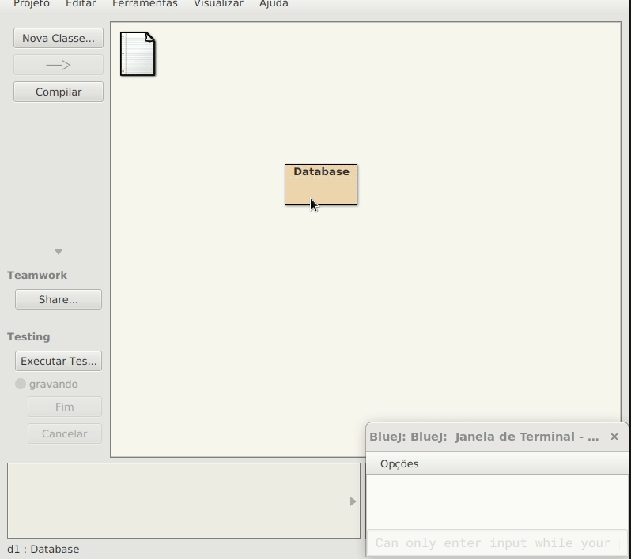

# Tutorial ORM e Acesso a Banco de Dados

No padrão arquitetural MVC, temos a camada de modelo que é responsável por representar os dados e a lógica de negócio da aplicação. A camada de modelo é a mais importante, pois é a responsável por representar o domínio da aplicação. Neste tutorial, será apresentado como utilizar o [ORM](https://pt.wikipedia.org/wiki/Mapeamento_objeto-relacional) ([Object Relational Mapping](https://en.wikipedia.org/wiki/Object%E2%80%93relational_mapping)) para persistir objetos em banco de dados relacional.

## 1. Acessando o banco de dados com ORMLite

A parte fundamental é o acesso a uma base de dados. Poderíamos adotar um banco de dados sofisticado, como o PostgreSQL ou Oracle, mas o foco não é esse, então podemos adotar algo bem mais simples como o [Sqlite](https://www.sqlite.org/index.html). Além de ser leve, o SQLite também não necessita instalação, o próprio driver (JDBC) cria e gerencia um arquivo de banco de dados.

Outra tecnologia adotada neste tutorial é o [Ormlite](https://ormlite.com/), que provê a persistência de objetos em banco de dados relacional (baseado em tabelas), ou seja, é também conhecido como ORM ([Object Relational Mapping](https://en.wikipedia.org/wiki/Object%E2%80%93relational_mapping) ou [Mapeamento Objeto-Relacional](https://pt.wikipedia.org/wiki/Mapeamento_objeto-relacional)). A linguagem utilizada para interação com banco de dados relacional é o [SQL](https://pt.wikipedia.org/wiki/SQL) (Structered Query Language), mas com o ORMLite, não será necessário utilizá-la, no lugar, será utilizado métodos como *create*, *query*, *update* e *delete*. Assim, a aplicação se tornará mais simples e legível.

## 1.1. Instalação de bibliotecas

Para poder utilizar o ORMLite, é necessário adicionar as bibliotecas ao projeto. As bibliotecas necessárias são:
* [sqlite-jdbc](https://github.com/xerial/sqlite-jdbc/releases/download/3.46.0.0/sqlite-jdbc-3.46.0.0.jar): driver JDBC para SQLite
* [ormlite-core](https://ormlite.com/releases/6.1/ormlite-core-6.1.jar): biblioteca principal do ORMLite
* [ormlite-jdbc](https://ormlite.com/releases/6.1/ormlite-jdbc-6.1.jar): biblioteca de conexão JDBC do ORMLite
* [SL4J API](https://repo1.maven.org/maven2/org/slf4j/slf4j-api/2.0.13/slf4j-api-2.0.13.jar): API de logging
* [SL4J Simple](https://repo1.maven.org/maven2/org/slf4j/slf4j-simple/2.0.13/slf4j-simple-2.0.13.jar): implementação simples de logging

Depois de baixar todas bibliotecas, essas devem ser adicionadas ao projeto: 
* Clique na opção BlueJ > Preferências
* Clique na aba Bibliotecas
* Clique no botão Adicionar
* Selecione as bibliotecas baixadas
* Reinicie o BlueJ


## 1.2. Classe Database: acesso ao banco de dados

O primeiro passo da construção da aplicação é criar uma classe responsável por gerenciar a conexão com o banco de dados. Crie a seguinte classe no BlueJ:

```java
import java.sql.*;
import com.j256.ormlite.jdbc.JdbcConnectionSource;

public class Database
{
   private String databaseName = null;
   private JdbcConnectionSource connection = null;
   
   public Database(String databaseName) {
       this.databaseName = databaseName;
   }    
   
   public JdbcConnectionSource getConnection() throws SQLException {
      if ( databaseName == null ) {
          throw new SQLException("database name is null");
      }
      if ( connection == null ) {
          try {
              connection = new JdbcConnectionSource("jdbc:sqlite:"+databaseName);             
            } catch ( Exception e ) {
                System.err.println( e.getClass().getName() + ": " + e.getMessage() );
                System.exit(0);
            }
            System.out.println("Opened database successfully");
      }
      return connection;
   }
   
   public void close() {
       if ( connection != null ) {
           try {
               connection.close();
               this.connection = null;
           } catch (java.io.IOException e) {
               System.err.println(e);
           }
       }
   }
}
```

Note no exemplo acima que foi implementado três métodos:
* Um método constutor que recebe o caminho do arquivo de base de dados, a propriedade *databaseName*;
* Um método *getConnection()* que inicializa a propriedade *connection* com um objeto [JdbcConnectionSource](https://ormlite.com/javadoc/ormlite-jdbc/com/j256/ormlite/jdbc/JdbcConnectionSource.html). Os detalhes de como criar uma conexão com o SQLite é descrito na [sdocumentação do ORMLite](https://ormlite.com/javadoc/ormlite-core/doc-files/ormlite.html#Connection-Source) e o [formato da string de conexão (jdbc:sqlite:&lt;caminho para arquivo&gt;)](https://www.sqlitetutorial.net/sqlite-java/sqlite-jdbc-driver/) utilizadas para se definir uma URL de conexão é documentado no driver JDBC/SQLite.
* Um método de *close()* para fechar a base de dados.

Para testar interativamente a classe, utilize o BlueJ:



#### 6.1.2. Student: entidade estudante

O próximo passo é criar uma classe que representa uma entidade do mundo real, um estudante, por exemplo. Uma classe entidade (entity class) é basicamente, um [POJO](https://pt.wikipedia.org/wiki/Plain_Old_Java_Objects), com suas propriedades acessíveis via *getters* e *setters*, podendo então ser persistidas em um banco de dados via um ORM (ORMLite, por exemplo). Crie a seguinte classe Estudante no BlueJ:

```java
import java.util.Date;
import java.text.SimpleDateFormat;
import com.j256.ormlite.table.DatabaseTable;
import com.j256.ormlite.field.DatabaseField;
import com.j256.ormlite.field.DataType;

@DatabaseTable(tableName = "student")
public class Student
{   
    @DatabaseField(generatedId = true)
    private int id;
    
    @DatabaseField
    private String fullName;
    
    @DatabaseField
    public int registration;
    
    @DatabaseField(dataType=DataType.DATE)
    public Date birthday;    
    
    public String printBirthday() {
        SimpleDateFormat dateFor = new SimpleDateFormat("dd/MM/yyyy");
        return dateFor.format(birthday);
    }

//Start GetterSetterExtension Source Code

    /**GET Method Propertie id*/
    public int getId(){
        return this.id;
    }//end method getId

    /**SET Method Propertie id*/
    public void setId(int id){
        this.id = id;
    }//end method setId

    /**GET Method Propertie fullName*/
    public String getFullName(){
        return this.fullName;
    }//end method getFullName

    /**SET Method Propertie fullName*/
    public void setFullName(String fullName){
        this.fullName = fullName;
    }//end method setFullName

    /**GET Method Propertie registration*/
    public int getRegistration(){
        return this.registration;
    }//end method getRegistration

    /**SET Method Propertie registration*/
    public void setRegistration(int registration){
        this.registration = registration;
    }//end method setRegistration

    /**GET Method Propertie birthday*/
    public Date getBirthday(){
        return this.birthday;
    }//end method getBirthday

    /**SET Method Propertie birthday*/
    public void setBirthday(Date birthday){
        this.birthday = birthday;
    }//end method setBirthday

//End GetterSetterExtension Source Code


}//End class
```

A forma mais simples de se criar classes entidade é usando o recurso de [anotações java](https://en.wikipedia.org/wiki/Java_annotation), que consiste em fornecer metainformação sobre um membro da classe (exemplo, classes, propriedades e métodos). Cada linguagem de programação adota uma sintaxe de anotação, em java temos:

```java
@<Classe de Anotação>(param1="valor1", param2="valor2", ...)
<Classe ou membro>
```

Por exemplo:

```java
@DatabaseTable(tableName = "student")
public class Student
...
```
A classe de anotação é [DatabaseTable](https://ormlite.com/javadoc/ormlite-core/com/j256/ormlite/table/DatabaseTable.html), que anota a classe *Student*, informando que a tabela a ser gravada tem nome *student*, conforme o parâmetro *tableName*. Na classe entidade *Student*, também foi utilizado a classe de anotação [DatabaseField](https://ormlite.com/javadoc/ormlite-core/com/j256/ormlite/field/DatabaseField.html) que informou que a propriedade *id* da classe é autogerado ([*generatedId*](https://ormlite.com/javadoc/ormlite-core/com/j256/ormlite/field/DatabaseField.html#generatedId--)) e o tipo de dados [DataType.DATE](https://ormlite.com/javadoc/ormlite-core/com/j256/ormlite/field/DataType.html#DATE) atribuído a propriedade *birthDay*. Outras propriedades como *fullName* e *registration* são respectivamente do tipo *int* e *String* e sua anotação não precisa de associar a um [DataType](https://ormlite.com/javadoc/ormlite-core/com/j256/ormlite/field/DataType.html) específico, basta anotá-los com [*DatabaseField*](https://ormlite.com/javadoc/ormlite-core/com/j256/ormlite/field/DatabaseField.html).

#### 6.1.3. StudentRepository: classe padrão Repository

Para lidar com entidades, pode-se adotar o [padrão Repository](https://martinfowler.com/eaaCatalog/repository.html), que possui várias vantagens como [permitir trocar o banco de dados sem afetar o sistema como um todo](https://medium.com/@renicius.pagotto/entendendo-o-repository-pattern-fcdd0c36b63b) e também facilita [testes da camada de persistência, com independência das camadas superiores](https://docs.microsoft.com/en-us/dotnet/architecture/microservices/microservice-ddd-cqrs-patterns/infrastructure-persistence-layer-design). Nessa classe vamos implementar operações básicas CRUD, manter um cache dos objetos carregados (loaded) das consultas realizadas na base de dados e também o estado do repositório (deletando ou criando objetos, por exemplo). Crie a classe *StudentRepository* no BlueJ:

```java
import com.j256.ormlite.dao.DaoManager;
import com.j256.ormlite.dao.Dao;
import java.sql.SQLException;
import com.j256.ormlite.table.TableUtils;
import java.util.List;
import java.util.ArrayList;

public class StudentRepository
{
    private static Database database;
    private static Dao<Student, Integer> dao;
    private List<Student> loadedStudents;
    private Student loadedStudent; 
    
    public StudentRepository(Database database) {
        StudentRepository.setDatabase(database);
        loadedStudents = new ArrayList<Student>();
    }
    
    public static void setDatabase(Database database) {
        StudentRepository.database = database;
        try {
            dao = DaoManager.createDao(database.getConnection(), Student.class);
            TableUtils.createTableIfNotExists(database.getConnection(), Student.class);
        }
        catch(SQLException e) {
            System.out.println(e);
        }            
    }
    
    public Student create(Student student) {
        int nrows = 0;
        try {
            nrows = dao.create(student);
            if ( nrows == 0 )
                throw new SQLException("Error: object not saved");
            this.loadedStudent = student;
            loadedStudents.add(student);
        } catch (SQLException e) {
            System.out.println(e);
        }
        return student;
    }    

    public void update(Student student) {
      // TODO
    }

    public void delete(Student student) {
      // TODO
    }
    
    public Student loadFromId(int id) {
        try {
            this.loadedStudent = dao.queryForId(id);
            if (this.loadedStudent != null)
                this.loadedStudents.add(this.loadedStudent);
        } catch (SQLException e) {
            System.out.println(e);
        }
        return this.loadedStudent;
    }    
    
    public List<Student> loadAll() {
        try {
            this.loadedStudents =  dao.queryForAll();
            if (this.loadedStudents.size() != 0)
                this.loadedStudent = this.loadedStudents.get(0);
        } catch (SQLException e) {
            System.out.println(e);
        }
        return this.loadedStudents;
    }

    // getters and setters ommited...        
}
```

Através do BlueJ, compile, gere os *getters* e *setters* das classes. Com isso, você pode realizar alguns testes:


O construtor de *StudentRepository* recebe um objeto *database* e o atribui a uma variável de classe *database*. Poderíamos utilizar uma variável de instância para referenciar a base de dados, mas por escolha de projeto, considerou-se que era mais conveniente ter apenas uma única instância *database* associada a classe *StudentRepository*, evita-se assim, indesejáveis conexões concorrentes a uma mesma base de dados. Outro ponto importante no construtor, é a utilização da classe DaoManager do Ormlite para criar um [Objeto de Acesso a Dados](https://en.wikipedia.org/wiki/Data_access_object), uma instância da [classe Dao do Ormlite](https://ormlite.com/javadoc/ormlite-core/com/j256/ormlite/dao/Dao.html) e o método [*createTableIfNotExists* da classe TableUtils](https://ormlite.com/javadoc/ormlite-core/com/j256/ormlite/table/TableUtils.html) que cria uma tabela *student* na base de dados caso ela não exista.

Note nos testes acima, que um objeto *StudentRepository* persiste objetos *Student* por meio do método *create()*. Quando se cria um objeto *Student* ele é um objeto transiente, ou seja, existe somente em memória. Quando se passa um objeto transiente como argumento para o método *create*, ele chama uma instância [Dao do Ormlite](https://ormlite.com/javadoc/ormlite-core/com/j256/ormlite/dao/Dao.html) para chamar um método homônimo *create* que persiste o objeto no banco de dados SQLite.

Outro ponto importante a ser notado é o método *loadAll*, que carrega objetos do banco de dados para a memória, invocando o método homônimo do objeto *dao* e retorna uma lista de todos estudantes carregados em memória, a propriedade *loadedStudents*. De forma análoga, o método *loadFromId* faz a carga de um estudante da base de dados a partir de um *id* informado, atribuindo-se o objeto carregado a propriedade *loadedStudent*.  

Caso queira visualizar os dados na forma de tabelas, pode-se utilizar uma ferramenta como o [DB Browser for SQLite](https://sqlitebrowser.org/), que possui versões para [Linux](https://sqlitebrowser.org/dl/#linux:~:text=Linux,-DB) e [Windows](https://github.com/sqlitebrowser/sqlitebrowser/releases/download/v3.12.1/DB.Browser.for.SQLite-3.12.1-win64-v2.msi):


Note que o ORMLite criou duas tabelas, uma tabela *student* que possui os dados de cada objeto *student* e uma tabela *sqlite_sequence* que controla o *id* auto incrementado, no nosso exemplo, o último *id* da tabela *student* tem valor 2, que identifica a estudante "Maria Souza".

Com estas 3 classes, concluímos a camada de persistência e nossos componentes *Model*. 
