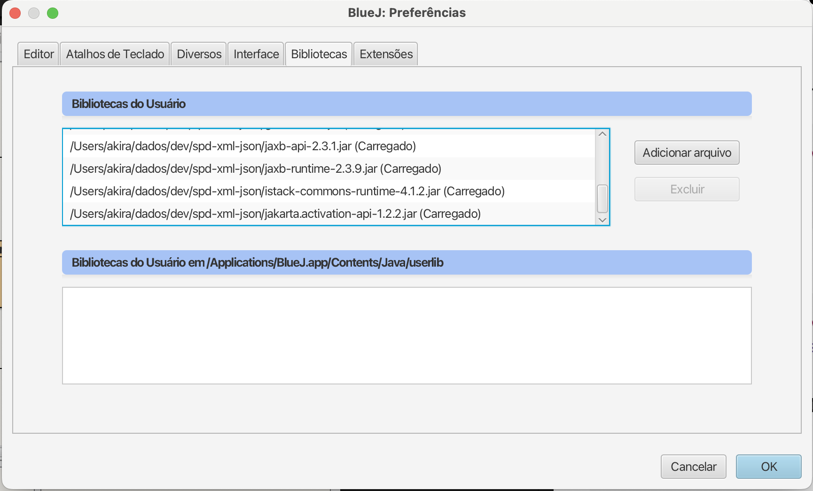

# Tutorial Serialização de Objetos em JSON e XML

Dando continuidade ao tutorial anterior, no qual vimos como mapear objetos Java para tabelas de banco de dados com **ORMLite** e SQLite, neste material aprenderemos como **serializar e desserializar objetos** em formatos amplamente utilizados para **persistência e troca de dados**:

- **JSON (JavaScript Object Notation)**
- **XML (eXtensible Markup Language)**

## 1. Serialização: conceitos gerais

**Serialização** é o processo de transformar um objeto em uma sequência de bytes ou texto estruturado (JSON, XML, YAML etc.) de modo que ele possa ser:
- Persistido (salvo) em arquivos, banco de dados ou caches.
- Transmitido em redes (APIs REST, mensageria etc.).
- Reconstruído posteriormente (desserialização).

Java oferece diversas bibliotecas e APIs para este fim. Aqui veremos:
- ✅ [Gson](https://github.com/google/gson) – para JSON  
- ✅ [Java XML Binding (JAXB)](https://docs.oracle.com/javase/tutorial/jaxb/) – para XML

## 2. Serializando objetos em JSON com Gson

O **Gson** é uma biblioteca do Google que facilita a conversão de objetos Java para JSON e vice-versa.

### 2.1. Instalando a biblioteca Gson

Para usar o Gson, faça o download do *jar*:

- [gson-2.11.0.jar](https://repo1.maven.org/maven2/com/google/code/gson/gson/2.11.0/gson-2.11.0.jar)

Depois de baixado, adicione ao seu projeto (no BlueJ: **Preferências > Bibliotecas > Adicionar**).

---

### 2.2. Exemplo de uso com a classe Student

Crie uma nova classe chamada `StudentJsonSerializer` com o seguinte código:

```java
import com.google.gson.Gson;
import com.google.gson.GsonBuilder;

public class StudentJsonSerializer
{
    private Gson gson;
    
    public StudentJsonSerializer() {
        // Configurando para formatar datas e pretty printing
        gson = new GsonBuilder()
                   .setDateFormat("yyyy-MM-dd")
                   .setPrettyPrinting()
                   .create();
    }
    
    public String toJson(Student student) {
        return gson.toJson(student);
    }
    
    public Student fromJson(String json) {
        return gson.fromJson(json, Student.class);
    }
}
```

## 2.3. Exemplo de serialização e desserialização
```java
public class Main
{
    public static void main(String[] args) {
        Student student = new Student();
        student.setId(1);
        student.setFullName("Maria Souza");
        student.setRegistration(123);
        student.setBirthday(new java.util.Date());
        
        StudentJsonSerializer serializer = new StudentJsonSerializer();
        String json = serializer.toJson(student);
        System.out.println("JSON gerado:\n" + json);
        
        // Desserializar
        Student loaded = serializer.fromJson(json);
        System.out.println("Nome do estudante desserializado: " + loaded.getFullName());
    }
}
```

Saída esperada:
```
JSON gerado:
{
  "id": 1,
  "fullName": "Maria Souza",
  "registration": 123,
  "birthday": "2025-07-08"
}
Nome do estudante desserializado: Maria Souza
```

## 3. Serializando objetos em XML com JAXB

A partir do JDK 11, para dar suporte ao JAXB no seu projeto é necessário baixar e instalar quatro bibliotecas no BlueJ:
- https://repo1.maven.org/maven2/javax/xml/bind/jaxb-api/2.3.1/jaxb-api-2.3.1.jar
- https://repo1.maven.org/maven2/org/glassfish/jaxb/jaxb-runtime/2.3.9/jaxb-runtime-2.3.9.jar
- https://repo1.maven.org/maven2/com/sun/istack/istack-commons-runtime/4.1.2/istack-commons-runtime-4.1.2.jar
- https://repo1.maven.org/maven2/jakarta/activation/jakarta.activation-api/1.2.2/jakarta.activation-api-1.2.2.jar

Uma vez baixadas, adicione-as ao seu projeto (no BlueJ: **Preferências > Bibliotecas > Adicionar**). A lista de bibliotecas carregadas ficará assim:



---

### 3.1. Preparando a classe Student

Para usar JAXB, é necessário adicionar **anotações JAXB** na sua classe `Student`.  
Edite a classe `Student` e acrescente os imports e anotações abaixo:

```java
import javax.xml.bind.annotation.XmlRootElement;
import javax.xml.bind.annotation.XmlElement;
import javax.xml.bind.annotation.XmlAccessorType;
import javax.xml.bind.annotation.XmlAccessType;

@XmlRootElement(name = "student")
@XmlAccessorType(XmlAccessType.FIELD)
public class Student
{
    // Seus campos permanecem iguais

    // Getters e setters permanecem iguais
}
```

Dica: A anotação `@XmlAccessorType(XmlAccessType.FIELD)` faz com que JAXB serialize diretamente os campos da classe sem precisar colocar @XmlElement em cada atributo.

A classe `Student` completa ficará assim:

```java
import java.util.Date;
import java.text.SimpleDateFormat;
import com.j256.ormlite.table.DatabaseTable;
import com.j256.ormlite.field.DatabaseField;
import com.j256.ormlite.field.DataType;
import javax.xml.bind.annotation.XmlRootElement;
import javax.xml.bind.annotation.XmlElement;
import javax.xml.bind.annotation.XmlAccessorType;
import javax.xml.bind.annotation.XmlAccessType;

@XmlRootElement(name = "student")
@XmlAccessorType(XmlAccessType.FIELD)
@DatabaseTable(tableName = "student")
public class Student
{   
    @DatabaseField(generatedId = true)
    private int id;
    
    @DatabaseField
    private String fullName;
    
    @DatabaseField
    public int registration;
    
    @DatabaseField(dataType=DataType.DATE)
    public Date birthday;    
    
    public String printBirthday() {
        SimpleDateFormat dateFor = new SimpleDateFormat("dd/MM/yyyy");
        return dateFor.format(birthday);
    }

//Start GetterSetterExtension Source Code

    /**GET Method Propertie id*/
    public int getId(){
        return this.id;
    }//end method getId

    /**SET Method Propertie id*/
    public void setId(int id){
        this.id = id;
    }//end method setId

    /**GET Method Propertie fullName*/
    public String getFullName(){
        return this.fullName;
    }//end method getFullName

    /**SET Method Propertie fullName*/
    public void setFullName(String fullName){
        this.fullName = fullName;
    }//end method setFullName

    /**GET Method Propertie registration*/
    public int getRegistration(){
        return this.registration;
    }//end method getRegistration

    /**SET Method Propertie registration*/
    public void setRegistration(int registration){
        this.registration = registration;
    }//end method setRegistration

    /**GET Method Propertie birthday*/
    public Date getBirthday(){
        return this.birthday;
    }//end method getBirthday

    /**SET Method Propertie birthday*/
    public void setBirthday(Date birthday){
        this.birthday = birthday;
    }//end method setBirthday

//End GetterSetterExtension Source Code


}//End class
```

## 3.2. Criando uma classe utilitária de serialização XML

Crie uma nova classe chamada StudentXmlSerializer com o seguinte código:

```java
import javax.xml.bind.*;
import java.io.StringWriter;
import java.io.StringReader;

public class StudentXmlSerializer
{
    private JAXBContext context;

    public StudentXmlSerializer() throws JAXBException {
        context = JAXBContext.newInstance(Student.class);
    }

    public String toXml(Student student) throws JAXBException {
        Marshaller marshaller = context.createMarshaller();
        marshaller.setProperty(Marshaller.JAXB_FORMATTED_OUTPUT, Boolean.TRUE);
        StringWriter sw = new StringWriter();
        marshaller.marshal(student, sw);
        return sw.toString();
    }

    public Student fromXml(String xml) throws JAXBException {
        Unmarshaller unmarshaller = context.createUnmarshaller();
        StringReader sr = new StringReader(xml);
        return (Student) unmarshaller.unmarshal(sr);
    }
}
```

## 3.3. Exemplo de serialização e desserialização

```java
public class Main
{
    public static void main(String[] args) {
        Student student = new Student();
        student.setId(1);
        student.setFullName("Maria Souza");
        student.setRegistration(123);
        student.setBirthday(new java.util.Date());

        StudentXmlSerializer serializer = new StudentXmlSerializer();
        String xml = serializer.toXml(student);
        System.out.println("XML gerado:\n" + xml);

        // Desserializar
        Student loaded = serializer.fromXml(xml);
        System.out.println("Nome do estudante desserializado: " + loaded.getFullName());
    }
}
```

Saída esperada:
```
XML gerado: 
<?xml version="1.0" encoding="UTF-8" standalone="yes"?>
<student>
    <id>1</id>
    <fullName>Maria Souza</fullName>
    <registration>123</registration>
    <birthday>2024-07-08T16:55:00.000+00:00</birthday>
</student>
Nome do estudante desserializado: Maria Souza
```

## 4. Dicas gerais

- **Validação de dados**  
  Tanto o Gson quanto o JAXB não validam automaticamente se os campos atendem regras de negócio. Se precisar garantir integridade dos dados (por exemplo, campos obrigatórios ou formatos específicos), crie validações manuais antes de serializar ou salvar.

- **Datas**  
  - No **Gson**, você pode customizar o formato de datas usando `.setDateFormat("yyyy-MM-dd")` no `GsonBuilder`.
  - No **JAXB**, é possível usar `@XmlSchemaType` ou customizar o marshaller/unmarshaller para definir como datas devem ser exibidas.

- **Portabilidade**  
  - JSON é mais usado em APIs REST e sistemas modernos.
  - XML ainda é comum em integrações legadas, sistemas bancários e aplicações corporativas.

- **Armazenamento**  
  - Você pode persistir o JSON ou XML em arquivos, bancos de dados ou mesmo enviar via rede (HTTP).
  - Para salvar em arquivo, use `FileWriter` e `FileReader` em Java, combinando com os métodos `toJson`, `fromJson`, `toXml` e `fromXml`.

- **Evolução do modelo**  
  - Se futuramente adicionar ou remover campos na classe `Student`, valide a compatibilidade com dados antigos. O Gson ignora campos extras por padrão, enquanto o JAXB pode lançar exceções se campos obrigatórios não existirem no XML.

---

## 4.1. Exemplos de persistência em arquivos

Para salvar um JSON em arquivo:

```java
FileWriter writer = new FileWriter("student.json");
writer.write(json);
writer.close();
```

Para ler e desserializar:

```java
FileReader reader = new FileReader("student.json");
Student loaded = new Gson().fromJson(reader, Student.class);
reader.close();
```

Para salvar um XML em arquivo:

```java
FileWriter writer = new FileWriter("student.xml");
writer.write(xml);
writer.close();
```

Para ler e desserializar:

```java
FileReader reader = new FileReader("student.xml");
Student loaded = serializer.fromXml(new BufferedReader(reader).lines().collect(Collectors.joining("\n")));
reader.close();
```

Observação: No exemplo acima com XML, estamos lendo o arquivo inteiro como uma String. Você também pode usar diretamente File e InputStream com o JAXB.

## 5. Próximos passos

Você já aprendeu a:

✅ Criar entidades Java com ORMLite  
✅ Persistir dados no banco SQLite  
✅ Serializar objetos em JSON e XML  
✅ Desserializar dados em objetos Java  

A seguir, algumas ideias de evolução do seu projeto:

- **Persistência de arquivos**
  - Salvar e carregar JSON e XML a partir do sistema de arquivos.
  - Criar backups automáticos dos dados da base.

- **APIs REST**
  - Implementar endpoints RESTful que retornam dados em JSON usando frameworks como [JAX-RS](https://eclipse-ee4j.github.io/jersey/), [Spring Boot](https://spring.io/projects/spring-boot) ou [Spark Java](http://sparkjava.com/).
  - Expor operações CRUD via HTTP.

- **Conversores e DTOs**
  - Criar classes DTO (Data Transfer Objects) para separar a estrutura usada na API da estrutura de banco de dados.
  - Implementar mapeadores entre entidade e DTO.

- **Validação automática**
  - Utilizar frameworks de validação, como [Hibernate Validator](https://hibernate.org/validator/) e [Jakarta Bean Validation](https://beanvalidation.org/), para garantir que dados sejam válidos antes de salvar.

- **Testes automatizados**
  - Criar testes unitários e de integração que validem serialização e persistência.
