# 📘 Tutorial Básico de UML com PlantUML

## Introdução à UML

A **UML (Unified Modeling Language)** é uma linguagem padronizada para **modelagem de sistemas orientados a objetos**, usada para:

- Representar visualmente a estrutura e o comportamento do sistema;
- Comunicar ideias entre desenvolvedores, analistas e clientes;
- Documentar requisitos, regras de negócio, entidades e fluxos de interação.

Este tutorial tem como foco três artefatos principais:

1. **Descrição de Caso de Uso**: captura os requisitos funcionais.
2. **Diagrama de Sequência**: mostra o fluxo de mensagens entre os objetos.
3. **Diagrama de Classes**: descreve a estrutura do sistema.

O exemplo utilizado será o de um **Sistema de Matrícula**, que permite que estudantes se matriculem em disciplinas de acordo com o ano de sua turma (1º ao 5º ano).

Há diversos outros diagramas UML, como:
- Diagrama de Atividades: representa o fluxo de atividades em um processo.
- Diagrama de Estados: representa o ciclo de vida de um objeto.
- Diagrama de Componentes: mostra a estrutura física do sistema.
- Diagrama de Implantação: representa a arquitetura de hardware e software.
- Diagrama de Pacotes: organiza classes em pacotes lógicos.
Para mais detalhes, veja https://pt.wikipedia.org/wiki/UML.

---

## 1. Caso de Uso

Casos de uso são uma técnica de modelagem que descreve como os usuários interagem com o sistema. Eles ajudam a entender os requisitos funcionais e a identificar as necessidades dos usuários.

Há duas formas de representar casos de uso:
1. **Diagrama de caso de uso**: uma representação gráfica que mostra os atores e os casos de uso.
2. **Descrição textual**: uma tabela com informações detalhadas.

### 1.1 Diagrama de Caso de Uso

Para levantar requisitos, é comum criar um diagrama de caso de uso. Ele mostra os atores (usuários ou sistemas externos) e os casos de uso (funcionalidades do sistema).

Suponha que temos um sistema de matrícula onde o estudante pode realizar matrícula, cancelar matrícula, visualizar disciplinas e verificar suas matrículas. O diagrama de caso de uso seria:


Para gerar o diagrama acima, você pode usar o seguinte código PlantUML:

### Exemplo: Diagrama de Caso de Uso

```plantuml
@startuml
left to right direction

actor Estudante

rectangle "Sistema de Matrícula" {
  usecase "Realizar Matrícula" as UC1
  usecase "Cancelar Matrícula" as UC2
  usecase "Visualizar Disciplinas" as UC3
  usecase "Verificar Matrículas" as UC4
}

Estudante --> UC1
Estudante --> UC2
Estudante --> UC3
Estudante --> UC4
@enduml
```



Para gerar o diagrama, você pode usar o [PlantUML](https://plantuml.com/), que é uma ferramenta de código aberto para criar diagramas UML a partir de texto. Você pode usar o [PlantUML online](https://www.plantuml.com/plantuml/uml/SyfFKj2rKt3CoKnELR1Io4ZDoSa700002) ou [instalá-lo localmente](https://plantuml.com/download).

O PlantUML Online gera um link para o diagrama, que pode ser compartilhado ou incorporado em documentos. Por exemplo, o diagrama acima pode ser acessado através do seguinte link: [Diagrama de Caso de Uso](https://www.plantuml.com/plantuml/png/RT31YeD030RWUvuYUFUmwdaHt3tkPPVjFSn46nZ7CibSMlf8VOg-M15457lzy_6Jf5MZP7aC4BWtj0cJ36T3BucToHG1oDcKy5ijUuh60FE4uX0OYpzHuv7GC_wGfUV3vK05tW0nApjInkANASYLqawGud_tiMKTHSVX7Qksx2IQbxulKIUN895qaVLESf9UtBPnXGtS0TQJi2m_vtKEINL8waFIGClHpnzy0G00).

Para incluir o diagrama em um documento Markdown, você pode usar a seguinte sintaxe:

```markdown

```

A sintaxe dos diagramas de caso de uso é simples e intuitiva. Você define os atores e os casos de uso, e o PlantUML gera o diagrama automaticamente. Para mais informações sobre a sintaxe, consulte a [documentação do PlantUML](https://plantuml.com/use-case-diagram).

### 1.2 Exemplo: Diagrama de Caso de Uso

A seguir, apresentamos um exemplo de descrição textual de um caso de uso para a funcionalidade "Realizar Matrícula" do sistema de matrícula:


| Campo               | Descrição                                                                 |
|--------------------|---------------------------------------------------------------------------|
| **Nome**           | Realizar Matrícula                                                        |
| **Ator Principal** | Estudante                                                                  |
| **Descrição**      | O estudante escolhe uma disciplina de sua grade e realiza a matrícula.    |
| **Pré-condições**  | O estudante deve estar logado.                                             |
| **Pós-condições**  | A matrícula é registrada no sistema.                                       |
| **Fluxo Principal**|                                                                           |
| 1. O sistema apresenta disciplinas disponíveis.                                                 |
| 2. O estudante seleciona uma disciplina.                                                        |
| 3. O sistema verifica vagas.                                                                    |
| 4. O sistema registra a matrícula e confirma.                                                   |
| **Alternativas**   | 3a. Se não houver vagas, o sistema informa e cancela a operação.           |


Outros casos de uso podem incluir "Cancelar Matrícula", "Visualizar Disciplinas" e "Verificar Matrículas", cada um com sua própria descrição e fluxo de interação. Para saber mais sobre descrição de casos de uso, consulte os [Slides do LES/PUC-Rio](https://moodle.unesp.br/pluginfile.php/25934/mod_resource/content/1/diagrama_casos_uso.pdf).

## 2. Diagrama de Sequência

### 2.1 O que é

Um **diagrama de sequência** mostra **como os objetos interagem ao longo do tempo**, trocando mensagens para executar um caso de uso. Ideal para representar **fluxos de execução**.

### 2.2 Elementos principais

- **Participantes** (atores e objetos)
- **Mensagens** (métodos invocados)
- **Ordem temporal** (do topo para baixo)

### 2.3 Exemplo: Diagrama de Sequência para "Realizar Matrícula"

O diagrama de sequência a seguir ilustra o processo de matrícula de um estudante em uma disciplina:


Para gerar o diagrama acima, você pode usar o PlantUML. O diagrama mostra a interação entre o estudante, o sistema e o banco de dados durante o processo de matrícula.

```plantuml
@startuml
actor Estudante
participant Sistema
participant Banco

Estudante -> Sistema : login(usuário, senha)
Sistema --> Estudante : confirmação de login

Estudante -> Sistema : solicitarDisciplinas()
Sistema -> Banco : buscarDisciplinas(ano)
Banco --> Sistema : lista de disciplinas
Sistema --> Estudante : exibir disciplinas

Estudante -> Sistema : selecionarDisciplina(id)
Sistema -> Banco : verificarVagas(id)
Banco --> Sistema : vagas disponíveis
Sistema -> Banco : registrarMatricula(idEstudante, idDisciplina)
Banco --> Sistema : matrícula confirmada
Sistema --> Estudante : matrícula registrada
@enduml
```



Para consultar a sintaxe do diagrama de sequência, você pode acessar a [documentação do PlantUML](https://plantuml.com/sequence-diagram).

## 3. Diagrama de Classes

O **diagrama de classes** representa a **estrutura estática do sistema**: classes, atributos, métodos e seus relacionamentos. Ele é fundamental no desenvolvimento orientado a objetos.

### 3.2 Elementos principais

- **Classe**: representa um tipo de objeto com um conjunto de **atributos** (dados) e **operações** (métodos) que definem seu comportamento.

- **Relacionamentos**:
  - **Associação** (`-->`): vínculo estrutural entre duas classes, indicando que uma classe mantém uma referência ou ligação direta com outra. Exemplo: uma `Matricula` está associada a um `Estudante`.
  - **Composição** (`*--` ou `◆` preenchido): tipo forte de associação em que a parte não existe sem o todo. Exemplo: um `Pedido` composto por `Itens`.
  - **Agregação** (`o--` ou `◇` vazio): relação de todo–parte mais fraca, em que as partes podem existir independentemente. Exemplo: uma `Turma` que agrega `Estudantes`.
  - **Herança / Generalização** (`<|--`): especialização de uma classe a partir de outra, indicando uma hierarquia. Exemplo: `Funcionario` herda de `Pessoa`.
  - **Dependência (uso)** (`..>`): seta tracejada com ponta aberta. Representa uma relação temporária em que uma classe **usa ou depende** de outra para realizar alguma tarefa, mas **sem manter um vínculo direto ou permanente**. Exemplo: a classe `Estudante` usa a classe `Disciplina` no ato da matrícula, mas não mantém uma referência direta contínua.

- **Multiplicidade**: indica quantas instâncias de uma classe podem se relacionar com instâncias de outra. Exemplos:
  - `1`: exatamente uma  
  - `*`: qualquer quantidade  
  - `1..*`: pelo menos uma


### 3.3 Exemplo: Diagrama de Classes para o Sistema de Matrícula

O diagrama de classes a seguir modela os principais elementos envolvidos em um sistema universitário de matrícula de estudantes em disciplinas. Ele é composto por três classes principais: `Estudante`, `Disciplina` e `Matricula`, além de suas respectivas associações.

- **`Estudante`** representa uma pessoa matriculada na instituição. Cada estudante possui atributos como `matricula` (identificador único), `nome` e `ano` (correspondente ao ano da grade curricular). A operação `realizarMatricula(d: Disciplina): String` representa o comportamento pelo qual o estudante solicita sua matrícula em uma disciplina específica.

- **`Disciplina`** representa uma unidade curricular oferecida pela universidade. Cada disciplina é caracterizada por um `código`, um `nome`, o `ano` ao qual pertence e o número de `vagas` disponíveis. A operação `verificarDisponibilidade(): bool` permite consultar se ainda há vagas abertas para matrícula.

- **`Matricula`** modela o ato de um estudante se inscrever em uma disciplina. Ela mantém os atributos `data`, que representa o momento da matrícula, e `status`, que indica sua situação atual (ativa, cancelada, etc.). Além disso, contém referências diretas às classes `Estudante` e `Disciplina`, expressando o vínculo específico entre essas duas entidades em uma determinada matrícula.

As **associações** são estruturais e expressam a composição das instâncias no sistema:

- Cada instância de `Matricula` está associada a **um único `Estudante`** e a **uma única `Disciplina`**, representando a matrícula individual daquele estudante naquela disciplina.
- Um mesmo `Estudante` pode realizar várias matrículas ao longo do tempo, e uma mesma `Disciplina` pode ser associada a várias matrículas distintas.

O diagrama explicita essas associações com multiplicidades (`*` para muitos, `1` para um) e direções que refletem corretamente os relacionamentos definidos pelos atributos internos das classes.


Para gerar o diagrama acima, você pode usar o seguinte código PlantUML:



```plantuml
@startuml
title Diagrama de Classes – Sistema de Matrícula

left to right direction

' Classes principais
class Estudante {
    - matricula: String
    - nome: String
    - ano: int
    + realizarMatricula(d: Disciplina): String
}

class Disciplina {
    - codigo: String
    - nome: String
    - ano: int
    - vagas: int
    + verificarDisponibilidade(): bool
}

class Matricula {
    - data: Date
    - status: String
    - estudante: Estudante
    - disciplina: Disciplina
}

' Relações estruturais
Matricula "*" --> "1" Estudante : estudante
Matricula "*" --> "1" Disciplina : disciplina

@enduml
```

Para consultar a sintaxe do diagrama de classes, você pode acessar a [documentação do PlantUML](https://plantuml.com/class-diagram).

## 4. Conclusão

Este tutorial apresentou os conceitos e exemplos práticos de três artefatos UML essenciais para o desenvolvimento orientado a objetos:

- A **descrição de caso de uso** ajuda a entender o que o sistema deve fazer.
- O **diagrama de sequência** mostra como os componentes colaboram para realizar uma ação.
- O **diagrama de classes** define a estrutura de dados e suas relações.

Esses modelos servem como **documentação técnica e suporte ao desenvolvimento**, sendo úteis em trabalhos acadêmicos e projetos reais.
